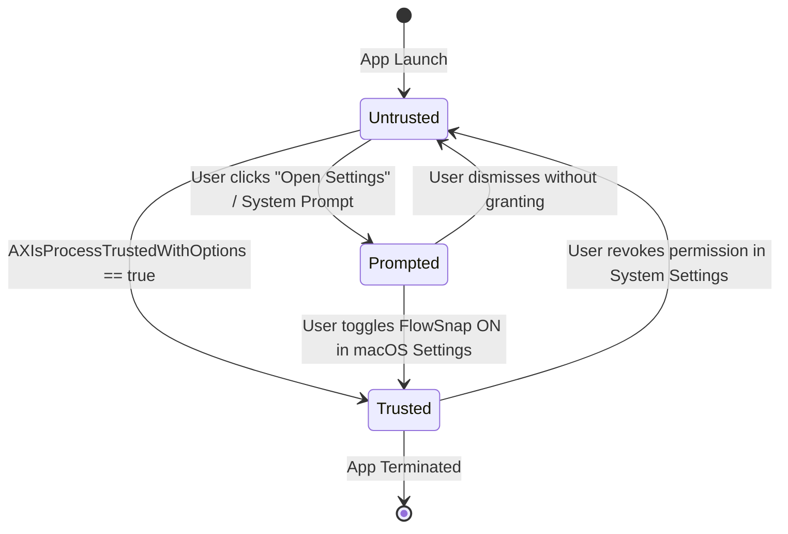
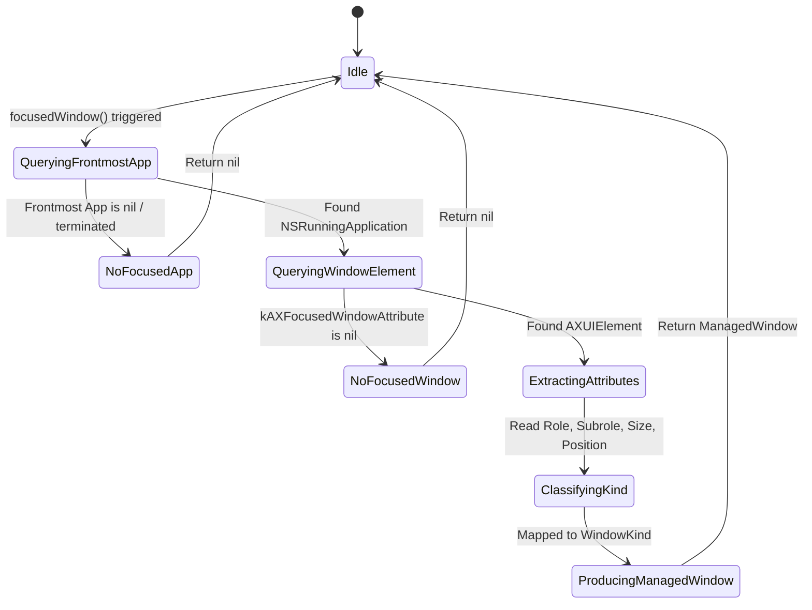

# Domain Model: Accessibility & Focused Window Discovery (US-SNAP-001)

- **Date**: 2026-08-27
- **Feature Slug**: `accessibility-window-discovery`
- **Protocol**: Bounded Task (Stage 4)

---

## 1. RBAC & Access Matrix

FlowSnap runs as a local macOS client process under the logged-in desktop user's account:

| Actor / Process          | Check Permission (`AXIsProcessTrusted`) | Open System Settings Pane |     Inspect Focused Window      | Mutate Window Frame (`setFrame`) |
| :----------------------- | :-------------------------------------: | :-----------------------: | :-----------------------------: | :------------------------------: |
| **FlowSnap (Untrusted)** |               ✅ Allowed                |        ✅ Allowed         |   ❌ Denied (Returns AXError)   |   ❌ Denied (Returns AXError)    |
| **FlowSnap (Trusted)**   |               ✅ Allowed                |        ✅ Allowed         | ✅ Allowed (`kAXFocusedWindow`) | ✅ Allowed (`kAXPosition/Size`)  |
| **macOS System / TCC**   |                Authority                |         Authority         |   Enforces Privacy & Security   |   Enforces Privacy & Security    |

---

## 2. State Machines & Lifecycles

### 2.1 Accessibility Permission Lifecycle



### 2.2 Focused Window Discovery Lifecycle



---

## 3. Business Rules

### **BR-SNAP-001**: Pre-flight Permission Enforcement

Before attempting any AXUIElement query or window operation, FlowSnap must check `AXIsProcessTrustedWithOptions`. If untrusted, all window inspection operations must return `nil` or throw `AccessibilityError.notTrusted` rather than crashing or triggering unhandled OS exceptions.

### **BR-SNAP-002**: Window Kind Classification & Standard Window Isolation

Windows queried from Accessibility must be categorized into `WindowKind`:

- `.normal`: `kAXRoleAttribute == kAXWindowRole` AND `kAXSubroleAttribute == kAXStandardWindowSubrole` AND `kAXSizeAttribute` is settable (resizable). Only `.normal` windows are eligible for snap layout manipulation.
- `.dialog`: `kAXRoleAttribute == kAXWindowRole` AND `kAXSubroleAttribute` in [`kAXDialogSubrole`, `kAXSystemDialogSubrole`].
- `.sheet`: `kAXRoleAttribute == kAXSheetRole`.
- `.system`: Spotlight, Notification Center, Menubar, or Dock elements.
- `.unsupported`: Any window where position/size cannot be read or modified.

### **BR-SNAP-003**: Window Title & Identity Fallback

When constructing `ManagedWindow`:

1. Attempt to read `kAXTitleAttribute`.
2. If title is nil or whitespace-only, query `NSRunningApplication(processIdentifier: pid).localizedName`.
3. If `localizedName` is also nil or empty, set `title` to `"Unknown Window"`.
   `ManagedWindow.title` must never be an empty string.

### **BR-SNAP-004**: Safe Geometry Extraction

`kAXPositionAttribute` and `kAXSizeAttribute` must be decoded using `AXValueGetValue` with `kAXValueTypeCGPoint` and `kAXValueTypeCGSize`. If either coordinate component cannot be decoded or is invalid (e.g. NaN or infinite), the window query must fail gracefully and return `nil`.

---

## 4. Workflows & Edge Cases

| Scenario                    | Trigger / Condition                                                      | Expected Handling                                                                                     |
| :-------------------------- | :----------------------------------------------------------------------- | :---------------------------------------------------------------------------------------------------- |
| **Permission Revoked**      | User untoggles permission in System Settings while FlowSnap is running   | Next query fails with `.notTrusted`; trigger notification/alert to prompt user.                       |
| **All Windows Minimized**   | Frontmost app has active process but all windows are minimized or hidden | `kAXFocusedWindowAttribute` returns nil; `focusedWindow()` returns `nil` safely.                      |
| **Modal Sheet Open**        | A document window has a modal save/open sheet attached                   | Classified as `.sheet` or `.dialog`; ignored by snap engine to avoid corrupted document state.        |
| **Headless / Electron App** | App lacks `kAXTitleAttribute`                                            | Fallback to `NSRunningApplication.localizedName` per BR-SNAP-003.                                     |
| **High Frequency Polling**  | App active check                                                         | Dynamic check runs on `didBecomeActiveNotification` + 1s active timer; zero polling when deactivated. |

---

## 5. Entities & Data Boundaries

### Entity: `ManagedWindow` (Domain / Value Object)

```swift
public struct ManagedWindow: Identifiable, Hashable, Sendable {
    public let id: CGWindowID
    public let pid: pid_t
    public let bundleIdentifier: String?
    public let title: String
    public var frame: CGRect
    public var isMinimized: Bool
    public var isResizable: Bool
    public var kind: WindowKind
}
```

### Enum: `WindowKind` (Domain)

```swift
public enum WindowKind: String, Codable, Sendable, Hashable {
    case normal
    case dialog
    case sheet
    case system
    case unsupported
}
```

---

## 6. Non-Functional Requirements (NFRs)

- **Performance**: P95 query execution time for `focusedWindow()` must be under 10ms.
- **Memory Safety**: No dangling `CFTypeRef` or memory leaks when querying AXUIElements; ensure strict CoreFoundation ARC memory management.
- **Concurrency**: Fully compliant with Swift 6 Strict Concurrency (`@MainActor`, `Sendable`, Actor-isolated `WindowRegistry`).
