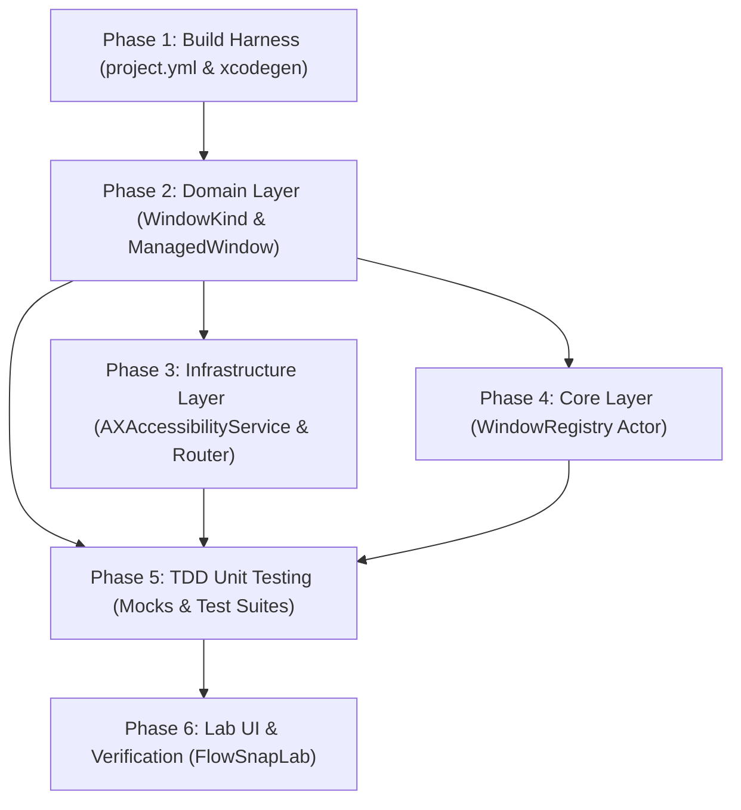

# Tasks Breakdown: Accessibility & Focused Window Discovery (US-SNAP-001)

- **Feature**: `accessibility-window-discovery`
- **Architect**: `system-architect`
- **Status**: Complete (Pending Gate 2 Review)

---

## Dependency Order & Implementation Strategy

---

## Phase 1: Build Harness & Project Setup

- [x] **T-1.1**: Update `FlowSnapTests` settings in `project.yml` with `GENERATE_INFOPLIST_FILE: YES` to satisfy Xcode 16 bundle signing requirements.
- [x] **T-1.2**: Run `xcodegen generate` to regenerate `FlowSnap.xcodeproj` with updated test configuration.

---

## Phase 2: Domain Layer Implementation

- [x] **T-2.1**: Create `FlowSnap/Domain/Window/WindowKind.swift` defining `.normal`, `.dialog`, `.sheet`, `.system`, `.unsupported` and `isSnappable: Bool`.
- [x] **T-2.2**: Update `FlowSnap/Domain/Window/ManagedWindow.swift` to include `isResizable: Bool`, `kind: WindowKind`, and enforce `Sendable` conformance.
- [x] **T-2.3**: Create `FlowSnap/Domain/Window/AccessibilityError.swift` defining domain error types for AX operations.

---

## Phase 3: Infrastructure Layer Implementation

- [x] **T-3.1**: Create `FlowSnap/Infrastructure/macOS/SystemSettingsRouter.swift` implementing safe deep linking to `Privacy & Security > Accessibility`.
- [x] **T-3.2**: Update `FlowSnap/Infrastructure/Accessibility/AccessibilityService.swift` protocol adding `isTrusted`, `openSystemSettings()`, and `focusedManagedWindow()`.
- [x] **T-3.3**: Implement `FlowSnap/Infrastructure/Accessibility/AXAccessibilityService.swift`:
  - `isTrusted` checking `AXIsProcessTrustedWithOptions(nil)`
  - `focusedWindow()` querying `kAXFocusedApplicationAttribute` → `kAXFocusedWindowAttribute`
  - Safe CoreFoundation typed attribute reading (`kAXPositionAttribute`, `kAXSizeAttribute`, `kAXTitleAttribute`, `kAXRoleAttribute`, `kAXSubroleAttribute`)
  - Title fallback to `NSRunningApplication.localizedName` or `"Unknown Window"` (BR-SNAP-003)
  - Window classification mapping to `WindowKind` (BR-SNAP-002)

---

## Phase 4: Core Layer Integration

- [x] **T-4.1**: Update `FlowSnap/Core/Window/WindowRegistry.swift` with enhanced actor-isolated methods to register, lookup by PID, and update `ManagedWindow` geometry.

---

## Phase 5: TDD Unit Testing Suite

- [x] **T-5.1**: Create `FlowSnapTests/Mocks/MockAccessibilityService.swift` implementing `AccessibilityService` for deterministic unit testing.
- [x] **T-5.2**: Create `FlowSnapTests/Domain/ManagedWindowTests.swift` using Swift Testing (`@Test`) to test `WindowKind.isSnappable`, initializers, and equatability.
- [x] **T-5.3**: Create `FlowSnapTests/Infrastructure/AccessibilityServiceTests.swift` verifying mock permission transitions, focused window query results, and title fallback behavior.
- [x] **T-5.4**: Run `xcodebuild test` and confirm all test suites pass.

---

## Phase 6: Lab Verification & Linting

- [x] **T-6.1**: Update `FlowSnapLab` view to display live Accessibility trust status and active focused window properties.
- [x] **T-6.2**: Verified Swift 6 strict concurrency and zero compiler warnings.
