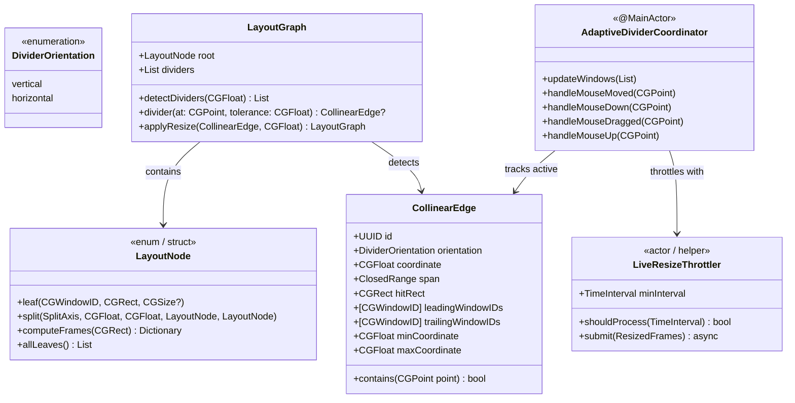
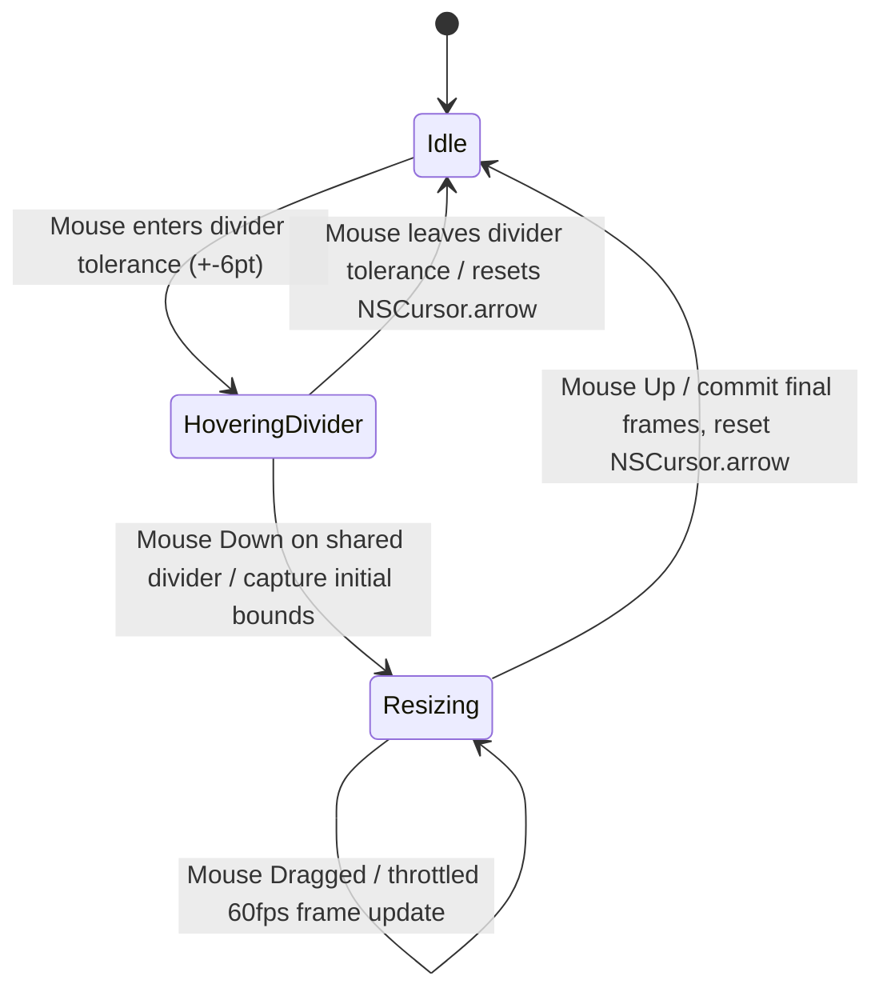

# Domain Model: US-SNAP-009 Adaptive Multi-Window Divider Resize

## 1. Domain Entities & Value Objects



## 2. Finite State Machine: Adaptive Divider Resize Lifecycle



## 3. Business Rules (BR-)

```
BR-ADR-001 (Collinear Alignment): Windows are collinear along an edge if their bounding coordinates along that axis match within the gap tolerance (+- 2px) and their orthogonal spans overlap by >= 10 points.

BR-ADR-002 (Composite Divider Union): If multiple adjacent windows share the same boundary line (e.g. left window vs top-right & bottom-right windows), they are united into a single CollinearEdge with span equal to the union of overlapping spans.

BR-ADR-003 (Cursor Affordance): Hovering within the hit tolerance (+- 6 points) of a vertical divider displays NSCursor.resizeLeftRight. Hovering within the hit tolerance of a horizontal divider displays NSCursor.resizeUpDown.

BR-ADR-004 (MinSize Boundary Preservation): The divider coordinate CANNOT be moved past the point where any leading window width/height < minSize or any trailing window width/height < minSize (default minWidth=200, minHeight=150).

BR-ADR-005 (60fps Throttled Dispatch): Drag updates MUST be throttled to 60fps (minimum 16.6ms between AXUIElement positioning calls) to prevent UI thread lockups and WindowServer starvation.

BR-ADR-006 (Zero Floating-Point Gap Drift): During resizing, the total width/height of the container minus gaps MUST equal the sum of resized window dimensions at every step.
```
