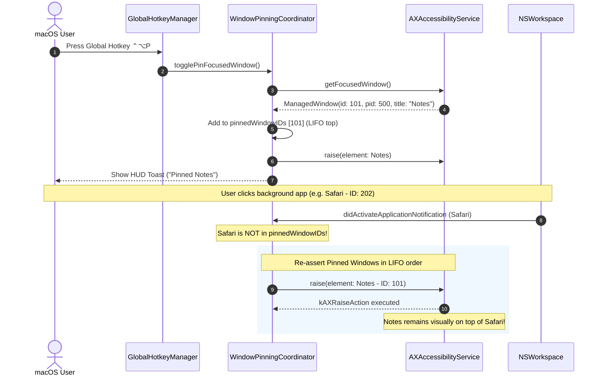
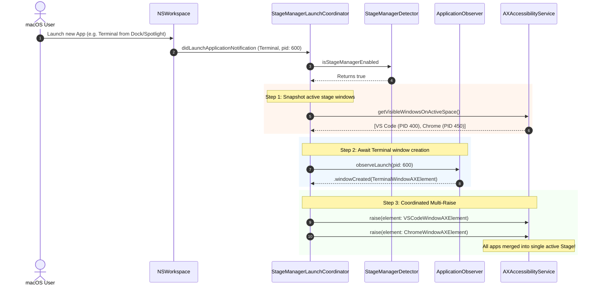

# 03 — Domain Model & Architecture Specification: always-on-top-window-pinning (US-SNAP-021)

## 1. Ubiquitous Language Additions (for `CONTEXT.md`)

- **WindowPinningCoordinating**: Protocol định nghĩa giao diện điều phối trạng thái ghim Always-On-Top, truy vấn danh sách cửa sổ đang ghim và thực thi re-assertion.
- **WindowPinningCoordinator**: @MainActor coordinator quản lý danh sách `PinnedWindowRecord`, theo dõi sự kiện đổi tiêu điểm của hệ điều hành, và duy trì thứ tự xếp lớp LIFO Z-Stacking qua `kAXRaiseAction`.
- **PinnedWindowRecord**: Cấu trúc dữ liệu bất biến (`Sendable`, `Identifiable`, `Hashable`) lưu trữ danh tính cửa sổ được ghim (`windowID`, `pid`, `bundleID`, `title`, `pinnedAt`).
- **StageManagerLaunchCoordinating**: Protocol định nghĩa khả năng đánh chặn sự kiện khởi chạy ứng dụng mới và phối hợp giữ nguyên Stage hiện tại.
- **StageManagerLaunchCoordinator**: Dịch vụ hạ tầng lắng nghe `NSWorkspace.didLaunchApplicationNotification`, theo dõi window creation qua `ApplicationObserving`, và đồng bộ hóa Stage qua `kAXRaiseAction`.

---

## 2. Business Rules (`BR-PIN-###`)

- **BR-PIN-001 (Toggle Pin State)**: Nhấn phím tắt toàn cục `⌃⌥P` (`togglePinFocusedWindow`) hoặc chọn action trong Menu Bar sẽ chuyển đổi trạng thái ghim của cửa sổ đang có tiêu điểm (focused window). Nếu cửa sổ đang ghim -> Unpin và xóa khỏi danh sách. Nếu chưa ghim -> Pin và thêm vào đỉnh danh sách LIFO.
- **BR-PIN-002 (Dynamic LIFO Z-Stacking)**: Hỗ trợ ghim không giới hạn số lượng cửa sổ. Toàn bộ cửa sổ được ghim luôn được duy trì mức ưu tiên hiển thị cao hơn các cửa sổ thông thường. Cửa sổ ghim nào được tương tác gần nhất sẽ nằm trên các cửa sổ ghim trước đó.
- **BR-PIN-003 (Active Re-assertion Coordination)**: Khi người dùng chuyển sang tương tác với một cửa sổ thông thường (không nằm trong danh sách ghim), `WindowPinningCoordinator` tự động nâng tuần tự danh sách cửa sổ ghim theo thứ tự từ đáy lên đỉnh LIFO bằng `kAXRaiseAction` (`AXUIElementPerformAction(element, kAXRaiseAction)`).
- **BR-PIN-004 (System Modal Safety)**: Nếu cửa sổ có tiêu điểm là hộp thoại hệ thống quan trọng (SecurityAgent, Touch ID, Keychain, Dialog phân quyền macOS), FlowSnap tạm dừng việc re-assertion để đảm bảo không che khuất hộp thoại bảo mật.
- **BR-PIN-005 (Local Space Scoping)**: Trạng thái ghim gắn liền với Desktop Space hiện tại, không tự động bám dính (sticky) sang Space khác khi chuyển đổi Space.
- **BR-PIN-006 (Stage Manager Launch Co-existence)**: Khi Stage Manager đang bật (`isStageManagerEnabled == true`) và tính năng Launch Co-existence được kích hoạt trong Settings, khi bất kỳ ứng dụng mới nào được khởi chạy:
  1. `StageManagerLaunchCoordinator` chụp lại danh sách cửa sổ của Stage hiện tại.
  2. Lắng nghe thời điểm cửa sổ mới hoàn tất khởi tạo qua `ApplicationObserving`.
  3. Thực hiện chuỗi nâng `kAXRaiseAction` cho toàn bộ các cửa sổ của Stage cũ để gom chung vào Stage hiện hành, ngăn chặn triệt để hành vi đẩy app ra dải cánh gà của macOS.
- **BR-PIN-007 (Automatic Window Lifecycle Cleanup)**: Khi một cửa sổ ghim bị đóng hoặc tiến trình ứng dụng kết thúc (`NSWorkspace.didTerminateApplicationNotification` hoặc trả về `kAXErrorInvalidUIElement`), tự động dọn dẹp bản ghi khỏi danh sách ghim.
- **BR-PIN-008 (HUD Feedback & Menu Bar Synchronization)**: Bật/tắt ghim kích hoạt HUD toast phản hồi trong 1.0 giây và cập nhật trạng thái hiển thị trên `MenuBarViewModel`.

---

## 3. Interaction Flow & Sequence Diagram

### 3.1. Always-On-Top Re-assertion Sequence



### 3.2. Stage Manager Launch Co-existence Sequence



---

## 4. Contract Specifications

### 4.1. Domain: `PinnedWindowRecord`

```swift
public struct PinnedWindowRecord: Sendable, Identifiable, Hashable {
    public let id: CGWindowID
    public let pid: pid_t
    public let bundleIdentifier: String?
    public let title: String
    public let pinnedAt: Date

    public init(
        id: CGWindowID,
        pid: pid_t,
        bundleIdentifier: String?,
        title: String,
        pinnedAt: Date = Date()
    ) {
        self.id = id
        self.pid = pid
        self.bundleIdentifier = bundleIdentifier
        self.title = title
        self.pinnedAt = pinnedAt
    }
}
```

### 4.2. Domain Protocol: `WindowPinningCoordinating`

```swift
@MainActor
public protocol WindowPinningCoordinating: AnyObject, Sendable {
    var pinnedWindows: [PinnedWindowRecord] { get }
    var isPinningActive: Bool { get }

    func isPinned(windowID: CGWindowID) -> Bool
    func togglePin(window: ManagedWindow) async -> Bool
    func unpin(windowID: CGWindowID)
    func unpinAll()
    func handleFocusChange(activeWindowID: CGWindowID?, activePID: pid_t?) async
}
```

### 4.3. Domain Protocol: `StageManagerLaunchCoordinating`

```swift
@MainActor
public protocol StageManagerLaunchCoordinating: AnyObject, Sendable {
    var isCoexistenceEnabled: Bool { get set }
    func handleApplicationLaunched(processIdentifier: pid_t, bundleIdentifier: String?) async
}
```
