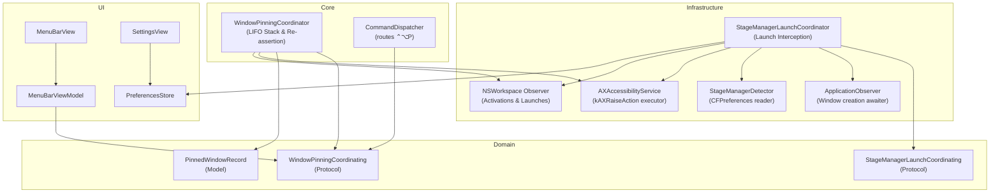

# Technical Architecture & Implementation Plan: always-on-top-window-pinning (US-SNAP-021)

## 1. Architectural Strategy & Deep Module Boundaries

US-SNAP-021 implements **Universal Always-On-Top Window Pinning & Stage Manager Launch Co-existence** following Domain-Driven Design (DDD), Seam Discipline, and John Ousterhout's Deep Modules principle:

- **Deep Module 1: `WindowPinningCoordinator` (`Core/Policy`)**:
  - Implements `WindowPinningCoordinating`.
  - Encapsulates dynamic LIFO Z-stacking and active re-assertion using pure public APIs (`AccessibilityServing.raise` / `kAXRaiseAction`).
  - Observes `NSWorkspace.didActivateApplicationNotification` and `kAXFocusedWindowChangedNotification`.
  - Enforces System Modal Safety (suspends re-assertion if active window is SecurityAgent / Touch ID dialog).
  - Handles auto-cleanup on app termination or dead window element errors.

- **Deep Module 2: `StageManagerLaunchCoordinator` (`Infrastructure/StageManager`)**:
  - Implements `StageManagerLaunchCoordinating`.
  - Listens for `NSWorkspace.didLaunchApplicationNotification`.
  - Connects with `StageManagerDetecting` (`StageManagerDetector`) and `PreferencesStore`.
  - Employs `ApplicationObserving` (`ApplicationObserver`) to wait for initial window creation without polling.
  - Multi-raises previously active Stage windows using `kAXRaiseAction` so that the newly opened app merges into the active Stage.

- **Deep Module 3: Global Hotkeys & Command Dispatch**:
  - Adds `ShortcutAction.togglePinFocusedWindow` (default: `Control + Option + P`).
  - Routes action through `CommandDispatcher` to `WindowPinningCoordinator.togglePin`.

- **Deep Module 4: Menu Bar Status & HUD Feedback**:
  - Injects `WindowPinningCoordinating` into `MenuBarViewModel`.
  - Renders pinned window count and dropdown list with unpin actions in `MenuBarView`.
  - Dispatches visual feedback HUD toast for 1.0 second upon pin/unpin.

---

## 2. Proposed Source Changes

### Domain Layer

- **[NEW]** `FlowSnap/Domain/Policy/PinnedWindowRecord.swift`:
  - Immutable model: `id: CGWindowID`, `pid: pid_t`, `bundleIdentifier: String?`, `title: String`, `pinnedAt: Date`.
- **[NEW]** `FlowSnap/Domain/Policy/WindowPinningCoordinating.swift`:
  - MainActor protocol defining pinning lifecycle, LIFO query, and focus change handling.
- **[NEW]** `FlowSnap/Domain/StageManager/StageManagerLaunchCoordinating.swift`:
  - MainActor protocol defining launch interception and Stage co-existence coordination.

### Core Layer

- **[NEW]** `FlowSnap/Core/Policy/WindowPinningCoordinator.swift`:
  - Concrete class implementing `WindowPinningCoordinating`.
  - Manages `[PinnedWindowRecord]` in LIFO order.
  - Active re-assertion via `accessibilityService.raise(element:)`.
  - System modal safety and termination cleanup.
- **[MODIFY]** `FlowSnap/Core/Dispatcher/CommandDispatcher.swift`:
  - Add support for `.togglePinFocusedWindow`.
- **[MODIFY]** `FlowSnap/Domain/Shortcut/ShortcutAction.swift`:
  - Add `case togglePinFocusedWindow = "togglePinFocusedWindow"`.

### Infrastructure Layer

- **[NEW]** `FlowSnap/Infrastructure/StageManager/StageManagerLaunchCoordinator.swift`:
  - Concrete class implementing `StageManagerLaunchCoordinating`.
  - Listens to `NSWorkspace.didLaunchApplicationNotification`, awaits window creation via `ApplicationObserving`, and multi-raises existing stage windows.

### UI & Storage Layer

- **[MODIFY]** `FlowSnap/Core/Storage/PreferencesStore.swift`:
  - Add `@Published public var stageManagerLaunchCoexistenceEnabled: Bool = true`.
- **[MODIFY]** `FlowSnap/UI/MenuBar/MenuBarViewModel.swift`:
  - Integrate `WindowPinningCoordinating`, expose pinned count and unpin actions.
- **[MODIFY]** `FlowSnap/UI/MenuBar/MenuBarView.swift`:
  - Display pinned windows section with individual / bulk unpin buttons.
- **[MODIFY]** `FlowSnap/UI/Settings/SettingsView.swift`:
  - Add Stage Manager Launch Co-existence toggle.

### App Dependency Injection Layer

- **[MODIFY]** `FlowSnap/App/AppDependencies.swift`:
  - Wire `WindowPinningCoordinator` and `StageManagerLaunchCoordinator`.

### Tests Layer

- **[NEW]** `FlowSnapTests/Mocks/MockWindowPinningCoordinator.swift`:
  - Test double for `WindowPinningCoordinating`.
- **[NEW]** `FlowSnapTests/Mocks/MockStageManagerLaunchCoordinator.swift`:
  - Test double for `StageManagerLaunchCoordinating`.
- **[NEW]** `FlowSnapTests/Core/Policy/WindowPinningCoordinatorTests.swift`:
  - Test toggle pin, LIFO Z-stack ordering, active re-assertion, system modal exemption, and app termination cleanup.
- **[NEW]** `FlowSnapTests/Infrastructure/StageManagerLaunchCoordinatorTests.swift`:
  - Test Stage Manager launch detection, window creation waiting, and multi-raise stage retention.
