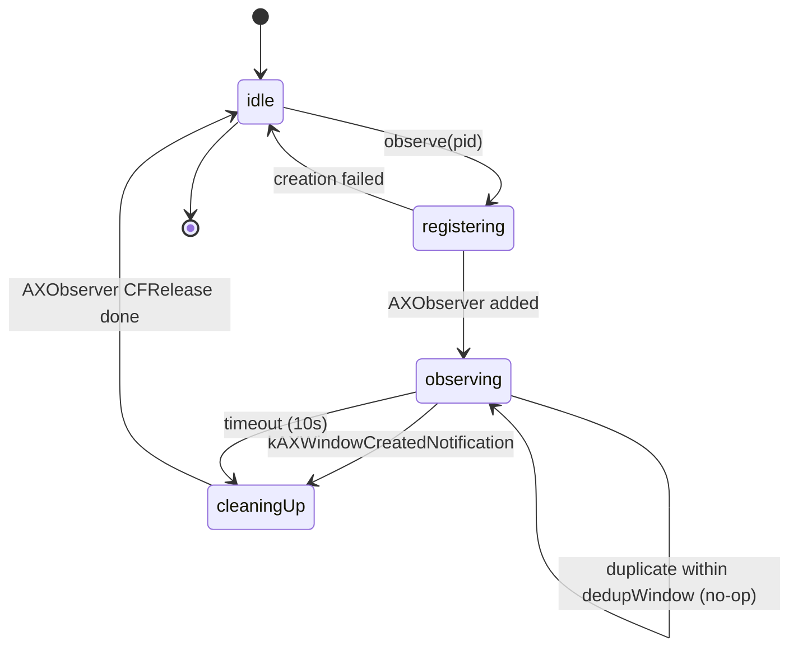

# Data Model — App Launch Observer & Current Space Policy (US-WORK-013)

> DTOs, value types, and lifecycle states introduced by US-WORK-013.
> All types are `Sendable` or actor-isolated per Swift 6 strict concurrency.

## 1. New / Changed Types

### 1.1 `ApplicationObserving` (protocol, Domain)

```swift
public protocol ApplicationObserving: Sendable {
    func observe(pid: pid_t, bundleID: String?) async
    func stopObserving(pid: pid_t)
    var events: AsyncStream<LaunchObservationEvent> { get }
}
```

| Field          | Type                         | Notes                                                  |
| :------------- | :--------------------------- | :----------------------------------------------------- |
| `observe`      | `async` method               | Idempotent within `dedupWindow`; dedup is internal.    |
| `stopObserving`| sync method                  | Force-release; used by manager on window-creation success. |
| `events`       | `AsyncStream<LaunchObservationEvent>` | Hot stream, finished only on `stopObservingAll`. |

### 1.2 `LaunchObservationEvent` (enum, Sendable, NEW)

```swift
public enum LaunchObservationEvent: Sendable, Hashable {
    case windowCreated(pid: pid_t, windowID: CGWindowID)
    case timeout(pid: pid_t)
    case failed(pid: pid_t, reason: LaunchObservationFailure)
}

public enum LaunchObservationFailure: Sendable, Hashable {
    case observerCreationFailed
    case addNotificationFailed(AXErrorCode)
}
```

Notes:
- `AXErrorCode` re-exported as a typed `Sendable` shim (raw `Int32`) to avoid
  leaking non-`Sendable` `AXError` into Domain.
- The concrete `ApplicationObserver` translates raw `AXError` → `AXErrorCode`
  before publishing.

### 1.3 `WindowEvent` (extended, Core)

```swift
enum WindowEvent: Hashable, Sendable {
    // existing cases...
    case applicationLaunched(pid_t, bundleID: String?)   // CHANGED signature
    case applicationTerminated(pid_t)
    case applicationWindowCreated(pid: pid_t, windowID: CGWindowID)  // NEW
    // existing cases...
}
```

Migration:
- `applicationLaunched(pid_t)` → `applicationLaunched(pid_t, bundleID: String?)`.
- Hash changes (added associated `String?`). All call sites compiled in the
  same module — no external consumers.

### 1.4 `ApplicationObserverState` (AXObserver lifecycle, Infrastructure-internal)

```swift
enum ApplicationObserverState: Sendable {
    case idle
    case registering(pid: pid_t)
    case observing(pid: pid_t, registeredAt: Date)
    case cleaningUp(pid: pid_t)
}
```

| State        | Trigger to enter                          | Trigger to exit               |
| :----------- | :---------------------------------------- | :---------------------------- |
| `idle`       | init / after `stopObservingAll`           | `.registering` on launch      |
| `registering`| entering `observe(pid:)`                 | success → `.observing` / fail → `.idle` |
| `observing`  | AXObserver created + notification added   | `.cleaningUp` on window/timeout |
| `cleaningUp` | `cleanup(pid)` invoked                   | observer released → `.idle`   |

### 1.5 `ManagedWindow` (unchanged)

Already `Sendable, Hashable`. The `applicationWindowCreated` event carries a
`CGWindowID` only; the manager resolves it via `AccessibilityService` into a
`ManagedWindow` before calling `applyPolicy`.

### 1.6 `WindowPolicy` (unchanged)

`enum WindowPolicy` already covers `.currentSpace` and `.currentDisplay`. This
feature only resolves and applies these two cases. All other cases are no-ops
in this slice (US-WORK-014 territory).

## 2. EventBus Payload Schemas

| Event                                          | Publisher                  | Subscriber(s)              | Payload                                |
| :--------------------------------------------- | :------------------------- | :------------------------- | :------------------------------------- |
| `WindowEvent.applicationLaunched(pid, bundleID)`| `WorkspaceObserver`        | `ApplicationObserver`, `WindowPolicyManager` | pid, bundleID                |
| `WindowEvent.applicationWindowCreated(pid, windowID)` | `ApplicationObserver` | `WindowPolicyManager`      | pid, windowID                          |
| `WindowEvent.applicationTerminated(pid)`       | `WorkspaceObserver`        | `WindowPolicyManager`      | pid                                    |
| `LaunchObservationEvent.windowCreated(...)`    | `ApplicationObserver`      | diagnostics / tests        | pid, windowID                          |
| `LaunchObservationEvent.timeout(pid)`          | `ApplicationObserver`      | diagnostics / tests        | pid                                    |
| `LaunchObservationEvent.failed(pid, reason)`   | `ApplicationObserver`      | diagnostics / tests        | pid, `LaunchObservationFailure`        |

## 3. Lifecycle / State Diagram



## 4. Constants & Configuration

| Constant                      | Default     | Override surface           | Source         |
| :----------------------------- | :---------- | :------------------------- | :------------- |
| `AXObserver.timeout`           | `10.0 s`    | `ApplicationObserver.init` | `00-tech-context.md`, RISK-LAUNCH-004 |
| `AXObserver.dedupWindow`       | `5.0 s`     | `ApplicationObserver.init` | RISK-LAUNCH-005 |
| `WindowPolicyManager.defaultPolicy` | `.currentSpace` | `setDefaultPolicy` | ASM-LAUNCH-003 |

## 5. Concurrency & Sendable Map

| Type                              | Isolation / Sendable | Notes                                   |
| :-------------------------------- | :------------------- | :-------------------------------------- |
| `ApplicationObserving` (protocol) | `Sendable`           | Pure value semantics                    |
| `LaunchObservationEvent`          | `Sendable` enum      | All associated values are `Sendable`    |
| `LaunchObservationFailure`        | `Sendable` enum      | `AXErrorCode` is `Int32` `Sendable`     |
| `WindowEvent`                     | `Sendable` enum      | Gains `Sendable` conformance            |
| `ApplicationObserverState`       | `Sendable` enum      | Pure data                               |
| `ApplicationObserver` (class)    | `@MainActor`         | Wraps `OpaquePointer` (`AXObserver`)    |
| `WorkspaceObserver` (class)      | `@MainActor`         | Wraps `NSWorkspace.notificationCenter`  |
| AXObserver C-callback refCon      | boxed `Sendable`      | `Unmanaged.passRetained(Box(...))`      |