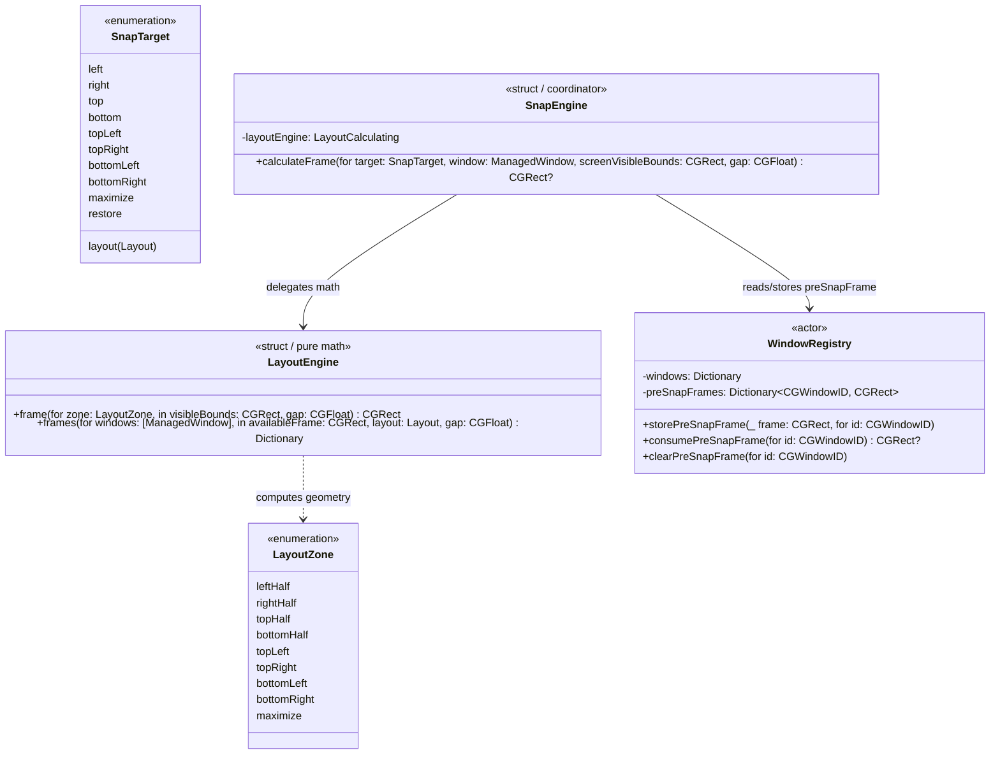
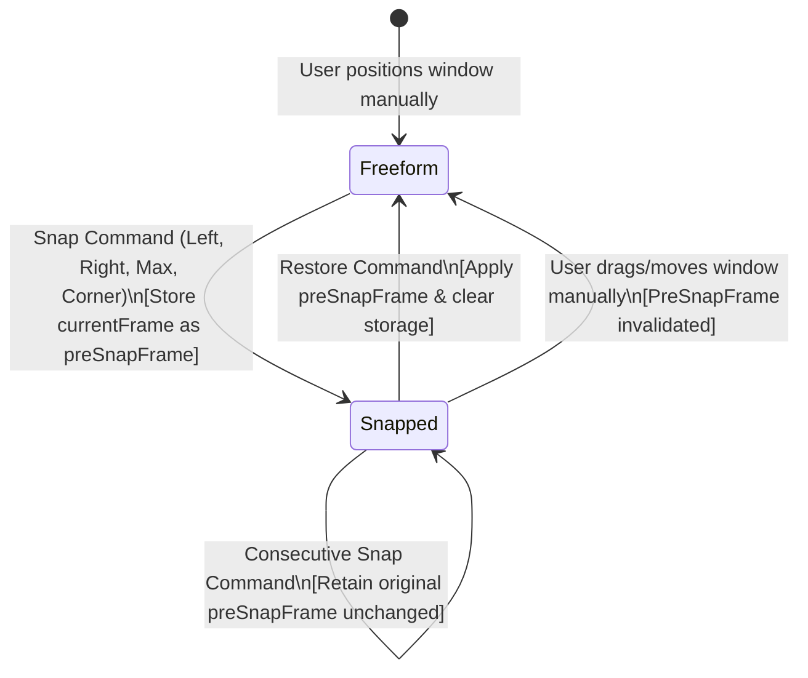

# Domain Model: Core Layout Calculation & Basic Snap Engine (US-SNAP-002)

- **Date**: 2026-08-28
- **Feature Slug**: `core-layout-snap-engine`
- **Protocol Depth**: Bounded Task (Light domain modeling)

---

## 1. Ubiquitous Language & Entities

---

## 2. Finite State Machine: Window Snap & Restore Transitions

---

## 3. Numbered Business Rules

### BR-LAYOUT-001: Visible Frame Boundary Isolation

- All calculations MUST be confined to the target display's `visibleFrame` (`screen.visibleFrame`), strictly excluding the macOS Menu Bar and Dock.
- Formula: $Origin_{available} = (visibleFrame.origin.x, visibleFrame.origin.y)$, $Size_{available} = (visibleFrame.width, visibleFrame.height)$.

### BR-LAYOUT-002: Odd-Pixel Floor Allocation

- When dividing an integer or fractional dimension $D$ on an odd-pixel display:
  - Left / Top segment size: $S_{1} = \lfloor D / 2.0 \rfloor$
  - Right / Bottom segment size: $S_{2} = D - S_{1}$
- Invariant: $S_{1} + S_{2} == D$ exactly. Zero pixel gap, zero screen edge overflow.

### BR-LAYOUT-003: Standard Zone Mathematical Mapping

Relative to `visibleFrame.origin`:

1. **`leftHalf`**: $x = 0$, $y = 0$, $w = \lfloor W / 2 \rfloor$, $h = H$
2. **`rightHalf`**: $x = \lfloor W / 2 \rfloor$, $y = 0$, $w = W - \lfloor W / 2 \rfloor$, $h = H$
3. **`topHalf`**: $x = 0$, $y = 0$, $w = W$, $h = \lfloor H / 2 \rfloor$
4. **`bottomHalf`**: $x = 0$, $y = \lfloor H / 2 \rfloor$, $w = W$, $h = H - \lfloor H / 2 \rfloor$
5. **`topLeft`**: $x = 0$, $y = 0$, $w = \lfloor W / 2 \rfloor$, $h = \lfloor H / 2 \rfloor$
6. **`topRight`**: $x = \lfloor W / 2 \rfloor$, $y = 0$, $w = W - \lfloor W / 2 \rfloor$, $h = \lfloor H / 2 \rfloor$
7. **`bottomLeft`**: $x = 0$, $y = \lfloor H / 2 \rfloor$, $w = \lfloor W / 2 \rfloor$, $h = H - \lfloor H / 2 \rfloor$
8. **`bottomRight`**: $x = \lfloor W / 2 \rfloor$, $y = \lfloor H / 2 \rfloor$, $w = W - \lfloor W / 2 \rfloor$, $h = H - \lfloor H / 2 \rfloor$
9. **`maximize`**: $x = 0$, $y = 0$, $w = W$, $h = H$

### BR-LAYOUT-004: Pre-Snap Frame Preservation & Restore Idempotency

- Prior to executing a snap action on `windowId`:
  - If `preSnapFrames[windowId]` is `nil`, save current window frame as `preSnapFrames[windowId]`.
  - If `preSnapFrames[windowId]` is already present (from an earlier consecutive snap), DO NOT overwrite it.
- Executing `restore`:
  - If `preSnapFrames[windowId]` exists, return it and remove it from `WindowRegistry`.
  - If `preSnapFrames[windowId]` is `nil`, return `nil` (no-op; window remains unchanged).

### BR-LAYOUT-005: Minimum Window Size Anchoring

- When an app's window has minimum dimensions $(minW, minH)$ larger than the calculated zone $(calcW, calcH)$:
  - $effW = \max(calcW, minW)$
  - $effH = \max(calcH, minH)$
  - Position anchors to the requested edge/corner:
    - If snapped to right edge: $x = visibleFrame.maxX - effW$
    - If snapped to bottom edge: $y = visibleFrame.maxY - effH$
    - If snapped to left/top: $x = visibleFrame.minX$, $y = visibleFrame.minY$

---

## 4. Workflows & Edge Cases

1. **Edge Case 1: Ultra-Small Display Bounds**: When available frame is smaller than 200x200 (e.g. nested test environments or extreme docking), ensure calculations never produce negative width or height.
2. **Edge Case 2: Consecutive Same-Zone Snap**: Snapping Left when already snapped Left preserves the existing `preSnapFrame` and re-applies Left calculation idempotently.
3. **Edge Case 3: Restore without Prior Snap**: When Restore is invoked on a freeform window, the system safely ignores the command without crashing or resizing.
