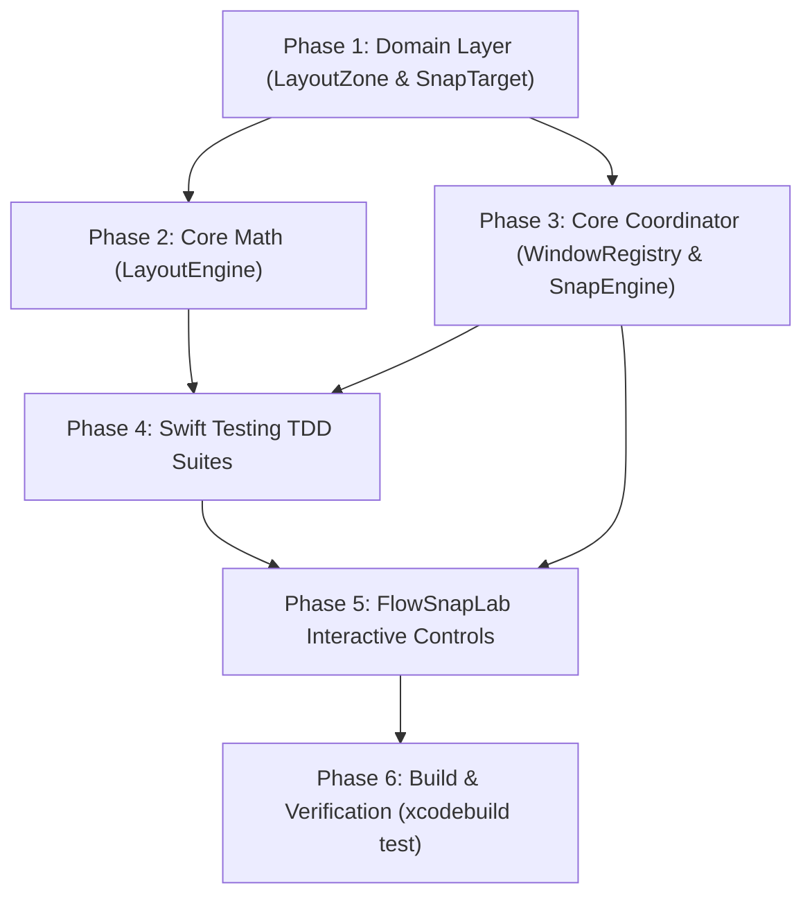

# Tasks Breakdown: Core Layout Calculation & Basic Snap Engine (US-SNAP-002)

- **Feature**: `core-layout-snap-engine`
- **Architect**: `system-architect`
- **Status**: Complete (Pending Gate 2 Review)

---

## Dependency Order & Implementation Strategy

---

## Phase 1: Domain Layer Implementation

- [x] **T-1.1**: Update `FlowSnap/Domain/Layout/LayoutZone.swift` with standard 9-case enum (`leftHalf`, `rightHalf`, `topHalf`, `bottomHalf`, `topLeft`, `topRight`, `bottomLeft`, `bottomRight`, `maximize`) conforming to `Sendable`, `CaseIterable`, `Codable`, `Hashable`.
- [x] **T-1.2**: Update `FlowSnap/Domain/Commands/SnapTarget.swift` to support `.zone(LayoutZone)`, `.restore`, and static conveniences (`.left`, `.right`, `.maximize`, etc.).
- [x] **T-1.3**: Update `FlowSnap/Core/Layout/LayoutCalculating.swift` protocol to include single-zone calculation `frame(for:in:gap:)`.

---

## Phase 2: Core Layout Engine Pure Math

- [x] **T-2.1**: Implement `LayoutEngine.frame(for:in:gap:)` in `FlowSnap/Core/Layout/LayoutEngine.swift` enforcing odd-pixel flooring policy (`BR-LAYOUT-002`) and boundary isolation (`BR-LAYOUT-001`).
- [x] **T-2.2**: Implement `LayoutEngine.frames(for:in:layout:gap:)` mapping multiple windows into layout zones.

---

## Phase 3: Core Coordinator Snap Engine & WindowRegistry State

- [x] **T-3.1**: Extend `FlowSnap/Core/Window/WindowRegistry.swift` actor with `storePreSnapFrameIfNeeded`, `preSnapFrame`, `consumePreSnapFrame`, and `clearPreSnapFrame`.
- [x] **T-3.2**: Implement `FlowSnap/Core/Layout/SnapEngine.swift` coordinating `LayoutEngine`, `WindowRegistry` pre-snap frames, and `AccessibilityService` window frame mutation.

---

## Phase 4: Swift Testing TDD Suites

- [x] **T-4.1**: Create `FlowSnapTests/Domain/LayoutZoneTests.swift` testing `LayoutZone` enum cases and serialization.
- [x] **T-4.2**: Update `FlowSnapTests/Core/LayoutEngineTests.swift` testing all 9 zones across standard resolutions (1440x900, 1920x1080, 2560x1440, 3840x2160, and portrait 1080x1920).
- [x] **T-4.3**: Create `FlowSnapTests/Core/LayoutEngineOddPixelTests.swift` testing odd-pixel dimensions (e.g. 1441x901) asserting zero-gap and zero-overflow invariants.
- [x] **T-4.4**: Create `FlowSnapTests/Core/SnapEngineTests.swift` verifying consecutive snap pre-frame preservation and restore lifecycle.

---

## Phase 5: FlowSnapLab Interactive Controls & XcodeGen

- [x] **T-5.1**: Add `[Snap Left]`, `[Snap Right]`, `[Maximize]`, and `[Restore]` buttons to `FlowSnapLabApp.swift`.
- [x] **T-5.2**: Run `xcodegen generate` to ensure all new test and source files are registered in `FlowSnap.xcodeproj`.

---

## Phase 6: Build & Verification

- [x] **T-6.1**: Run `xcodebuild test -project FlowSnap.xcodeproj -scheme FlowSnapTests -destination 'platform=macOS'`.
- [x] **T-6.2**: Verify zero build warnings, 100% test pass, and strict concurrency compliance.
