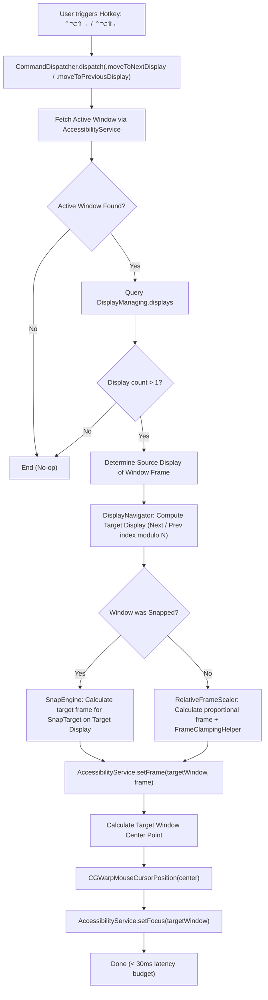

# 03 — Domain Model (Stage 4) — cross-display-window-throw

## Business Rules

- **`BR-DISP-007` (Display Topology Ordering)**:
  - Connected displays MUST be sorted horizontally from left to right:
    `sortedDisplays = displays.sorted { ($0.frame.minX, $0.frame.minY) < ($1.frame.minX, $1.frame.minY) }`.
  - Primary sort key is `screen.frame.minX` (AppKit coordinates); secondary tie-breaker is `screen.frame.minY`.

- **`BR-DISP-008` (Cyclic Display Traversal)**:
  - `Move to Next Display` targets index `(currentIndex + 1) % count`.
  - `Move to Previous Display` targets index `(currentIndex - 1 + count) % count`.
  - If `currentIndex` cannot be determined (e.g. window is between screens or off-screen), the fallback is `primaryDisplay`.

- **`BR-DISP-009` (Proportional Relative Scaling)**:
  - For free-floating windows, the window's position and size relative to `sourceDisplay.visibleFrame` MUST be preserved proportionally on `targetDisplay.visibleFrame`:
    - `relX = (window.x - src.minX) / src.width`
    - `relY = (window.y - src.minY) / src.height`
    - `relW = window.width / src.width`
    - `relH = window.height / src.height`
  - Clamped using `FrameClampingHelper` to guarantee the window is fully inside `targetDisplay.visibleFrame` with minimum visible dimensions (e.g. at least 200x200 pt).

- **`BR-DISP-010` (Semantic Snap Preservation)**:
  - If a window is snapped into a recognized `SnapTarget` (or was last placed by `SnapEngine`), FlowSnap MUST re-calculate the target frame using `SnapEngine.calculateFrame(target:on:gap:)` for the `targetDisplay`.
  - Applies target display's safe area (Menu Bar, Dock) and active `WindowGap`.

- **`BR-DISP-011` (Single-Display Graceful No-Op)**:
  - If `displays.count <= 1`, receiving `moveToNextDisplay` or `moveToPreviousDisplay` MUST return immediately with zero changes to window frame, zero cursor movement, and zero error alerts.

- **`BR-DISP-012` (Cursor Warping & Focus Maintenance)**:
  - Upon repositioning the window to the target display, FlowSnap MUST warp the system mouse pointer to the center of the newly positioned window:
    - `targetCenter = CGPoint(x: targetFrame.midX, y: targetFrame.midY)`
    - `CGWarpMouseCursorPosition(targetCenter)`
  - Accessibility focus MUST be re-asserted on the window element to prevent focus drop.

---

## State Transition & Execution Flow



---

## Domain Contracts & Signatures

```swift
public protocol DisplayNavigating: Sendable {
    func nextDisplay(after current: Display, in displays: [Display]) -> Display?
    func previousDisplay(before current: Display, in displays: [Display]) -> Display?
}

public struct RelativeFrameScaler: Sendable {
    public static func scale(
        frame: CGRect,
        from sourceBounds: CGRect,
        to targetBounds: CGRect,
        minSize: CGSize = CGSize(width: 200, height: 200)
    ) -> CGRect
}
```
