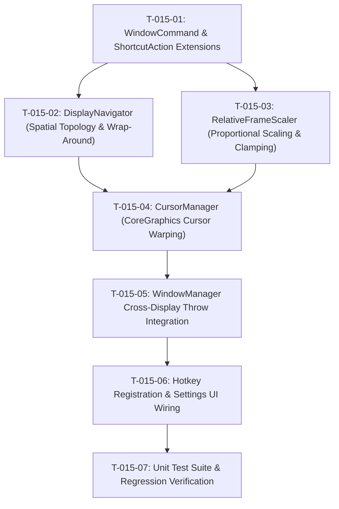

# Tasks: Cross-Display Window Throw (US-DISP-015)

- **Feature**: `cross-display-window-throw`
- **Specification**: [.specify/features/cross-display-window-throw/spec.md](file:///Users/vutuanhau/Documents/PROJECT/FlowSnap/.specify/features/cross-display-window-throw/spec.md)
- **Plan**: [.specify/features/cross-display-window-throw/plan.md](file:///Users/vutuanhau/Documents/PROJECT/FlowSnap/.specify/features/cross-display-window-throw/plan.md)

---

## Task Checklist & Execution Graph

---

### Phase 1: Domain Extensions

- [x] **T-015-01: Update `WindowCommand` & `ShortcutAction`**
  - Add `case moveToNextDisplay` and `case moveToPreviousDisplay` to `FlowSnap/Domain/Commands/WindowCommand.swift`.
  - Update `FlowSnap/Domain/Hotkeys/ShortcutAction.swift`:
    - Assign `defaultShortcut` for `.nextDisplay` (`⌃⌥⇧→`) and `.previousDisplay` (`⌃⌥⇧←`).
    - Map `defaultCommand` to `.moveToNextDisplay` and `.moveToPreviousDisplay`.
  - **Verify**: Project compiles cleanly with `swift build`.

---

### Phase 2: Core Spatial Topology & Scaling Engine

- [x] **T-015-02: Implement `DisplayNavigator.swift`**
  - Create `FlowSnap/Core/Display/DisplayNavigator.swift` conforming to `DisplayNavigating`.
  - Implement spatial left-to-right sorting by `minX` (tie-break `minY`).
  - Implement cyclic modulo index traversal for `nextDisplay` and `previousDisplay`.
  - Return `nil` when `displays.count <= 1`.
  - **Verify**: Unit tests in `FlowSnapTests/Core/Display/DisplayNavigatorTests.swift` cover horizontal, vertical, and single-monitor layouts.

- [x] **T-015-03: Implement `RelativeFrameScaler.swift`**
  - Create `FlowSnap/Core/Display/RelativeFrameScaler.swift`.
  - Implement proportional geometric scaling mapping relative percentages from source `visibleFrame` to target `visibleFrame`.
  - Integrate with `FrameClampingHelper` to enforce minimum window dimensions (200x200 pt) and 100% on-screen visibility.
  - **Verify**: Unit tests in `FlowSnapTests/Core/Display/RelativeFrameScalerTests.swift` test 4K -> FHD, FHD -> 4K, and off-center window translations.

---

### Phase 3: Infrastructure Cursor Management

- [x] **T-015-04: Implement `CursorManager.swift`**
  - Create `FlowSnap/Infrastructure/macOS/CursorManager.swift` conforming to `CursorWarping`.
  - Call `CGWarpMouseCursorPosition(point)`.
  - Provide `MockCursorManager` for test suites.
  - **Verify**: Mock tracks warp invocations in tests.

---

### Phase 4: Window Coordination

- [x] **T-015-05: Coordinate Cross-Display Throw in `WindowManager` & `CommandDispatcher`**
  - Extend `WindowManager` / `CommandDispatcher` to handle `.moveToNextDisplay` and `.moveToPreviousDisplay`.
  - Pipeline: Fetch focused window -> Check displays (guard > 1) -> Identify source display -> Compute target display via `DisplayNavigator` -> Calculate new frame (re-snap if snapped, scale if free-form) -> `AccessibilityService.setFrame` -> Warp cursor -> `AccessibilityService.setFocus`.
  - **Verify**: Integration tests verify correct execution order and zero-flicker single-display no-op.

---

### Phase 5: UI & Hotkey Wiring

- [x] **T-015-06: Connect Hotkeys & Settings UI**
  - Verify `GlobalHotkeyManager` registers `⌃⌥⇧→` and `⌃⌥⇧←` on launch.
  - Verify Settings UI `ShortcutSettingsView` reflects the default shortcuts under `Display Navigation`.
  - **Verify**: Keystroke recording and custom binding works in Settings.

---

### Phase 6: Test Suite & Verification

- [x] **T-015-07: Full Test Suite & Quality Gates**
  - Write test cases for all 6 requirements (`REQ-DISP-015-001` through `006`).
  - Run full test suite: `swift test` / `xcodebuild test`.
  - Ensure 0 regressions across all existing tests (372/372 passing).
