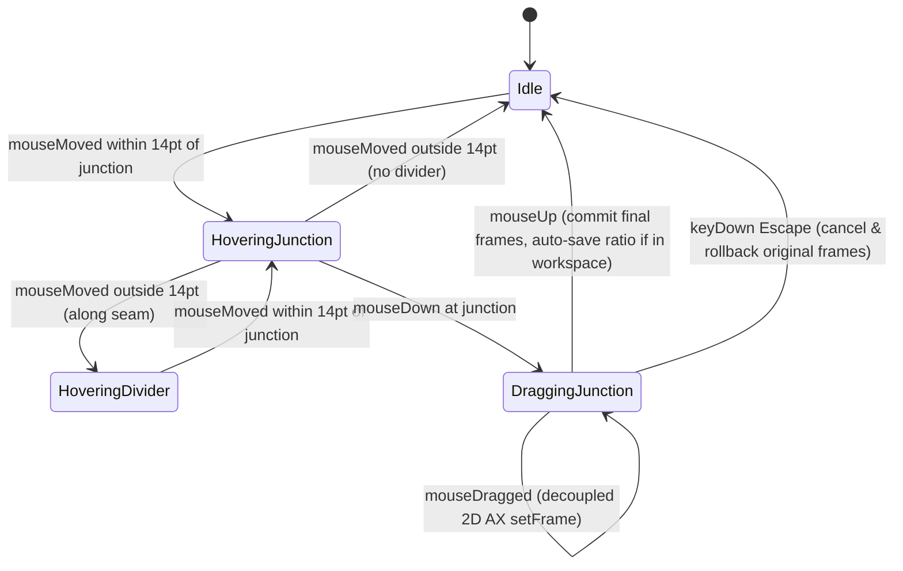

# Domain Models: Multi-Window T-Junction & Crosshair Divider Resize

- **Feature**: `cross-junction-divider-resize`
- **Protocol**: Bounded Task

---

## 1. Domain Entities & Value Objects

### `CrossJunction`

Represents an intersection point where a vertical divider and horizontal divider meet (forming either a 3-window T-junction or a 4-window Cross junction).

```swift
public struct CrossJunction: Equatable, Identifiable, Sendable {
    public var id: UUID
    public var point: CGPoint
    public var verticalDividerID: UUID
    public var horizontalDividerID: UUID
    public var hitRadius: CGFloat
    public var participatingWindowIDs: Set<CGWindowID>

    public func contains(_ testPoint: CGPoint) -> Bool {
        let dx = testPoint.x - point.x
        let dy = testPoint.y - point.y
        return (dx * dx + dy * dy) <= (hitRadius * hitRadius)
    }
}
```

---

## 2. State Machine



---

## 3. Business Rules (`BR-CJR-###`)

- **BR-CJR-001: Junction Detection**: Intersections between vertical and horizontal collinear edges are detected where a vertical seam coordinate falls within the horizontal seam's span and vice versa within tolerance $\le 8\,\text{pt}$.
- **BR-CJR-002: Proximity Priority**: If the cursor location is within $\le 14\,\text{pt}$ Euclidean distance of a `CrossJunction.point`, the junction handle takes priority over 1D edge dividers.
- **BR-CJR-003: Visual Affordance**: Hovering a junction switches the cursor to `NSCursor.crosshair` and illuminates a circular glowing accent handle pill centered on the junction point.
- **BR-CJR-004: Decoupled 2D Resizing**: Dragging a junction to target coordinate $(X, Y)$ applies vertical edge resize for the horizontal axis and horizontal edge resize for the vertical axis. Clamping against `minSize` is decoupled per axis—hitting horizontal min-width does not freeze vertical movement, and vice versa.
- **BR-CJR-005: Atomic Cancellation**: Pressing `Escape` (keyCode 53) during an active junction drag session immediately halts resizing, restores initial window frames across all participating windows, and dismisses the overlay.
- **BR-CJR-006: Non-Resizable Window Safety**: Windows with `isResizable == false` cannot participate in junction resizing. If a junction touches a fixed-size window, that fixed axis remains immovable.
