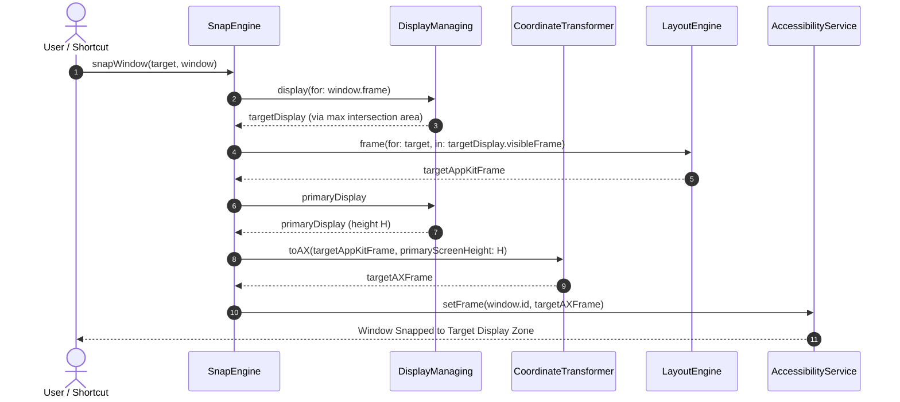

# Domain Model: Display-Aware Multi-Monitor Manipulation (US-SNAP-003)

- **Feature**: `display-aware-manipulation`
- **Stage**: BA Pipeline — Stage 4: Domain Modeling (Bounded Task)

---

## 1. Domain Entities & Value Objects

### 1.1 `Display` (Domain Model)

Represents an immutable snapshot of a physical or virtual screen connected to the macOS system.

```swift
public struct Display: Identifiable, Hashable, Sendable {
    public let id: CGDirectDisplayID
    public let frame: CGRect          // AppKit global coordinates (points)
    public let visibleFrame: CGRect   // Usable area excluding Dock & Menu Bar
    public let scaleFactor: CGFloat    // Retina scale (1.0, 2.0)
    public let isPrimary: Bool         // True when frame.origin == .zero

    public init(
        id: CGDirectDisplayID,
        frame: CGRect,
        visibleFrame: CGRect,
        scaleFactor: CGFloat,
        isPrimary: Bool? = nil
    ) {
        self.id = id
        self.frame = frame
        self.visibleFrame = visibleFrame
        self.scaleFactor = scaleFactor
        self.isPrimary = isPrimary ?? (frame.origin == .zero)
    }
}
```

### 1.2 `CoordinateTransformer` (Core Utility)

Pure functional math utility performing self-inverse coordinate transformations between AppKit and Accessibility API.

```swift
public struct CoordinateTransformer: Sendable {
    public static func toAX(rect: CGRect, primaryScreenHeight: CGFloat) -> CGRect {
        CGRect(
            x: rect.origin.x,
            y: primaryScreenHeight - (rect.origin.y + rect.height),
            width: rect.width,
            height: rect.height
        )
    }

    public static func toAppKit(rect: CGRect, primaryScreenHeight: CGFloat) -> CGRect {
        CGRect(
            x: rect.origin.x,
            y: primaryScreenHeight - (rect.origin.y + rect.height),
            width: rect.width,
            height: rect.height
        )
    }

    public static func toAX(point: CGPoint, primaryScreenHeight: CGFloat) -> CGPoint {
        CGPoint(x: point.x, y: primaryScreenHeight - point.y)
    }

    public static func toAppKit(point: CGPoint, primaryScreenHeight: CGFloat) -> CGPoint {
        CGPoint(x: point.x, y: primaryScreenHeight - point.y)
    }
}
```

### 1.3 `DisplayManaging` (Protocol)

Protocol abstraction decoupling display discovery and spatial navigation from system frameworks.

```swift
public protocol DisplayManaging: Sendable {
    var displays: [Display] { get async }
    var primaryDisplay: Display? { get async }
    func display(containing point: CGPoint) async -> Display?
    func display(for windowFrame: CGRect) async -> Display?
    func nextDisplay(after currentDisplay: Display) async -> Display?
}
```

---

## 2. Business Rules

| Rule ID         | Name                       | Description                                                                                                                                                                                                                                                                                                                                                                                        |
| :-------------- | :------------------------- | :------------------------------------------------------------------------------------------------------------------------------------------------------------------------------------------------------------------------------------------------------------------------------------------------------------------------------------------------------------------------------------------------- |
| **BR-DISP-001** | Primary Display Reference  | The screen with AppKit `frame.origin == .zero` is the Primary Display. Its total frame height ($H_{Primary}$) must be used as the anchor height for global AX coordinate transformations across all screens.                                                                                                                                                                                       |
| **BR-DISP-002** | Target Display Resolution  | When resolving the target display for a window, calculate `CGRectIntersection(windowFrame, display.frame)` for each connected screen. The display yielding the maximum positive intersection area is the target. If intersection area is zero for all displays, fallback to the display containing current mouse cursor point; if cursor is outside all displays, fallback to the Primary Display. |
| **BR-DISP-003** | Inversion Involution Math  | AppKit-to-AX coordinate mapping is an exact mathematical involution: $Y_{AX} = H_{Primary} - (Y_{AppKit} + Height)$. Applying `toAppKit(toAX(rect, H), H)` must yield `rect` with zero floating-point drift.                                                                                                                                                                                       |
| **BR-DISP-004** | Reactive Screen Updates    | When `NSApplication.didChangeScreenParametersNotification` fires, `DisplayManager` asynchronously updates its internal cache without mutating window positions until the next explicit snap or restore command.                                                                                                                                                                                    |
| **BR-DISP-005** | Mirrored Screen Coalescing | When mirroring is active (`CGDisplayIsInMirrorSet`), mirrored secondary displays are coalesced into the active primary mirror master to prevent conflicting snap targets.                                                                                                                                                                                                                          |
| **BR-DISP-006** | Cyclic Display Navigation  | In multi-monitor environments ($\ge 2$ displays), `nextDisplay(after:)` cycles through displays in index order ($0 \to 1 \dots \to 0$). If only 1 display is connected, returns `nil` (no-op).                                                                                                                                                                                                     |
| **BR-DISP-007** | Sub-pixel Precision        | All coordinate transformations preserve exact `CGFloat` points without premature rounding or truncation.                                                                                                                                                                                                                                                                                           |

---

## 3. Sequence / Interaction Diagram


