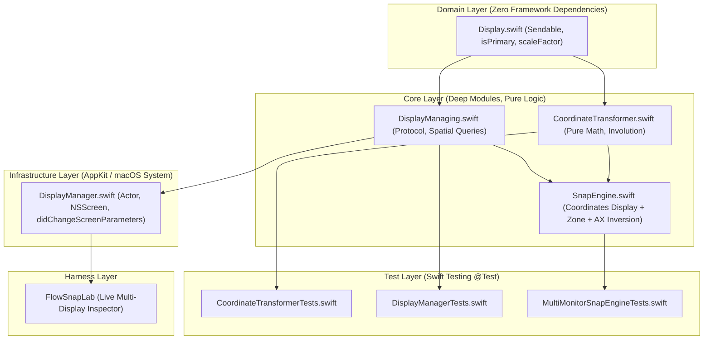

# Technical Implementation Plan: Display-Aware Multi-Monitor Manipulation (US-SNAP-003)

- **Feature**: `display-aware-manipulation`
- **Architect**: `system-architect`
- **Status**: Ready for Review (Gate 2)

---

## 1. Architectural Architecture & Module Topology

---

## 2. Implementation Slices

### Slice 1: Domain & Core Math (Data & Logic)

- Update `FlowSnap/Domain/Display/Display.swift` to add `isPrimary: Bool` with default initializer resolution (`frame.origin == .zero`).
- Implement `FlowSnap/Core/Display/CoordinateTransformer.swift` providing pure static bidirectional mapping:
  - `toAX(rect:primaryScreenHeight:)`
  - `toAppKit(rect:primaryScreenHeight:)`
  - `toAX(point:primaryScreenHeight:)`
  - `toAppKit(point:primaryScreenHeight:)`
- Implement failing test suite `FlowSnapTests/Core/CoordinateTransformerTests.swift` proving mathematical involution and edge cases (negative coordinates, sub-pixel precision).

### Slice 2: Core Abstraction & Infrastructure Adapter (API & System)

- Create `FlowSnap/Core/Display/DisplayManaging.swift` defining `displays`, `primaryDisplay`, `primaryScreenHeight`, `display(containing:)`, `display(for:cursorPoint:)`, and `nextDisplay(after:)`.
- Create `FlowSnap/Infrastructure/Display/DisplayManager.swift` actor:
  - Maps `NSScreen.screens` to `Display` domain entities.
  - Detects and coalesces mirrored screens using `CGDisplayIsInMirrorSet` and `CGDisplayMirrorsDisplay`.
  - Calculates maximum intersection area for windows straddling monitors.
  - Listens to `NSApplication.didChangeScreenParametersNotification` on MainActor and updates state.
- Create `FlowSnapTests/Infrastructure/DisplayManagerTests.swift` using mock screen topologies.

### Slice 3: SnapEngine Multi-Display Integration (Coordination)

- Enhance `FlowSnap/Core/Layout/SnapEngine.swift` to support display-aware snapping:
  - Resolves target display from `displayManager` if not explicitly specified.
  - Performs layout calculation in `targetDisplay.visibleFrame`.
  - Converts target AppKit frame to AX frame using `CoordinateTransformer.toAX(rect:primaryScreenHeight:)`.
  - Adds `calculateFrame(for:window:onNextDisplay:)` utilizing `displayManager.nextDisplay(after:)`.
- Create `FlowSnapTests/Core/MultiMonitorSnapEngineTests.swift`.

### Slice 4: FlowSnapLab & Verification

- Update `FlowSnapLabApp.swift` with multi-monitor inspection view.
- Run `xcodegen generate`.
- Run full test suite: `xcodebuild test -project FlowSnap.xcodeproj -scheme FlowSnapTests -destination 'platform=macOS'`.
