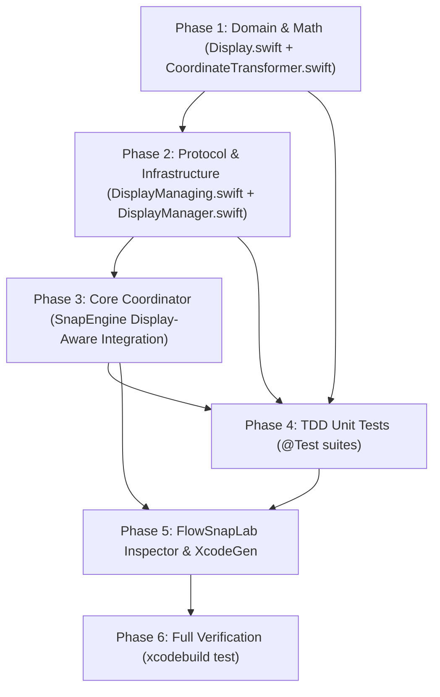

# Tasks Breakdown: Display-Aware Multi-Monitor Manipulation (US-SNAP-003)

- **Feature**: `display-aware-manipulation`
- **Architect**: `system-architect`
- **Status**: Ready for Execution (Pending Gate 2 Sign-Off)

---

## Dependency Order & Implementation Strategy

---

## Phase 1: Domain & Core Coordinate Math

- [x] **T-1.1**: Update `FlowSnap/Domain/Display/Display.swift` to add `isPrimary: Bool` with default initializer value `frame.origin == .zero`.
- [x] **T-1.2**: Implement `FlowSnap/Core/Display/CoordinateTransformer.swift` with pure static bidirectional math (`toAX`, `toAppKit`) for `CGRect` and `CGPoint`.
- [x] **T-1.3**: Create `FlowSnapTests/Core/CoordinateTransformerTests.swift` verifying standard conversions, exact mathematical involution, negative screen origins, and sub-pixel float precision.

---

## Phase 2: Core Abstraction & Infrastructure Adapter

- [x] **T-2.1**: Create `FlowSnap/Core/Display/DisplayManaging.swift` protocol defining `displays`, `primaryDisplay`, `primaryScreenHeight`, `display(containing:)`, `display(for:cursorPoint:)`, and `nextDisplay(after:)`.
- [x] **T-2.2**: Implement `FlowSnap/Infrastructure/Display/DisplayManager.swift` actor:
  - Enumerates `NSScreen.screens` to `Display` models.
  - Coalesces mirrored screens using `CGDisplayIsInMirrorSet`.
  - Computes maximum intersection area for overlapping/straddling windows with cursor/primary fallback (`BR-DISP-002`).
  - Implements cyclic `nextDisplay(after:)` (`BR-DISP-006`).
  - Listens to `NSApplication.didChangeScreenParametersNotification` on MainActor.
- [x] **T-2.3**: Create `FlowSnapTests/Infrastructure/DisplayManagerTests.swift` verifying target screen selection, straddling window overlap, negative coordinate displays, and notification observation.

---

## Phase 3: SnapEngine Multi-Display Coordination

- [x] **T-3.1**: Enhance `FlowSnap/Core/Layout/SnapEngine.swift`:
  - Add `calculateAXFrame(for:window:on:primaryScreenHeight:gap:)` converting target AppKit frames to AX coordinates via `CoordinateTransformer`.
  - Add `calculateFrame(for:window:displayManager:gap:)` resolving target display automatically via `displayManager.display(for:cursorPoint:)`.
  - Add `calculateFrame(for:window:target:moveToNextDisplayVia:)` implementing cross-monitor zone migration.
- [x] **T-3.2**: Create `FlowSnapTests/Core/MultiMonitorSnapEngineTests.swift` testing display-aware snapping and cross-display migration.

---

## Phase 4: FlowSnapLab & Project Harness

- [x] **T-4.1**: Update `FlowSnapLab/FlowSnapLabApp.swift` with live multi-display monitor inspector (screens, frame, visible bounds, primary height, scale factor).
- [x] **T-4.2**: Run `xcodegen generate` to register all new source and test files in `FlowSnap.xcodeproj`.

---

## Phase 5: Verification & DoD Compliance

- [x] **T-5.1**: Run `xcodebuild test -project FlowSnap.xcodeproj -scheme FlowSnapTests -destination 'platform=macOS'`.
- [x] **T-5.2**: Verify zero build warnings, 100% test pass, and strict Swift 6 concurrency compliance.
