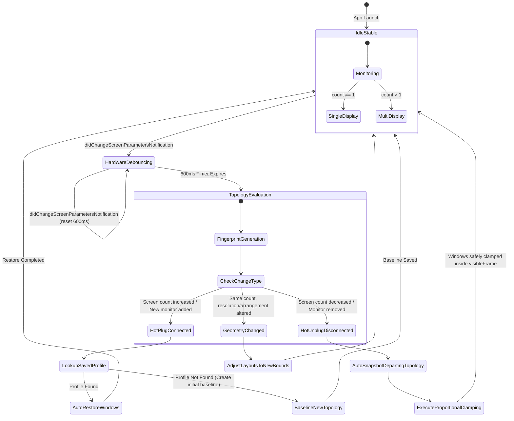
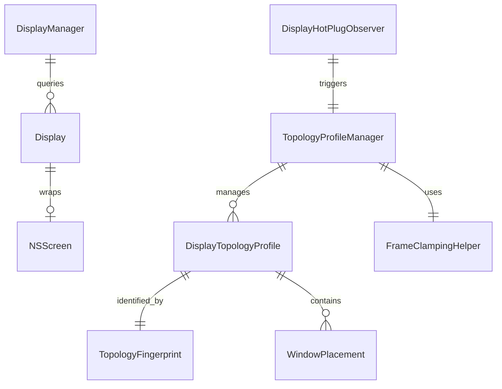

# 03 — Domain Model & Business Rules: Display Topology Profiles & Hot-Plug Rebalancer (US-DISP-016)

## 1. Domain Entities

### 1.1 `TopologyFingerprint` (Value Object)

- **Type**: `RawRepresentable`, `Codable`, `Hashable`, `Sendable`, `CustomStringConvertible`
- **Fields**:
  - `rawValue: String` (SHA-256 hash string, e.g. `TOPOLOGY-a8f3b...`)
  - `displayCount: Int`
  - `displayDescriptions: [String]` (Human readable summary, e.g. `["Built-in Retina (1512x982)", "KG270 M5 (1920x1080)"]`)
- **Invariant**: Generated deterministically by sorting displays horizontally (`origin.x` ascending, tie-breaker `origin.y`).

### 1.2 `DisplayTopologyProfile` (Aggregate Root)

- **Type**: `Identifiable`, `Codable`, `Sendable`
- **Fields**:
  - `id: UUID`
  - `fingerprint: TopologyFingerprint`
  - `name: String` (e.g. `"Office Desk Dual Display"`, `"Home Studio"`, or auto-generated)
  - `capturedAt: Date`
  - `placements: [String: WindowPlacement]` (Key: Bundle ID -> placement intent)
  - `displayAssignments: [String: Int]` (Key: Bundle ID -> target display index in sorted topology)

### 1.3 `FrameClampingHelper` (Domain Service)

- **Type**: Pure geometric stateless helper, `Sendable`
- **Function**: `clamp(frame: CGRect, to visibleFrame: CGRect, titleBarHeight: CGFloat) -> CGRect`
- **Invariants**:
  - `clamped.width = min(frame.width, visibleFrame.width)`
  - `clamped.height = min(frame.height, visibleFrame.height)`
  - `clamped.minX >= visibleFrame.minX` and `clamped.maxX <= visibleFrame.maxX`
  - `clamped.minY >= visibleFrame.minY` (top edge below Menu Bar, titlebar safe)
  - `clamped.maxY <= visibleFrame.maxY` (bottom edge above Dock)

---

## 2. Finite State Machine (Topology Lifecycle)

---

## 3. Entity-Relationship Diagram (ERD)

---

## 4. Numbered Business Rules

- **`BR-DISP-007` (Deterministic Fingerprint Hash)**: The `TopologyFingerprint` MUST be computed by sorting all connected displays by horizontal origin (`origin.x` ascending, tie-breaker `origin.y`). The raw data string for SHA-256 hash MUST include screen count, screen UUIDs (or stable vendor/model identifiers), localized names, and `visibleFrame` dimensions.
- **`BR-DISP-008` (Debounce Coalescing Window)**: Upon receiving `NSApplication.didChangeScreenParametersNotification`, the system MUST delay processing by exactly 600ms. If another notification arrives before the timer expires, the timer resets to 600ms. No window repositioning is permitted during the debounce interval.
- **`BR-DISP-009` (Hot-Unplug Auto-Snapshot)**: When a display disconnection is detected (`newCount < oldCount`), the system MUST immediately snapshot the current positions of windows on the disconnecting displays and associate this snapshot with the departing `TopologyFingerprint`.
- **`BR-DISP-010` (Title Bar Safety Clamping)**: Any window transferred to the primary display due to an unplug event MUST be processed by `FrameClampingHelper`. The window's title bar (minimum 36pt vertical height) MUST be fully accessible inside `visibleFrame`, with `origin.y >= visibleFrame.minY` and `maxX <= visibleFrame.maxX`.
- **`BR-DISP-011` (Proportional Downscaling on Clamping)**: If a window's width or height exceeds `primaryDisplay.visibleFrame`, its dimensions MUST be proportionally downscaled to fit within the visible bounds while maintaining an aspect ratio no smaller than minimum app boundaries (200x200 pt).
- **`BR-DISP-012` (Zero-Prompt Auto-Restore on Reconnect)**: When a known `TopologyFingerprint` is detected after hot-plug, `TopologyProfileManager` MUST automatically restore all running applications recorded in the profile to their designated displays and zones without displaying a blocking confirmation modal.
- **`BR-DISP-013` (Graceful Missing App Handling)**: During auto-restore, if an application recorded in the profile is no longer running, `TopologyProfileManager` MUST skip that placement entry without error and continue restoring the remaining active applications.
- **`BR-DISP-014` (Public API Only)**: Fingerprinting, display detection, and window manipulation MUST use 100% public Apple APIs (`NSScreen`, `CGDisplayCreateUUIDFromDisplayID`, `AXUIElement`). Zero private CoreGraphics or SkyLight symbols are permitted.

---

## 5. Non-Functional Requirements (NFR)

- **Performance Latency**:
  - Debounce timer: 600ms coalescing.
  - Fingerprint computation: < 2ms (SHA-256 over ~200 bytes string).
  - Clamping execution for ≤ 10 windows: < 50ms total.
  - Auto-restore execution: < 150ms total.
- **Memory & Resource Safety**:
  - Observer tokens stored in ARC-managed `TokenBox` with automatic unregistering upon deallocation.
  - Zero memory leaks or retaining cycles in debounce closures.
- **Concurrency & Thread Safety**:
  - `TopologyProfileManager` and `DisplayHotPlugObserver` isolated to `@MainActor`.
  - Data transfer models conform to `Sendable`.
