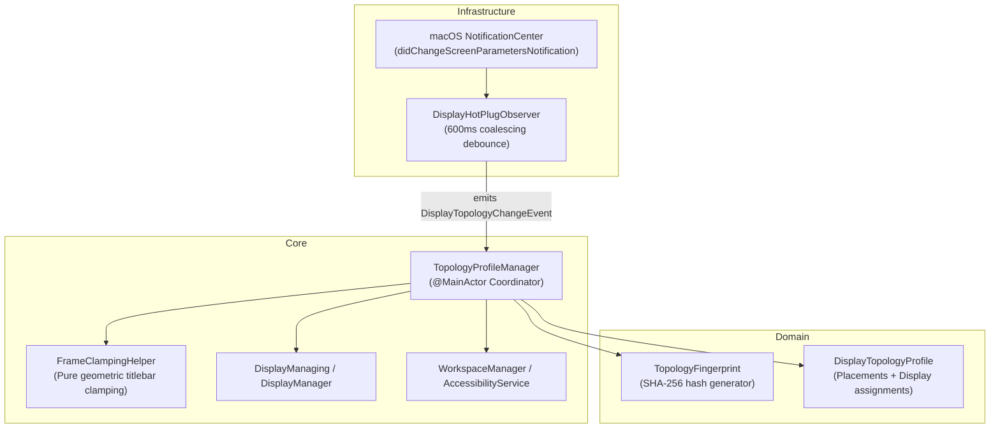

# Technical Architecture & Implementation Plan: US-DISP-016

## 1. Architectural Strategy & Deep Module Boundaries

US-DISP-016 implements **Display Topology Profiles & Hot-Plug Rebalancing** using John Ousterhout's Deep Modules principle: minimal, simple public interfaces hiding complex OS geometry calculations, notification debouncing, and state reconciliation.

### Deep Module Seams:

---

## 2. Proposed Source Changes

### Domain Layer

- **[NEW]** `FlowSnap/Domain/Display/TopologyFingerprint.swift`:
  - `TopologyFingerprint` struct (Hashable, Codable, Sendable).
  - Static generator `TopologyFingerprint.generate(from: [Display]) -> TopologyFingerprint`.
- **[NEW]** `FlowSnap/Domain/Display/DisplayTopologyProfile.swift`:
  - `DisplayTopologyProfile` struct (Identifiable, Codable, Sendable, Equatable).

### Core Layer

- **[NEW]** `FlowSnap/Core/Display/TopologyProfileManaging.swift`:
  - Protocol definition for `TopologyProfileManaging` and `DisplayTopologyChangeEvent`.
- **[NEW]** `FlowSnap/Core/Display/TopologyProfileManager.swift`:
  - Concrete `@MainActor` implementation coordinating auto-snapshot on disconnect and zero-prompt auto-restore on reconnect.
  - Integrates with `PreferencesStore` for persisting known profiles.

### Infrastructure Layer

- **[NEW]** `FlowSnap/Infrastructure/Display/DisplayHotPlugObserving.swift`:
  - Protocol for testable display hot-plug event observing.
- **[NEW]** `FlowSnap/Infrastructure/Display/DisplayHotPlugObserver.swift`:
  - Debounced listener for `NSApplication.didChangeScreenParametersNotification` with a 600ms coalescing timer.

### Application Wiring

- **[MODIFY]** `FlowSnap/App/AppDelegate.swift` / `FlowSnapApp.swift`:
  - Wire `DisplayHotPlugObserver` and `TopologyProfileManager` into `AppDependencies`.

### Unit & Integration Tests

- **[NEW]** `FlowSnapTests/Domain/TopologyFingerprintTests.swift`:
  - Verifies deterministic hashing across identical display layouts, screen re-ordering, and resolution differences.
- **[NEW]** `FlowSnapTests/Core/Display/TopologyProfileManagerTests.swift`:
  - Verifies auto-snapshot on disconnect, proportional clamping on unplug, and zero-prompt restore on reconnect.
- **[NEW]** `FlowSnapTests/Infrastructure/Display/DisplayHotPlugObserverTests.swift`:
  - Verifies 600ms debounce coalescing over multiple rapid-fire events.
- **[NEW]** `FlowSnapTests/Mocks/MockDisplayHotPlugObserver.swift`:
  - Test double simulating hot-plug and hot-unplug events synchronously.

---

## 3. Data Flow & Algorithmic Design

### A. Fingerprint Generation Algorithm (`TopologyFingerprint.generate`)

1. Receive `displays: [Display]`.
2. Sort displays deterministically: `displays.sorted { ($0.frame.minX, $0.frame.minY) < ($1.frame.minX, $1.frame.minY) }`.
3. For each display, build an attribute tuple:
   - Index: `0..<N`
   - Identifier: Display UUID string (via `CGDisplayCreateUUIDFromDisplayID` or fallback vendor/model hash)
   - Resolution: `Int(frame.width)xInt(frame.height)`
   - Visible frame: `Int(visibleFrame.origin.x),Int(visibleFrame.origin.y),Int(visibleFrame.width),Int(visibleFrame.height)`
4. Join into canonical string: `count:\(N)|0:\(id0):\(w0)x\(h0)...`.
5. Compute SHA-256 hash using `CryptoKit.SHA256`.
6. Return `TopologyFingerprint(rawValue: hashString, displayCount: N, displayDescriptions: names)`.

### B. Hot-Unplug Rebalancing Algorithm

1. Observer triggers `.hotUnplugDisconnected(newFingerprint, departingFingerprint)`.
2. Snapshot all windows across current screens before they get distorted. Save as profile for `departingFingerprint`.
3. Identify windows located outside the remaining display visible frame(s).
4. Run `FrameClampingHelper.clamp(frame: window.frame, to: primaryDisplay.visibleFrame, minVisibilityRatio: 1.0)`.
5. Apply clamped frames via `AccessibilityService.setFrame`.

### C. Hot-Plug Auto-Restore Algorithm

1. Observer triggers `.hotPlugConnected(newFingerprint, addedCount)`.
2. Look up saved `DisplayTopologyProfile` for `newFingerprint.rawValue`.
3. If found:
   - For each saved placement `(bundleID, placement)`:
     - Check if target display index exists in current `DisplayManager.displays`.
     - Target display `targetDisplay = displays[placement.displayIndex]`.
     - Calculate target frame on `targetDisplay` using `SnapEngine` (for snapped zones) or `RelativeFrameScaler` (for freeform frames).
     - Reposition window via `AccessibilityService.setFrame`.
4. If not found:
   - Capture current layout as baseline profile for this new topology.

---

## 4. Verification & Testing Strategy

- **Automated Tests**:
  - `swift test` running unit tests for `TopologyFingerprint`, `DisplayHotPlugObserver`, and `TopologyProfileManager`.
  - Mock display topology switching: 1 screen -> 2 screens (hot-plug), 2 screens -> 1 screen (hot-unplug).
- **Manual Verification**:
  - Verification with `FlowSnapLab` / simulated screen parameter notifications.
