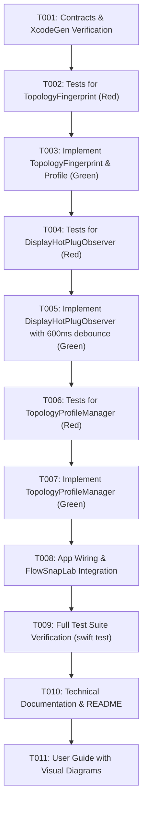

# Implementation Tasks: Display Topology Profiles & Hot-Plug Rebalancer (US-DISP-016)

## Overview & Dependency Graph

---

## Task Checklist

### Phase 1: Setup & Contracts Verification

- [ ] **T001**: Review `contracts/DisplayTopologyContracts.swift` and ensure XcodeGen targets (`FlowSnap`, `FlowSnapTests`, `FlowSnapLab`) compile without boundary warnings.

### Phase 2: Domain Layer (TDD)

- [ ] **T002**: [TEST] Write unit tests in `FlowSnapTests/Domain/TopologyFingerprintTests.swift` testing:
  - Deterministic SHA-256 hash output across display order permutations.
  - Distinct fingerprints for different resolution / aspect ratio configurations.
  - Human-readable summary descriptions.
- [ ] **T003**: [CODE] Implement `FlowSnap/Domain/Display/TopologyFingerprint.swift` and `FlowSnap/Domain/Display/DisplayTopologyProfile.swift`. Make tests in T002 pass.

### Phase 3: Infrastructure Layer (TDD)

- [ ] **T004**: [TEST] Write unit tests in `FlowSnapTests/Infrastructure/Display/DisplayHotPlugObserverTests.swift` testing:
  - 600ms coalescing debounce resetting when multiple rapid events fire within < 600ms.
  - Event dispatch on `@MainActor` upon timer expiration.
  - Clean observer deallocation with zero memory leaks.
- [ ] **T005**: [CODE] Implement `FlowSnap/Infrastructure/Display/DisplayHotPlugObserving.swift` and `FlowSnap/Infrastructure/Display/DisplayHotPlugObserver.swift`. Make tests in T004 pass.

### Phase 4: Core Layer (TDD)

- [ ] **T006**: [TEST] Write integration tests in `FlowSnapTests/Core/Display/TopologyProfileManagerTests.swift` testing:
  - Hot-Unplug event (`count: 2 -> 1`): Auto-snapshot taken for departing fingerprint; windows clamped inside primary `visibleFrame` via `FrameClampingHelper`.
  - Hot-Plug event (`count: 1 -> 2`): Reconnecting known fingerprint triggers zero-prompt auto-restore.
  - Missing app handling: Applications no longer running are gracefully skipped.
- [ ] **T007**: [CODE] Implement `FlowSnap/Core/Display/TopologyProfileManaging.swift` and `FlowSnap/Core/Display/TopologyProfileManager.swift`. Make tests in T006 pass.

### Phase 5: App Wiring & End-to-End Verification

- [ ] **T008**: [CODE] Connect `TopologyProfileManager` and `DisplayHotPlugObserver` in `FlowSnap/App/AppDependencies.swift` and `AppDelegate.swift`.
- [ ] **T009**: [VERIFY] Run full test suites (`swift test`) and verify 100% tests passing across all test suites with zero warnings.

### Phase 6: Documentation & Review

- [ ] **T010**: [DOCS] Create technical documentation `docs/features/display-topology-profiles-hotplug/README.md` and update feature index `docs/features/README.md`.
- [ ] **T011**: [DOCS] Create user visual guide `docs/user-guides/display-topology-profiles-hotplug.md` and update `docs/user-guides/README.md`.
- [ ] **T012**: [CLOSE] Update `docs/PRODUCT_BACKLOG_ROADMAP.md` to mark `US-DISP-016` as `[x]`.
