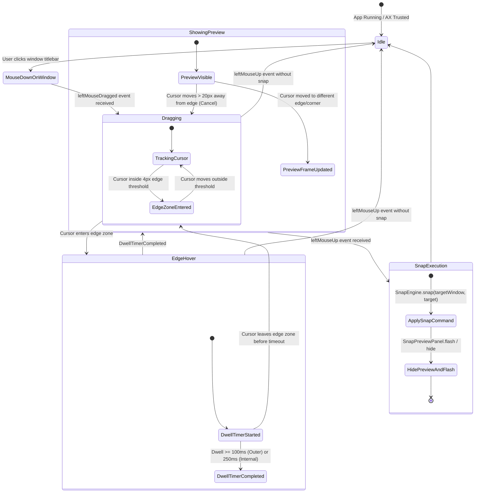

# Domain Model: Drag-to-Snap & HUD Snap Preview (US-SNAP-006)

## 1. Domain Entities & Protocols

### 1.1 `SnapDetector` (Core Domain Logic)

```swift
public struct SnapDetectionResult: Equatable, Sendable {
    public let target: SnapTarget
    public let previewFrame: CGRect
    public let displayID: CGDirectDisplayID
}

public protocol SnapDetecting: Sendable {
    func detectZone(
        at point: CGPoint,
        on display: Display,
        adjacentDisplays: [Display]
    ) -> SnapTarget?
}
```

### 1.2 `MouseDragTracking` Protocol

```swift
@MainActor
public protocol MouseDragTracking: AnyObject, Sendable {
    var isTracking: Bool { get }
    func startTracking(onDrag: @escaping @Sendable (CGPoint) -> Void, onRelease: @escaping @Sendable (CGPoint) -> Void)
    func stopTracking()
}
```

### 1.3 `SnapPreviewManaging` Protocol

```swift
@MainActor
public protocol SnapPreviewManaging: AnyObject, Sendable {
    var isPreviewVisible: Bool { get }
    func showPreview(frame: CGRect, displayID: CGDirectDisplayID)
    func hidePreview(animated: Bool)
    func flashSnapSuccess(frame: CGRect)
}
```

---

## 2. Finite State Machine (Drag-to-Snap Life Cycle)



---

## 3. Business Rules

- **BR-DRAG-001 (Edge Detection Threshold)**:
  - Khi con trỏ chuột di chuyển vào dải biên cách mép màn hình $\le 4\text{px}$, hệ thống ghi nhận sự kiện tiếp cận biên.
  - Cạnh biên ngoài cùng (không có màn hình liền kề): Kích hoạt sau thời gian dwell $\ge 100\text{ms}$.
  - Cạnh tiếp giáp giữa các màn hình (Internal adjacent borders): Kích hoạt sau thời gian dwell $\ge 250\text{ms}$ để cho phép di chuyển cửa sổ xuyên qua màn hình mượt mà.
- **BR-DRAG-002 (Snap Target Mapping)**:
  - **Left Edge** (vùng giữa 60% chiều cao): `SnapTarget.leftHalf` (50% bên trái).
  - **Right Edge** (vùng giữa 60% chiều cao): `SnapTarget.rightHalf` (50% bên phải).
  - **Top Edge** (vùng giữa 60% chiều rộng): `SnapTarget.maximize` (Toàn màn hình).
  - **Bottom Edge** (vùng giữa 60% chiều rộng): `SnapTarget.bottomHalf` (50% bên dưới).
  - **4 Corners** (20% chiều dài mỗi góc):
    - Top-Left: `SnapTarget.topLeft`
    - Top-Right: `SnapTarget.topRight`
    - Bottom-Left: `SnapTarget.bottomLeft`
    - Bottom-Right: `SnapTarget.bottomRight`
- **BR-DRAG-003 (HUD Snap Preview Overlay)**:
  - Lớp phủ `SnapPreviewPanel` là `NSPanel` dạng non-activating (`.nonactivatingPanel`), level `.floating`, không nhận chuột (`ignoresMouseEvents = true`), tuyệt đối không chiếm key focus.
  - Giao diện Liquid Glass với `NSVisualEffectView` (.hudWindow material), bo góc 10px, viền stroke 1.5px `Color.accentColor`.
  - Hiệu ứng xuất hiện mượt mà (fade-in 150ms) và biến mất êm dịu (fade-out 150ms).
- **BR-DRAG-004 (Release-to-Snap Execution)**:
  - Khi nhận sự kiện `leftMouseUp` trong trạng thái đang hiển thị Preview, `SnapEngine` lập tức thực thi snap cửa sổ active vào vùng mục tiêu tương ứng.
  - Tự động ẩn `SnapPreviewPanel` ngay sau khi lệnh snap được gửi.
- **BR-DRAG-005 (Cancel / Move-Away Dismissal)**:
  - Nếu người dùng kéo chuột ra xa mép màn hình $> 20\text{px}$ hoặc chuyển hướng di chuyển, lập tức hủy dwell timer và ẩn HUD preview mà không kích hoạt snap.
