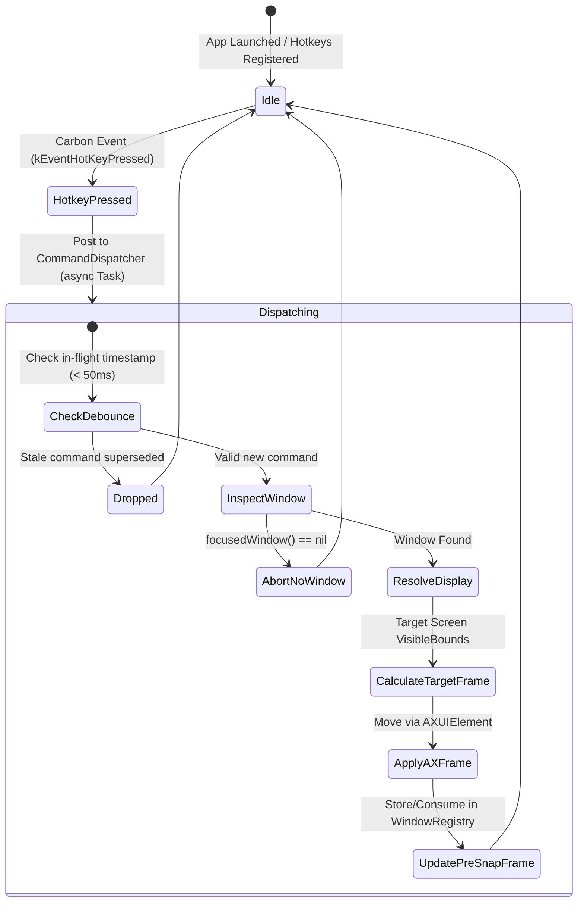

# Domain Model: Global Hotkeys & Command Dispatcher (US-SNAP-004)

- **Feature**: `global-hotkeys-dispatcher`
- **Stage**: BA Pipeline — Stage 4: Domain Modeling (Bounded Task)

---

## 1. Domain Entities & Value Objects

### 1.1 `KeyboardShortcut` (Value Object)

Represents an immutable physical key combination with modifiers, serialization, and human-readable formatting.

```swift
public struct KeyboardShortcut: Hashable, Codable, Sendable {
    public let keyCode: UInt32
    public let carbonModifiers: UInt32

    public init(keyCode: UInt32, carbonModifiers: UInt32) {
        self.keyCode = keyCode
        self.carbonModifiers = carbonModifiers
    }

    /// Formats shortcut into canonical macOS display glyphs (e.g. "⌃⌥←", "⌃⌥1").
    public var displayString: String { ... }
}
```

### 1.2 `HotkeyBinding` (Entity)

Associates a specific `KeyboardShortcut` with an executable `WindowCommand` and tracks its system registration status.

```swift
public struct HotkeyBinding: Identifiable, Hashable, Sendable {
    public let id: UInt32
    public let shortcut: KeyboardShortcut
    public let command: WindowCommand
    public let isRegistered: Bool

    public init(id: UInt32, shortcut: KeyboardShortcut, command: WindowCommand, isRegistered: Bool = false) {
        self.id = id
        self.shortcut = shortcut
        self.command = command
        self.isRegistered = isRegistered
    }
}
```

### 1.3 `WindowCommand` (Domain Command Enum)

Payload defining the intent of user actions, decoupled from keyboard, menu bar, or script triggers.

```swift
public enum WindowCommand: Hashable, Sendable {
    case snap(SnapTarget)
    case maximize
    case restore
    case minimize
    case moveToDisplay(CGDirectDisplayID)
    case restoreWorkspace(UUID)
    case saveWorkspace(String)
}
```

---

## 2. Service Contracts & Deep Module Interfaces

### 2.1 `GlobalHotkeyManaging` (Infrastructure Protocol)

Interface abstracting system-level hotkey registration and lifecycle.

```swift
public protocol GlobalHotkeyManaging: AnyObject, Sendable {
    /// Registers a single hotkey binding with an asynchronous action callback.
    func register(_ binding: HotkeyBinding, action: @escaping @Sendable (WindowCommand) -> Void) -> Bool

    /// Registers the standard FlowSnap default hotkey bindings.
    func registerDefaultHotkeys(action: @escaping @Sendable (WindowCommand) -> Void) -> [HotkeyBinding]

    /// Unregisters all currently installed hotkeys.
    func unregisterAll()

    /// Currently tracked bindings and registration health.
    var activeBindings: [HotkeyBinding] { get }
}
```

### 2.2 `CommandDispatching` (Core Protocol)

Coordinates command routing, active window lookup, display resolution, and async execution.

```swift
public protocol CommandDispatching: Sendable {
    /// Dispatches a window command asynchronously with latency budget < 50ms.
    func dispatch(_ command: WindowCommand) async throws
}
```

---

## 3. Business Rules (`BR-HOTKEY-###`)

| Rule ID           | Title                            | Statement & Invariant                                                                                                                                                                                                                                                                                |
| :---------------- | :------------------------------- | :--------------------------------------------------------------------------------------------------------------------------------------------------------------------------------------------------------------------------------------------------------------------------------------------------- |
| **BR-HOTKEY-001** | Default Shortcut Scheme          | System registers 8 default global shortcuts with `Control + Option` (`⌃⌥`):<br>- `⌃⌥←`: Snap Left 50%<br>- `⌃⌥→`: Snap Right 50%<br>- `⌃⌥↑`: Maximize<br>- `⌃⌥↓`: Restore pre-snap frame<br>- `⌃⌥1`: Top-Left 25%<br>- `⌃⌥2`: Top-Right 25%<br>- `⌃⌥3`: Bottom-Left 25%<br>- `⌃⌥4`: Bottom-Right 25% |
| **BR-HOTKEY-002** | Non-blocking Collision Tolerance | If a shortcut registration fails (`eventHotKeyExistsErr` / Carbon OSStatus != 0), mark `isRegistered = false`, log warning, and continue registering all remaining valid shortcuts. Never crash or abort app launch.                                                                                 |
| **BR-HOTKEY-003** | Latency Budget (< 50ms)          | Carbon C callback immediately offloads work via structured concurrency (`Task { ... }`) to `CommandDispatcher`. The hotkey thread must never perform synchronous file I/O or acquire blocking locks.                                                                                                 |
| **BR-HOTKEY-004** | Idempotent Snapping              | Re-triggering a shortcut for the zone a window already occupies preserves the frame and pre-snap state deterministically without unintended layout drift.                                                                                                                                            |
| **BR-HOTKEY-005** | Latest-Wins Debouncing           | `CommandDispatcher` drops stale pending executions within a 50ms debounce window when rapid consecutive keystrokes are received, executing only the latest intent.                                                                                                                                   |
| **BR-HOTKEY-006** | Active Window Guard              | If `focusedWindow()` returns `nil` (e.g. desktop or system alert focused), command dispatch terminates gracefully with zero side-effects.                                                                                                                                                            |

---

## 4. State Machine & Event Flow


