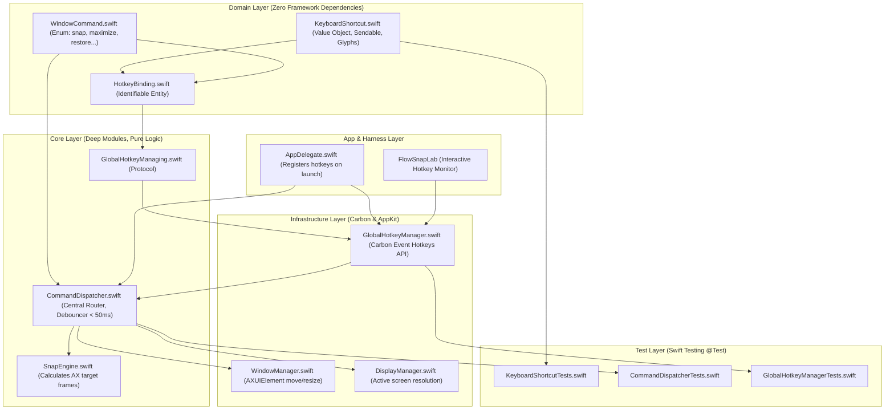

# Technical Implementation Plan: Global Hotkeys & Command Dispatcher (US-SNAP-004)

- **Feature**: `global-hotkeys-dispatcher`
- **Architect**: `system-architect`
- **Status**: Ready for Review (Gate 2)

---

## 1. Architectural Architecture & Module Topology

---

## 2. Implementation Slices

### Slice 1: Domain Models & Value Objects

- Define `FlowSnap/Domain/Hotkeys/KeyboardShortcut.swift`:
  - `keyCode: UInt32`, `carbonModifiers: UInt32`
  - Canonical `displayString` generator for macOS glyphs (`⌃`, `⌥`, `⇧`, `⌘`, arrow keys, numeric keys).
- Define `FlowSnap/Domain/Hotkeys/HotkeyBinding.swift`:
  - Associates `KeyboardShortcut` with `WindowCommand` and tracks `isRegistered: Bool`.
- Test suite: `FlowSnapTests/Domain/KeyboardShortcutTests.swift` testing display formatting and equality.

### Slice 2: Infrastructure Hotkey Manager (Carbon Events)

- Define `FlowSnap/Core/Hotkeys/GlobalHotkeyManaging.swift` protocol.
- Implement `FlowSnap/Infrastructure/Hotkeys/GlobalHotkeyManager.swift`:
  - Uses Carbon `RegisterEventHotKey` with custom `EventHotKeyID`.
  - Installs application-level event handler (`kEventClassKeyboard`, `kEventHotKeyPressed`).
  - Implements graceful skip on `eventHotKeyExistsErr` (`BR-HOTKEY-002`).
  - Implements `unregisterAll()` and handles cleanup in `deinit`.
- Mock double: `FlowSnapTests/Mocks/MockGlobalHotkeyManager.swift`.
- Test suite: `FlowSnapTests/Infrastructure/GlobalHotkeyManagerTests.swift`.

### Slice 3: Core Command Dispatcher & Debouncing

- Enhance `FlowSnap/Core/Commands/CommandDispatcher.swift`:
  - Inject `WindowManaging`, `SnapEngine`, `DisplayManaging`.
  - Implement async `dispatch(_ command: WindowCommand)`.
  - For `.snap(let target)`:
    1. Query focused window via `windowManager.focusedWindow()`.
    2. Guard against `nil` focused window (`BR-HOTKEY-006`).
    3. Query target display via `displayManager.display(for: window.frame, cursorPoint: nil)`.
    4. Calculate AX frame via `snapEngine.calculateAXFrame(...)`.
    5. Execute move via `windowManager.move(window, to: targetAXFrame)`.
  - Implement 50ms latest-wins debounce task cancellation (`BR-HOTKEY-005`).
- Test suite: `FlowSnapTests/Core/CommandDispatcherTests.swift` with mock window and display managers.

### Slice 4: App Integration, Harness & Lab

- Wire `GlobalHotkeyManager` and `CommandDispatcher` into `AppDelegate.swift` on launch.
- Add live shortcut monitor in `FlowSnapLab` showing registered shortcuts and execution log.
- Run `xcodegen generate` to update `FlowSnap.xcodeproj`.

---

## 3. Verification Plan

1. **Automated Tests**:
   - `KeyboardShortcutTests`: Validate keycode-to-glyph translation for all 8 default combinations.
   - `CommandDispatcherTests`:
     - Test left half snap dispatch to focused window.
     - Test maximize and restore dispatch.
     - Test safe no-op when no window is focused.
     - Test debounced cancellation of rapid back-to-back commands.
   - `GlobalHotkeyManagerTests`: Validate registration tracking and collision handling.
2. **End-to-End Build**:
   - Run `xcodebuild -project FlowSnap.xcodeproj -scheme FlowSnap -destination 'platform=macOS' test`.
   - Verify all tests pass with zero warnings.
