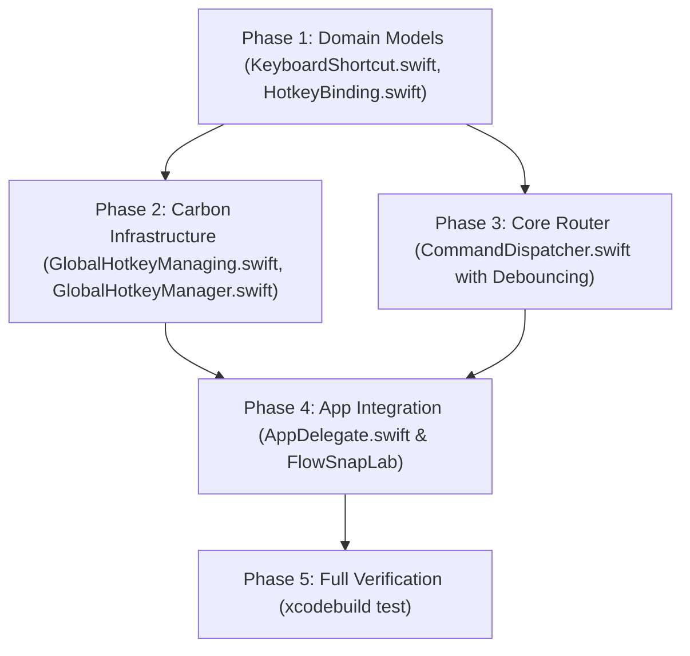

# Tasks Breakdown: Global Hotkeys & Command Dispatcher (US-SNAP-004)

- **Feature**: `global-hotkeys-dispatcher`
- **Architect**: `system-architect`
- **Status**: Completed & Verified (`56/56` tests passing)

---

## Dependency Order & Implementation Strategy

---

## Phase 1: Domain Models & Value Objects

- [x] **T-1.1**: Create `FlowSnap/Domain/Hotkeys/KeyboardShortcut.swift` value object with keycode, Carbon modifier mask, and canonical macOS display glyphs (`displayString`).
- [x] **T-1.2**: Create `FlowSnap/Domain/Hotkeys/HotkeyBinding.swift` entity associating a shortcut with a `WindowCommand` and tracking registration status.
- [x] **T-1.3**: Create `FlowSnapTests/Domain/KeyboardShortcutTests.swift` validating keycode-to-glyph translation for all 8 standard shortcuts (`⌃⌥←`, `⌃⌥→`, `⌃⌥↑`, `⌃⌥↓`, `⌃⌥1..4`).

---

## Phase 2: Global Hotkey Infrastructure (Carbon Event Hotkeys)

- [x] **T-2.1**: Update `FlowSnap/Core/Hotkeys/GlobalHotkeyManaging.swift` protocol defining `register`, `registerDefaultHotkeys`, `unregisterAll`, and `activeBindings`.
- [x] **T-2.2**: Implement `FlowSnap/Infrastructure/Hotkeys/GlobalHotkeyManager.swift`:
  - Registers hotkeys via Carbon `RegisterEventHotKey` and `InstallEventHandler`.
  - Binds 8 default shortcuts (`BR-HOTKEY-001`).
  - Implements non-blocking graceful skip on `eventHotKeyExistsErr` (`BR-HOTKEY-002`).
  - Safe event teardown via `UnregisterEventHotKey` in `unregisterAll()` and `deinit`.
- [x] **T-2.3**: Create `FlowSnapTests/Mocks/MockGlobalHotkeyManager.swift` and `FlowSnapTests/Infrastructure/GlobalHotkeyManagerTests.swift` validating registration, status tracking, and teardown.

---

## Phase 3: Core Command Dispatcher & Debouncing

- [x] **T-3.1**: Implement `FlowSnap/Core/Commands/CommandDispatcher.swift`:
  - Coordinates `WindowManaging`, `DisplayManaging`, and `SnapEngine`.
  - Dispatches `.snap`, `.maximize`, `.restore` asynchronously to the focused window.
  - Implements active window guard returning safe no-op if `focusedWindow() == nil` (`BR-HOTKEY-006`).
  - Implements latest-wins debouncing within a 50ms window (`BR-HOTKEY-005`).
- [x] **T-3.2**: Create `FlowSnapTests/Core/CommandDispatcherTests.swift` verifying left snap, maximize, restore, missing window guard, and debounced cancellation.

---

## Phase 4: App Integration, Harness & Lab

- [x] **T-4.1**: Wire `GlobalHotkeyManager` and `CommandDispatcher` into `FlowSnap/App/AppDelegate.swift` on `applicationDidFinishLaunching`.
- [x] **T-4.2**: Add live hotkey status inspector to `FlowSnapLab` displaying active hotkeys and simulated trigger buttons.
- [x] **T-4.3**: Run `xcodegen generate` to register all new domain, core, infrastructure, and test files in `FlowSnap.xcodeproj`.

---

## Phase 5: Verification & DoD Compliance

- [x] **T-5.1**: Run `xcodebuild -project FlowSnap.xcodeproj -scheme FlowSnap -destination 'platform=macOS' test` to verify all test suites pass.
- [x] **T-5.2**: Update `docs/PRODUCT_BACKLOG_ROADMAP.md` and feature documentation.
