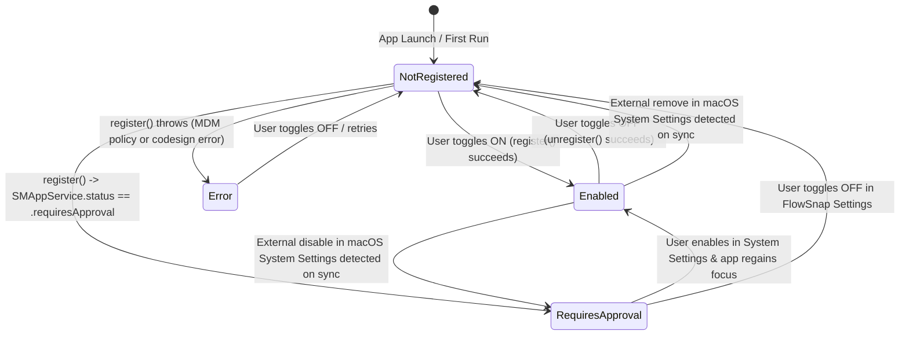

# 04 - Domain Modeling: Launch FlowSnap at Login (US-SNAP-024)

- **Feature**: Launch FlowSnap at Login Integration
- **Story ID**: `US-SNAP-024`
- **Slug**: `launch-at-login`
- **Date**: 2026-09-05
- **Status**: Complete

---

## 1. Ubiquitous Language & Core Models

### 1.1 Entities & Value Objects

```swift
/// Domain status representing the registration state of FlowSnap as a macOS login item.
public enum LaunchAtLoginStatus: Sendable, Equatable {
    case enabled
    case notRegistered
    case requiresApproval
    case notFound
    case error(String)

    public var isEnabled: Bool {
        self == .enabled
    }

    public var requiresUserApproval: Bool {
        self == .requiresApproval
    }
}

/// Abstract protocol for managing login item lifecycle via SMAppService or test doubles.
public protocol LaunchAtLoginManaging: Sendable {
    /// Queries the current status of FlowSnap as a login item.
    func currentStatus() -> LaunchAtLoginStatus

    /// Registers FlowSnap to launch at user login.
    func register() throws

    /// Unregisters FlowSnap from launching at user login.
    func unregister() throws

    /// Opens the macOS System Settings pane for Login Items & Extensions.
    func openSystemSettings()
}
```

---

## 2. Finite State Machine (FSM)



---

## 3. Business Rules (`BR-LAL-###`)

| Rule ID      | Name                                        | Statement                                                                                                                                                                                                                             | Enforcement Point                               |
| :----------- | :------------------------------------------ | :------------------------------------------------------------------------------------------------------------------------------------------------------------------------------------------------------------------------------------ | :---------------------------------------------- |
| `BR-LAL-001` | **System Single Source-of-Truth**           | FlowSnap must never assume login status based solely on persistent local cache; `LaunchAtLoginStatus` is derived directly from `LaunchAtLoginManaging.currentStatus()`.                                                               | `PreferencesStore.refreshLaunchAtLoginStatus()` |
| `BR-LAL-002` | **Explicit Intent Toggle**                  | Calling `setLaunchAtLogin(true)` attempts `register()`. If successful, `launchAtLogin` publishes `true`. If `register()` throws, the exception is caught, status is updated, and `launchAtLogin` reverts to `false`.                  | `PreferencesStore.setLaunchAtLogin(_:)`         |
| `BR-LAL-003` | **Clean Deregistration**                    | Calling `setLaunchAtLogin(false)` attempts `unregister()`. If successful, `launchAtLogin` publishes `false` and status becomes `.notRegistered`.                                                                                      | `PreferencesStore.setLaunchAtLogin(_:)`         |
| `BR-LAL-004` | **Two-Way Synchronization**                 | The application must synchronize its login item status when: (1) `PreferencesStore` is initialized, (2) `GeneralSettingsView` appears, and (3) `NSApplication.didBecomeActiveNotification` fires.                                     | `PreferencesStore` & `GeneralSettingsView`      |
| `BR-LAL-005` | **Approval Required Affordance**            | When status is `.requiresApproval`, the UI must display a non-modal informative indicator with a button that triggers `openSystemSettings()` via `x-apple.systempreferences:com.apple.LoginItems-Settings.extension`.                 | `GeneralSettingsView`                           |
| `BR-LAL-006` | **Zero Crash in Non-Installed Environment** | In uninstalled, Xcode preview, or unsigned developer builds where `SMAppService` returns `.notFound` or errors, the manager must catch the error gracefully, emit `.notFound` or `.error`, and never crash or trigger a `fatalError`. | `SystemLaunchAtLoginManager`                    |

---

## 4. Non-Functional Requirements (NFR)

1. **Performance**: Status query must complete in $< 5\,\text{ms}$ synchronously or asynchronously without blocking the main UI runloop.
2. **Security & Privacy**: Zero Private APIs. Strict adherence to Apple `ServiceManagement.SMAppService.mainApp` API (macOS 13.0+). No helper daemon or root privilege required.
3. **Testability**: 100% test coverage for all status transitions and error paths using an in-memory `MockLaunchAtLoginManager`.
