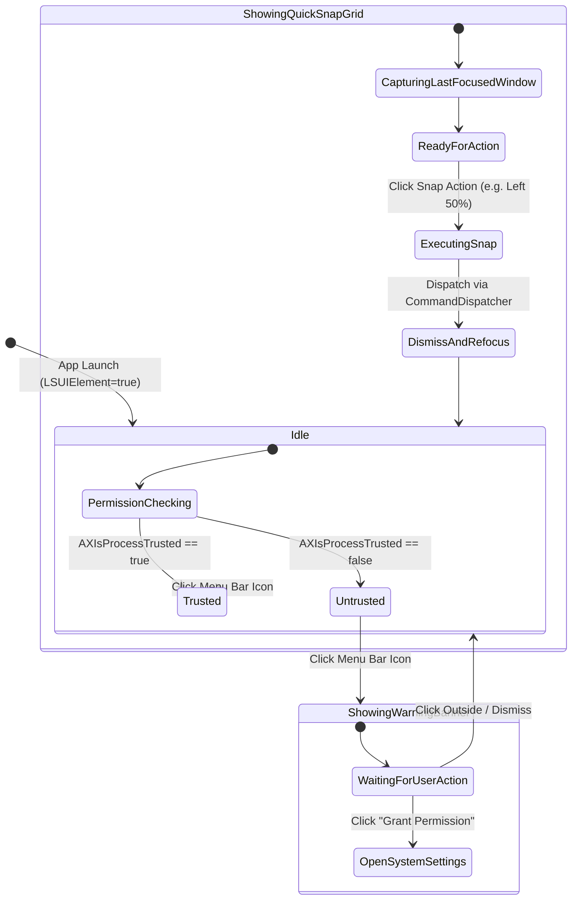

# Domain Model: Menu Bar Status Item & Quick Snap Controls (US-SNAP-005)

## 1. Domain Entities & Protocols

### 1.1 `MenuBarStatusItemManaging` Protocol

```swift
@MainActor
public protocol MenuBarStatusItemManaging: AnyObject, Sendable {
    var isMenuVisible: Bool { get }
    func setupStatusItem()
    func updatePermissionState(isTrusted: Bool)
    func hideMenu()
}
```

### 1.2 `MenuBarViewModel`

```swift
@Observable
@MainActor
public final class MenuBarViewModel {
    public var isAccessibilityTrusted: Bool = false
    public var targetWindowDescription: String?

    public func refreshState()
    public func triggerSnap(_ target: SnapTarget)
    public func requestAccessibilityPermission()
    public func openSettings()
    public func quitApp()
}
```

---

## 2. Finite State Machine (Menu Bar Life Cycle)



---

## 3. Business Rules

- **BR-MENU-001 (Agent App Execution)**: The application MUST run as a background agent app (`LSUIElement = true`) with zero icon in macOS Dock, retaining only the `NSStatusItem` in the system menu bar.
- **BR-MENU-002 (Target Window Preservation)**: Before displaying the menu or when selecting an action, the system captures the frontmost non-FlowSnap managed window (`lastFocusedWindow`). Snap actions are applied strictly to this captured window.
- **BR-MENU-003 (Instant Action & Auto-Dismiss)**: Triggering any quick snap action executes the command via `CommandDispatcher`, automatically dismisses the menu bar dropdown/popover, and restores active focus to the target window.
- **BR-MENU-004 (Permission Status Feedback)**: If accessibility permission is not granted:
  1. Status icon exhibits an alert indicator or state.
  2. The top row of the menu displays an interactive warning banner: `⚠️ Accessibility Permission Required [Grant Permission]`.
  3. Clicking "Grant Permission" prompts macOS AX dialog or opens `x-apple.systempreferences:com.apple.preference.security?Privacy_Accessibility`.
- **BR-MENU-005 (Quick Snap Grid Layout)**: The menu presents standard snap actions:
  - Halves: Left Half (`⌃⌥←`), Right Half (`⌃⌥→`), Top Half, Bottom Half.
  - Full / Restore: Maximize (`⌃⌥↑`), Restore (`⌃⌥↓`).
  - Quarters: Top-Left (`⌃⌥1`), Top-Right (`⌃⌥2`), Bottom-Left (`⌃⌥3`), Bottom-Right (`⌃⌥4`).
- **BR-MENU-006 (Standard System Actions)**: The menu includes separator-delimited system items:
  - Settings... (`⌘,`): Opens the Settings scene/window.
  - About FlowSnap / Version display.
  - Quit FlowSnap (`⌘Q`): Cleanly terminates application and unregisters global hotkeys.
