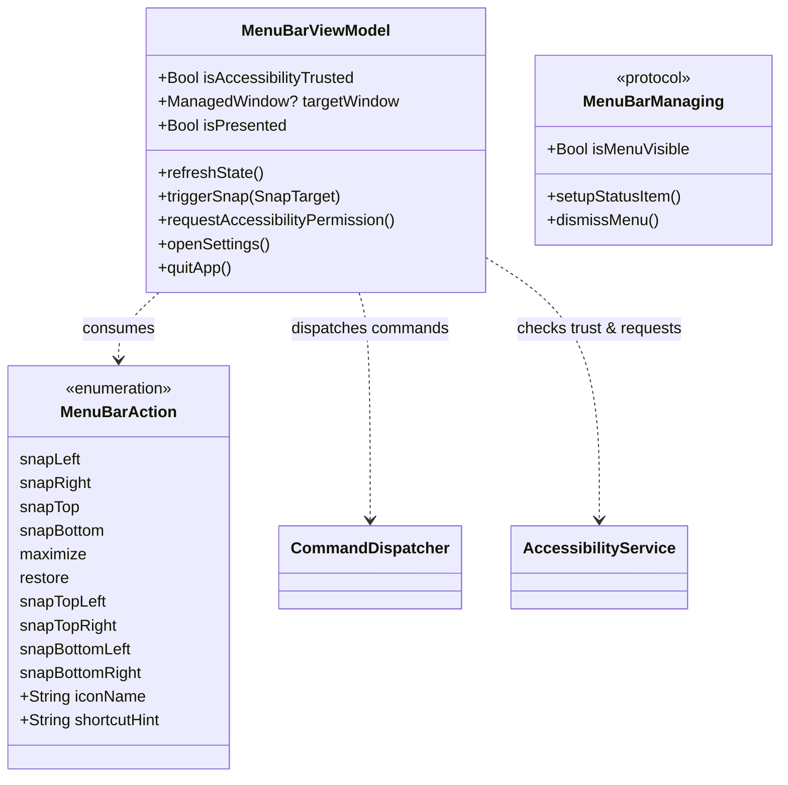

# Data Model: Menu Bar Status Item & Quick Snap Controls (US-SNAP-005)

## 1. Component State & Models

---

## 2. DTO & State Definitions

### `MenuBarViewModel`

State container isolated to `@MainActor`:

- `isAccessibilityTrusted: Bool`: Computed or updated on presentation to reflect AX permissions.
- `targetWindow: ManagedWindow?`: Snapshot of the window targeted for snapping when the menu is opened.
- `dismissHandler: (() -> Void)?`: Callback to close the menu bar popover after triggering an action.
