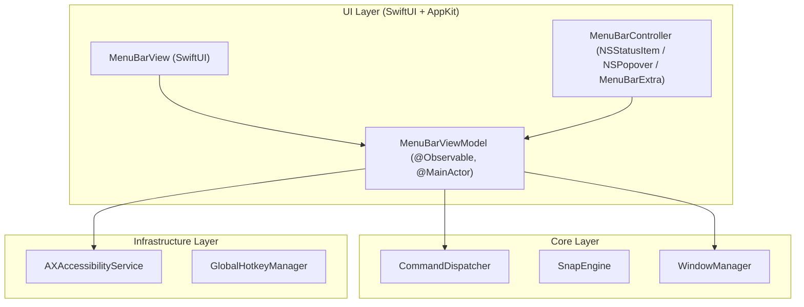

# Technical Architecture Plan: Menu Bar Status Item & Quick Snap Controls (US-SNAP-005)

## 1. Architecture Overview

---

## 2. Implementation Phases

### Phase 1: Domain & Contracts

- Define `MenuBarAction` and `MenuBarManaging` protocol.
- Integrate action types with `SnapTarget` and `WindowCommand`.

### Phase 2: ViewModel & State Management

- Implement `MenuBarViewModel` with `@Observable` and `@MainActor`.
- Inject `CommandDispatcher`, `AccessibilityService`, and `WindowManager`.
- Provide methods: `triggerSnap(action:)`, `requestAccessibilityPermission()`, `openSettings()`, `quitApp()`.

### Phase 3: SwiftUI UI Component

- Implement `MenuBarView` with:
  - Permission status banner (warning badge & 1-click system settings link).
  - Quick Snap 2-column or 3-column action card grid with SF Symbols and shortcut badges.
  - Divider with Settings and Quit commands.

### Phase 4: App Integration & Wiring

- Connect `MenuBarViewModel` in `AppDependencies`.
- Wire `MenuBarView` in `FlowSnapApp.swift` or `MenuBarController`.
- Verify `LSUIElement = true` in `Info.plist`.

### Phase 5: Testing & Verification

- Unit test `MenuBarViewModel` state transitions, permission reactions, and mock command dispatches.
