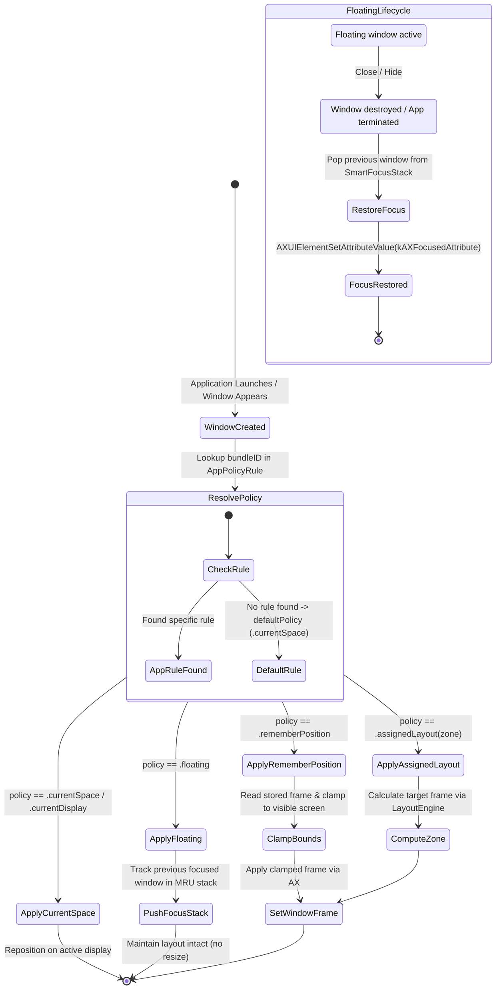

# Domain Model: Per-App Window Policies & Smart Floating Stack (US-WORK-014)

- **Feature**: `per-app-rules-floating-stack`
- **Stage**: BA Pipeline — Stage 4: Domain Modeling
- **Anchors**: `ASM-POLICY-001` (floating & smart stack), `ASM-POLICY-002` (clamped remembered position), `ASM-POLICY-003` (predefined canonical zones)

---

## 1. Entities & Value Objects

### 1.1 `WindowPolicy` (Domain Value Object)

Extends the placement policy enum to cleanly model all operational behaviors while remaining `Codable`, `Hashable`, and `Sendable`.

```swift
public enum WindowPolicy: Codable, Hashable, Sendable {
    /// Place window on the active Space and current display (default).
    case currentSpace

    /// Place window on the current active display.
    case currentDisplay

    /// Floating window: exempt from grid snapping and auto-tiling; tracks focus history.
    case floating

    /// Remember and restore the application's last known window position and size.
    case rememberPosition

    /// Snap to a canonical layout zone upon creation (e.g. leftHalf, rightHalf, maximize).
    case assignedLayout(LayoutZone)

    /// Assign to a specific named workspace by UUID.
    case assignedWorkspace(UUID)
}
```

### 1.2 `AppPolicyRule` (Entity)

Configurable policy record mapping a target application to its desired window behavior.

```swift
public struct AppPolicyRule: Identifiable, Codable, Hashable, Sendable {
    public let id: UUID
    public let bundleID: String
    public var appName: String
    public var policy: WindowPolicy
    public var iconName: String

    public init(
        id: UUID = UUID(),
        bundleID: String,
        appName: String,
        policy: WindowPolicy,
        iconName: String = "app.dashed"
    ) {
        self.id = id
        self.bundleID = bundleID
        self.appName = appName
        self.policy = policy
        self.iconName = iconName
    }
}
```

### 1.3 `RememberedFrame` (Value Object)

Represents saved geometry for an application with display identification metadata.

```swift
public struct RememberedFrame: Codable, Hashable, Sendable {
    public let bundleID: String
    public let frame: CGRect
    public let displayID: CGDirectDisplayID?
    public let savedAt: Date

    public init(bundleID: String, frame: CGRect, displayID: CGDirectDisplayID? = nil, savedAt: Date = Date()) {
        self.bundleID = bundleID
        self.frame = frame
        self.displayID = displayID
        self.savedAt = savedAt
    }
}
```

---

## 2. Core Business Rules

| Rule ID           | Title                     | Statement                                                                                                                                                                                                                                                                                                          | Enforcement Point                                |
| :---------------- | :------------------------ | :----------------------------------------------------------------------------------------------------------------------------------------------------------------------------------------------------------------------------------------------------------------------------------------------------------------- | :----------------------------------------------- |
| **BR-POLICY-001** | Priority Rule Precedence  | An explicit bundleID rule in `AppPolicyRule` strictly supersedes the global `defaultPolicy`. If no rule exists for a bundleID, `defaultPolicy` (.currentSpace) applies.                                                                                                                                            | `WindowPolicyManager.policy(forBundleID:)`       |
| **BR-POLICY-002** | Floating Layout Exemption | Windows belonging to an application governed by `.floating` MUST NOT be automatically repositioned, resized, or tiled when other windows snap or during workspace layout application.                                                                                                                              | `SnapEngine`, `LayoutEngine`, `WorkspaceManager` |
| **BR-POLICY-003** | Display Bounds Clamping   | Restored frames under `.rememberPosition` MUST be clamped inside the target display's `visibleBounds` such that: (a) origin $X \ge \text{minX}$, (b) origin $Y \ge \text{minY}$, (c) width $\le \text{displayWidth}$, (d) height $\le \text{displayHeight}$, (e) at least 80% of window area is visible on screen. | `RememberedFrameStore.clampedFrame(for:in:)`     |
| **BR-POLICY-004** | Smart Focus Restoration   | When a floating application window is closed or destroyed (`kAXUIElementDestroyedNotification`), FlowSnap pops the previous non-floating window from `SmartFocusStack` and sets its AX focus (`AXUIElementSetAttributeValue(kAXFocusedAttribute)`).                                                                | `SmartFocusStack.popAndRestoreFocus()`           |
| **BR-POLICY-005** | Canonical Zone Layout     | An application configured with `.assignedLayout(zone)` calculates its placement using `LayoutEngine.calculateFrame(zone, in: display.visibleFrame)` and repositions immediately upon `windowCreated`.                                                                                                              | `WindowPolicyManager.applyPolicy(for:)`          |

---

## 3. State Transition Model



---

## 4. Non-Functional Requirements (NFRs)

- **Performance**: Policy resolution and frame calculation must complete within **< 10ms**.
- **Public API Mandate**: No private CGS APIs used for floating window levels. Floating behavior relies strictly on standard window level + focus management.
- **Safety**: Clamping calculation is purely mathematical and cannot crash on zero or NaN display bounds.
- **Persistence**: Per-app rules and remembered frames are stored atomically in `PreferencesStore` (`UserDefaults`), synchronized instantly across UI and core engine.
