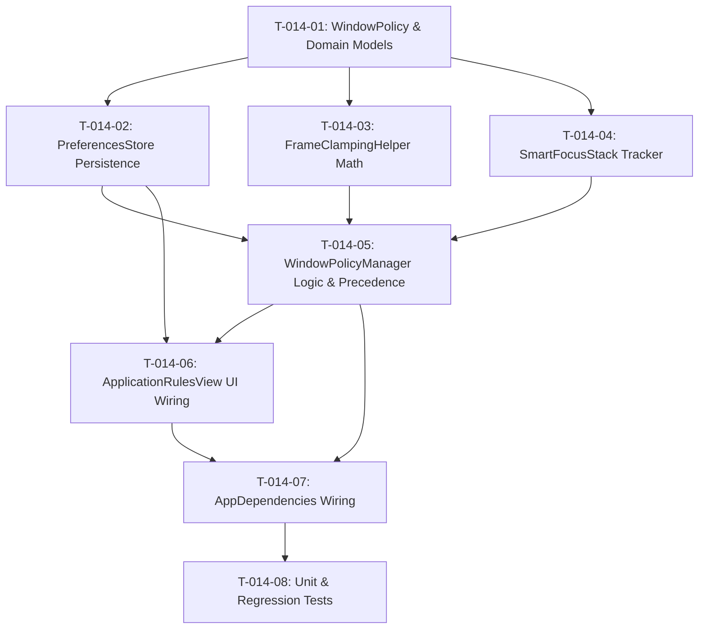

# Tasks: Per-App Window Policies & Smart Floating Stack (US-WORK-014)

- **Feature**: `per-app-rules-floating-stack`
- **Specification**: [.specify/features/per-app-rules-floating-stack/spec.md](file:///Users/vutuanhau/Documents/PROJECT/FlowSnap/.specify/features/per-app-rules-floating-stack/spec.md)
- **Plan**: [.specify/features/per-app-rules-floating-stack/plan.md](file:///Users/vutuanhau/Documents/PROJECT/FlowSnap/.specify/features/per-app-rules-floating-stack/plan.md)

---

## Task Checklist & Execution Graph

---

### Phase 1: Domain Entities & Model Extensions

- [x] **T-014-01: Update `WindowPolicy.swift` & Create Domain Entities**
  - Update `WindowPolicy` enum to support `case assignedLayout(LayoutZone)`.
  - Create `FlowSnap/Domain/Policy/AppPolicyRule.swift` (Codable, Identifiable, Hashable, Sendable).
  - Create `FlowSnap/Domain/Policy/RememberedFrame.swift` (Codable, Hashable, Sendable).
  - **Verify**: `swift build` passes without concurrency warnings.

---

### Phase 2: Persistence Layer

- [x] **T-014-02: Extend `PreferencesStore.swift` for Per-App Rules & Remembered Frames**
  - Add `@Published public private(set) var appRules: [AppPolicyRule]`.
  - Add `@Published public private(set) var rememberedFrames: [String: RememberedFrame]`.
  - Implement `setAppRule(_ rule: AppPolicyRule)`, `removeAppRule(forBundleID:)`.
  - Implement `saveRememberedFrame(_ frame: CGRect, forBundleID:displayID:)`, `rememberedFrame(forBundleID:)`.
  - **Verify**: Unit tests verify serialization to and from UserDefaults.

---

### Phase 3: Core Calculations & Policy Coordination

- [x] **T-014-03: Implement `FrameClampingHelper.swift`**
  - Create mathematical clamping utility ensuring minimum 80% visibility and bounding within screen limits.
  - **Verify**: Unit test diverse screen rects and edge cases (negative coordinates, disconnected larger screens).

- [x] **T-014-04: Implement `SmartFocusStack.swift`**
  - Create `@MainActor` tracker for window focus history.
  - Provide `recordFocus(windowID:isFloating:)` and `removeFloatingWindow(windowID:) -> CGWindowID?`.
  - **Verify**: Unit tests verify LIFO focus restoration to non-floating windows.

- [x] **T-014-05: Upgrade `WindowPolicyManager.swift`**
  - Inject `PreferencesStore` (or rule lookup closure) into `WindowPolicyManager`.
  - Implement `.floating`, `.rememberPosition`, and `.assignedLayout(LayoutZone)` branches in `applyPolicy(for:)`.
  - Connect `SmartFocusStack` to restore focus on floating window closure.
  - **Verify**: Tests prove specific bundleID rule overrides default policy.

---

### Phase 4: UI Experience

- [x] **T-014-06: Connect `ApplicationRulesView.swift` to Live Store**
  - Replace hardcoded `@State private var rules` with binding to `PreferencesStore.appRules`.
  - Add interactive sheet to pick apps from running apps / `/Applications`.
  - Provide policy picker dropdown with canonical zone selector when `.assignedLayout` is chosen.
  - **Verify**: Adding or editing a rule updates `PreferencesStore` immediately.

---

### Phase 5: Integration & Verification

- [x] **T-014-07: Wire `AppDependencies.swift`**
  - Pass `preferencesStore` into `windowPolicyManager`.
  - **Verify**: Xcode build cleanly links all dependencies.

- [x] **T-014-08: Complete Test Suites & Verification**
  - Write unit test cases in `FlowSnapTests/Core/Policy/WindowPolicyManagerTests.swift` covering all 4 policies, rule precedence, bounds clamping, and focus stack.
  - Run full test suite: `swift test`.
  - Verify 0 regressions.
