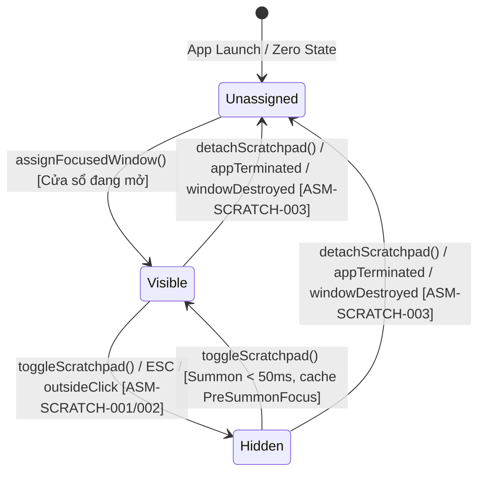

# 03 — Domain Model & Architecture — quake-scratchpad-instant-toggle

> Feature: `US-SNAP-022: Quake-Style Quick Scratchpad & Instant Window Toggle`  
> Domain Layer: Core / Overlay & Window Management  
> Concurrency Model: Swift 6 Strict Concurrency (`@MainActor`, `Sendable`)

---

## 1. Domain Overview & Purpose

Cung cấp cơ chế lớp phủ tiện ích tức thì (Quake-style Scratchpad) trên macOS:

- Người dùng chỉ định một cửa sổ công việc phụ trợ (terminal iTerm2/Terminal, notes, calculator, tra cứu tài liệu...) làm Quick Scratchpad.
- Khi đang làm việc tập trung trên bất kỳ ứng dụng nào khác (ví dụ Brave lướt web full-screen hoặc VS Code code chia 2 cột), chỉ cần nhấn `⌥Space`: Cửa sổ Scratchpad ngay lập tức xuất hiện nổi trên cùng trước mặt người dùng và nhận bàn phím để gõ lệnh hoặc tra cứu.
- Khi nhấn lại `⌥Space`, hoặc nhấn `ESC`, hoặc click chuột ra ngoài (nếu bật tùy chọn), Scratchpad ngay lập tức biến mất trả lại 100% không gian cho ứng dụng chính, hoàn toàn không làm xê dịch hay co nhỏ ứng dụng chính dù chỉ 1 pixel.

---

## 2. State Machine



### State Transitions & Trigger Matrix

| Current State        | Event / Trigger         | Target State      | Actions & Side Effects                                                                                                                  |
| :------------------- | :---------------------- | :---------------- | :-------------------------------------------------------------------------------------------------------------------------------------- |
| `unassigned`         | `assignFocusedWindow()` | `visible(record)` | Đăng ký `ScratchpadRecord`, lưu PID/WindowID, cập nhật Menu Bar.                                                                        |
| `visible(record)`    | `toggleScratchpad()`    | `hidden(record)`  | Thực thi Hybrid Dismiss (`app.hide()` nếu 1 cửa sổ, hoặc de-activate / lower layer nếu ≥ 2 cửa sổ); hoàn trả focus về `preSummonFocus`. |
| `visible(record)`    | `pressESC()`            | `hidden(record)`  | Intercept ESC khi Scratchpad là key window, thực thi dismiss tức thì.                                                                   |
| `visible(record)`    | `clickOutside()`        | `hidden(record)`  | Nếu `dismissOnBlur == true`, phát hiện click ngoài bounds và dismiss.                                                                   |
| `hidden(record)`     | `toggleScratchpad()`    | `visible(record)` | Chụp snapshot app/window đang có focus (`preSummonFocus`), gọi `kAXRaiseAction` và kích hoạt Scratchpad window trong < 50ms.            |
| `visible` / `hidden` | `detachScratchpad()`    | `unassigned`      | Giải phóng tham chiếu, dọn dẹp listeners, cập nhật Menu Bar thành "Chưa gán".                                                           |
| `visible` / `hidden` | `appTerminated`         | `unassigned`      | `NSWorkspace.didTerminateApplicationNotification` khớp PID -> auto-detach an toàn.                                                      |

---

## 3. Business Rules Reference

- **BR-SCRATCH-001: Instant Assignment & Registration**
  - Người dùng có thể chỉ định cửa sổ đang có tiêu điểm làm Scratchpad thông qua phím tắt toàn cục (`ShortcutAction.assignScratchpad` — mặc định `⌃⌥Space`) hoặc từ mục hành động trên Menu Bar.
  - Hệ thống ghi lại `ScratchpadRecord` (CGWindowID, PID, bundleID, appName, windowTitle) và phát tín hiệu cập nhật UI.
  - Nếu đã có cửa sổ Scratchpad trước đó, thao tác gán mới sẽ ghi đè và thay thế cửa sổ cũ.

- **BR-SCRATCH-002: Instant Summon Latency (< 50ms) & Zero-Shrink**
  - Khi nhấn phím tắt triệu hồi (`ShortcutAction.toggleScratchpad` — mặc định `⌥Space`), nếu Scratchpad đang ở trạng thái `hidden`:
    - Chụp lại thông tin ứng dụng và cửa sổ đang nhận tiêu điểm hiện tại (`PreSummonFocus`).
    - Nâng cửa sổ Scratchpad lên lớp trên cùng bằng `kAXRaiseAction` và kích hoạt ứng dụng chứa Scratchpad.
    - Thời gian phản hồi từ lúc nhận phím tắt đến khi cửa sổ nhận tiêu điểm bàn phím phải nhỏ hơn 50ms.
    - Ứng dụng nền (Brave, VS Code) giữ nguyên 100% kích thước và vị trí, tuyệt đối không co nhỏ hoặc thay đổi bố cục.

- **BR-SCRATCH-003: Hybrid Dismiss Mechanism**
  - Khi có lệnh ẩn (nhấn lại `⌥Space`, hoặc `ESC`, hoặc Click-outside):
    - Nếu ứng dụng chứa Scratchpad chỉ có 1 cửa sổ mở: gọi `NSRunningApplication.hide()`.
    - Nếu ứng dụng chứa Scratchpad có ≥ 2 cửa sổ mở: không gọi `hide()` để tránh làm giấu các cửa sổ công việc khác; kích hoạt lại `preSummonFocus` app và hạ độ ưu tiên hiển thị của Scratchpad.

- **BR-SCRATCH-004: Accurate Pre-Summon Focus Restoration**
  - Khi dismiss, tiêu điểm bàn phím phải được hoàn trả chính xác cho ứng dụng và cửa sổ đã lưu trong `PreSummonFocus`.
  - Nếu ứng dụng trước đó đã bị đóng hoặc không còn khả dụng, tiêu điểm trả về ứng dụng frontmost kế tiếp do macOS quản lý.

- **BR-SCRATCH-005: Dual Dismiss Triggers (ESC & Blur Configuration)**
  - Phím `ESC` mặc định kích hoạt lệnh ẩn khi Scratchpad đang nhận tiêu điểm (không nuốt ESC của app khác).
  - Tùy chọn `dismissOnBlur` trong `PreferencesStore` cho phép người dùng bật/tắt hành vi tự đóng khi click chuột ra ngoài cửa sổ Scratchpad. Mặc định là `false` để hỗ trợ sao chép / đối chiếu dữ liệu giữa Scratchpad và ứng dụng nền.

- **BR-SCRATCH-006: Safe Lifecycle Detach & Ghost Avoidance**
  - Tự động hủy gán (`detach`) khi ứng dụng Scratchpad bị tắt (`NSWorkspace.didTerminateApplicationNotification`) hoặc khi `AXUIElement` không còn hợp lệ (`kAXErrorInvalidUIElement`).
  - Menu Bar ngay lập tức cập nhật trạng thái "Chưa gán".

- **BR-SCRATCH-007: Stage Manager & Spaces Co-existence**
  - Cửa sổ Scratchpad được triệu hồi trực tiếp trên Space và Stage hiện hành mà không kích hoạt hiệu ứng chuyển Space của macOS.

- **BR-SCRATCH-008: Menu Bar Status & Quake Actions**
  - Menu Bar hiển thị trạng thái Scratchpad:
    - Nếu đã gán: Tên ứng dụng + Tiêu đề cửa sổ, nút "Triệu hồi / Ẩn (⌥Space)", nút "Hủy gán (Detach)".
    - Nếu chưa gán: Nút "Gán cửa sổ hiện tại làm Scratchpad (⌃⌥Space)".

---

## 4. Domain Models & Protocols

```swift
public struct ScratchpadRecord: Sendable, Equatable, Identifiable {
    public var id: CGWindowID { windowID }
    public let windowID: CGWindowID
    public let pid: pid_t
    public let bundleID: String?
    public let appName: String
    public let windowTitle: String?
    public let assignedAt: Date
}

public enum ScratchpadState: Sendable, Equatable {
    case unassigned
    case visible(record: ScratchpadRecord)
    case hidden(record: ScratchpadRecord)
}

public struct PreSummonFocus: Sendable, Equatable {
    public let pid: pid_t
    public let windowID: CGWindowID?
    public let timestamp: Date
}

@MainActor
public protocol ScratchpadCoordinating: AnyObject, Sendable {
    var state: ScratchpadState { get }
    var currentRecord: ScratchpadRecord? { get }
    var isVisible: Bool { get }

    func assignFocusedWindow() async -> Bool
    func toggleScratchpad() async -> Bool
    func summonScratchpad() async -> Bool
    func dismissScratchpad() async -> Bool
    func detachScratchpad()
}
```

---

## 5. Non-Functional Requirements (NFRs)

1. **Latency Budget**: Toàn bộ chu trình summon hoặc dismiss hoàn tất trong `< 50ms`.
2. **Zero Private API**: 100% tuân thủ Public Accessibility API (`AXUIElement`), `NSWorkspace`, và `NSRunningApplication`.
3. **Strict Concurrency**: Toàn bộ các cấu trúc dữ liệu tuân thủ Swift 6 `Sendable`, coordinator cô lập tại `@MainActor`.
4. **Memory Footprint**: Tiêu thụ thêm `< 1MB` RAM, 0% CPU khi nhàn rỗi (sử dụng Notification Center và Event Monitor có điều kiện).
