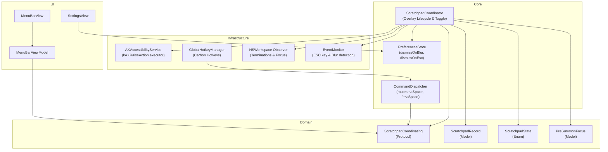

# Technical Architecture & Implementation Plan: quake-scratchpad-instant-toggle (US-SNAP-022)

## 1. Architectural Strategy & Deep Module Boundaries

US-SNAP-022 implements the **Quake-Style Quick Scratchpad & Instant Window Toggle** adhering strictly to Domain-Driven Design (DDD), John Ousterhout's Deep Modules principle, and Swift 6 Strict Concurrency:

- **Deep Module 1: `ScratchpadCoordinator` (`Core/Overlay`)**:
  - Implements `ScratchpadCoordinating`.
  - Encapsulates the entire Scratchpad lifecycle (`.unassigned`, `.visible`, `.hidden`).
  - Coordinates instant summon via `AccessibilityServing.raise` and `NSRunningApplication.activate`.
  - Implements Hybrid Dismiss: calls `NSRunningApplication.hide()` if the application has only 1 window; demotes layer and reactivates `PreSummonFocus` app if ≥ 2 windows.
  - Manages event monitoring for ESC key and click-outside blur with zero leaks and automatic monitor de-registration when inactive.
  - Subscribes to `NSWorkspace.didTerminateApplicationNotification` for automatic, safe lifecycle detach.

- **Deep Module 2: Global Hotkeys & Command Dispatcher**:
  - Adds `ShortcutAction.toggleScratchpad` (`Option + Space`) and `ShortcutAction.assignScratchpad` (`Control + Option + Space`).
  - Routes actions via `CommandDispatcher` directly to `ScratchpadCoordinator`.

- **Deep Module 3: Menu Bar Status & UI Integration**:
  - Injects `ScratchpadCoordinating` into `MenuBarViewModel`.
  - Displays assigned Scratchpad state (app name, window title) and action buttons in `MenuBarView`.
  - Adds configuration toggles (`scratchpadDismissOnBlur`, `scratchpadDismissOnEsc`) in `PreferencesStore` and `SettingsView`.

---

## 2. Proposed Source Changes

### Domain Layer

- **[NEW]** `FlowSnap/Domain/Scratchpad/ScratchpadRecord.swift`:
  - `CGWindowID`, `pid: pid_t`, `bundleID: String?`, `appName: String`, `windowTitle: String?`, `assignedAt: Date`.
- **[NEW]** `FlowSnap/Domain/Scratchpad/ScratchpadState.swift`:
  - `.unassigned`, `.visible(record:)`, `.hidden(record:)`.
- **[NEW]** `FlowSnap/Domain/Scratchpad/PreSummonFocus.swift`:
  - `pid: pid_t`, `windowID: CGWindowID?`, `timestamp: Date`.
- **[NEW]** `FlowSnap/Domain/Scratchpad/ScratchpadCoordinating.swift`:
  - MainActor protocol defining assignment, summon, dismiss, and detach.

### Core & Infrastructure Layer

- **[NEW]** `FlowSnap/Core/Scratchpad/ScratchpadCoordinator.swift`:
  - Implements `ScratchpadCoordinating`.
  - Handles state transitions, hybrid dismiss, focus restoration, event monitors, and termination observing.
- **[MODIFY]** `FlowSnap/Domain/Shortcut/ShortcutAction.swift`:
  - Add `case toggleScratchpad = "toggleScratchpad"` and `case assignScratchpad = "assignScratchpad"`.
- **[MODIFY]** `FlowSnap/Core/Hotkeys/GlobalHotkeyManager.swift`:
  - Register default shortcuts for `.toggleScratchpad` (`⌥Space`) and `.assignScratchpad` (`⌃⌥Space`).
- **[MODIFY]** `FlowSnap/Core/Dispatcher/CommandDispatcher.swift`:
  - Route `.toggleScratchpad` and `.assignScratchpad` commands to `ScratchpadCoordinator`.
- **[MODIFY]** `FlowSnap/Core/Storage/PreferencesStore.swift`:
  - Add `scratchpadDismissOnBlur: Bool` and `scratchpadDismissOnEsc: Bool`.

### UI Layer

- **[MODIFY]** `FlowSnap/UI/MenuBar/MenuBarViewModel.swift`:
  - Inject `ScratchpadCoordinating`, expose reactive properties for Scratchpad state.
- **[MODIFY]** `FlowSnap/UI/MenuBar/MenuBarView.swift`:
  - Render Scratchpad status and quick actions.
- **[MODIFY]** `FlowSnap/UI/Settings/SettingsView.swift`:
  - Render toggles for Scratchpad dismiss options and shortcut customization.

### App Injection Layer

- **[MODIFY]** `FlowSnap/App/AppDependencies.swift`:
  - Instantiate and inject `ScratchpadCoordinator`.

### Tests Layer

- **[NEW]** `FlowSnapTests/Mocks/MockScratchpadCoordinator.swift`:
  - Mock double for testing MenuBar, Dispatcher, and Settings interactions.
- **[NEW]** `FlowSnapTests/Core/Scratchpad/ScratchpadCoordinatorTests.swift`:
  - Swift Testing suite asserting assignment, summon (< 50ms), hybrid dismiss, focus restoration, and auto-detach.
