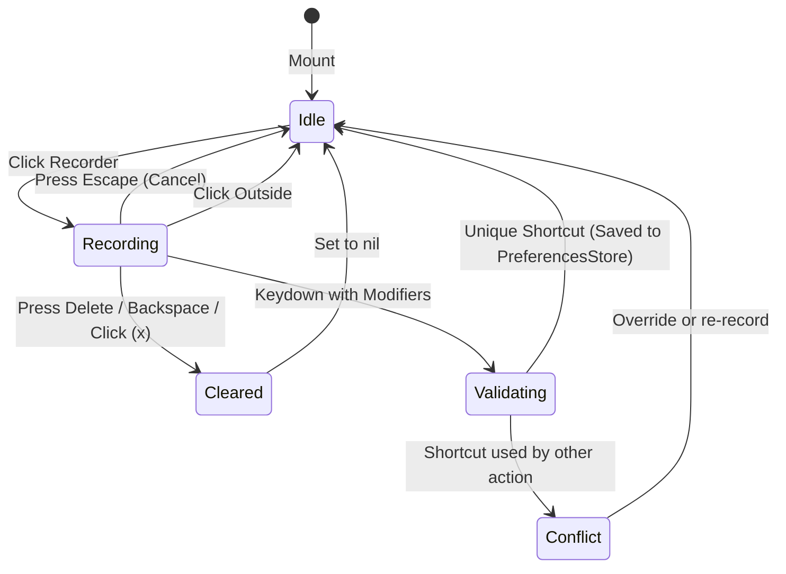

# Domain Model: Settings UI & Shortcut Customization (US-SNAP-010)

## Entities & Value Objects

### 1. `ShortcutAction` (Enum, CaseIterable, Codable, Hashable, Sendable)
Represents every configurable snap or window command in FlowSnap:
- `leftHalf` ("Left Half", default `⌃⌥←`, maps to `.snap(.zone(.leftHalf))`)
- `rightHalf` ("Right Half", default `⌃⌥→`, maps to `.snap(.zone(.rightHalf))`)
- `topHalf` ("Top Half", default unassigned / `⌃⌥⇧↑`, maps to `.snap(.zone(.topHalf))`)
- `bottomHalf` ("Bottom Half", default unassigned / `⌃⌥⇧↓`, maps to `.snap(.zone(.bottomHalf))`)
- `maximize` ("Maximize", default `⌃⌥↑`, maps to `.maximize`)
- `restore` ("Restore", default `⌃⌥↓`, maps to `.restore`)
- `topLeft` ("Top Left Quarter", default `⌃⌥1`, maps to `.snap(.zone(.topLeft))`)
- `topRight` ("Top Right Quarter", default `⌃⌥2`, maps to `.snap(.zone(.topRight))`)
- `bottomLeft` ("Bottom Left Quarter", default `⌃⌥3`, maps to `.snap(.zone(.bottomLeft))`)
- `bottomRight` ("Bottom Right Quarter", default `⌃⌥4`, maps to `.snap(.zone(.bottomRight))`)
- `nextDisplay` ("Next Display", default unassigned, maps to `.moveToDisplay(...)`)
- `previousDisplay` ("Previous Display", default unassigned, maps to `.moveToDisplay(...)`)

### 2. `KeyboardShortcut` (Value Object, Codable, Hashable, Sendable)
- `keyCode: UInt32`
- `carbonModifiers: UInt32`
- `displayString: String`
- Initializers for Carbon raw values, standard keycode constants, and NSEvent modifier masks.

### 3. `ShortcutCategory` (Enum)
Groups actions for organized settings presentation:
- `halvesAndMaximize`: Halves, Maximize, Restore
- `quarters`: Top-Left, Top-Right, Bottom-Left, Bottom-Right
- `displays`: Next / Previous Display Navigation

### 4. `PreferencesStore` (Observable Store, @MainActor)
Maintains reactive preferences:
- `windowGap: CGFloat` (0, 4, 8, 12, 16)
- `defaultRatio: LayoutRatio` (.equal, .sixtyForty, .seventyThirty, .eightyTwenty, .threeColumn25_50_25)
- `customShortcuts: [ShortcutAction: KeyboardShortcut]`
- `isDragToSnapEnabled: Bool` (default: `true`)
- `dragPreviewDwellDelay: Double` (default: `0.05` to `0.15`)
- `launchAtLogin: Bool`
- `hasConflict(_ shortcut: KeyboardShortcut, excluding: ShortcutAction?) -> ShortcutAction?`
- `setShortcut(_ shortcut: KeyboardShortcut?, for action: ShortcutAction)`
- `resetShortcutsToDefault()`
- Publisher `shortcutsDidChange: AnyPublisher<Void, Never>` or `@Published customShortcuts`

## State Machine: Shortcut Recorder

