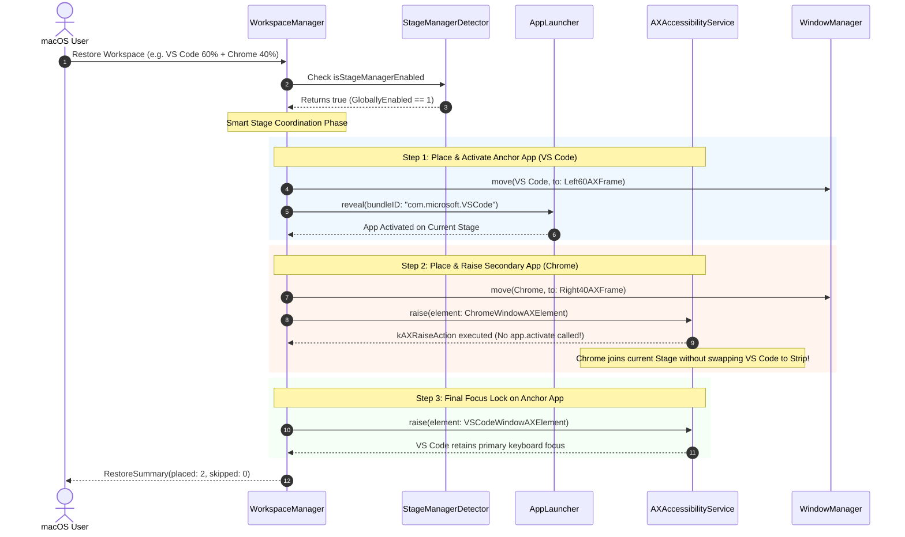

# 03 — Domain Model & Architecture Specification: stage-manager-auto-grouping (US-WORK-018)

## 1. Ubiquitous Language Additions (for `CONTEXT.md`)

- **Stage Manager**: Tính năng quản lý cửa sổ dạng sân khấu của macOS (từ macOS 13+ Ventura trở lên), tổ chức các cửa sổ đang hoạt động ở trung tâm và xếp các nhóm cửa sổ khác ở thanh dải thu nhỏ (sidebar strip) bên trái màn hình.
- **Stage Manager Strip (Thumbnail Sidebar)**: Dải chứa các thumbnail của các ứng dụng/nhóm ứng dụng đang chạy nền bên lề trái màn hình khi Stage Manager bật.
- **Smart Stage Coordination**: Chiến lược điều phối gom nhóm của FlowSnap khi Stage Manager đang bật, kết hợp kích hoạt ứng dụng chủ tọa (Anchor App) bằng `app.activate()` và kéo các ứng dụng phụ trợ (Secondary Apps) lên sân khấu bằng `kAXRaiseAction` thay vì activate tuần tự, tránh hiện tượng đảo sân khấu của macOS.
- **Anchor App (Ứng dụng Chủ tọa)**: Ứng dụng đầu tiên trong danh sách khôi phục của Workspace (thường là cửa sổ có diện tích lớn nhất, ví dụ: VS Code), được cấp quyền kích hoạt hệ thống để xác lập không gian hiển thị của Stage hiện tại.
- **kAXRaiseAction**: Hành động Accessibility chuẩn của macOS (`kAXRaiseAction`) gửi tới `AXUIElement` của cửa sổ để đưa cửa sổ đó lên lớp trên cùng của màn hình mà không làm kích hoạt cơ chế đảo Stage của tiến trình `WindowManager`.

---

## 2. Business Rules (`BR-SMA-###`)

- **BR-SMA-001 (Dynamic Detection)**: FlowSnap phải kiểm tra trạng thái kích hoạt của Stage Manager (`isStageManagerEnabled`) tại thời điểm thực thi mỗi lệnh Restore thông qua domain cấu hình `com.apple.WindowManager` (khóa `GloballyEnabled`). Không cache vĩnh viễn trạng thái để đảm bảo phản ứng tức thì khi người dùng bật/tắt trong Control Center.
- **BR-SMA-002 (Anchor-First Activation)**: Khi `isStageManagerEnabled == true`, FlowSnap chỉ được phép gọi `app.activate()` hoặc `launcher.reveal()` đối với ứng dụng đầu tiên (`orderedPlacements.first`).
- **BR-SMA-003 (Secondary Window Raising via kAXRaiseAction)**: Đối với các ứng dụng từ thứ hai trở đi trong danh sách placements:
  - Phải thực hiện định vị frame bình thường qua `WindowManager.move()`.
  - Phải kiểm tra trạng thái ẩn (`app.isHidden`) và gọi `app.unhide()` nếu cần.
  - Tuyệt đối **KHÔNG** gọi `app.activate()`.
  - Phải gọi `accessibilityService.raise(element:)` hoặc `raise(window:)` qua `kAXRaiseAction` để đưa cửa sổ lên Stage hiện hành.
- **BR-SMA-004 (Final Focus Lock)**: Sau khi toàn bộ các cửa sổ trong Workspace đã được di chuyển và nâng lên Stage, FlowSnap phải gửi một lệnh nâng/focus cuối cùng tới cửa sổ chính của Anchor App để đảm bảo tiêu điểm bàn phím thuộc về ứng dụng làm việc trung tâm.
- **BR-SMA-005 (Graceful Fallback)**: Khi `isStageManagerEnabled == false` hoặc gặp lỗi không thể đọc thiết lập hệ thống, FlowSnap tự động thực thi luồng restore tuần tự tiêu chuẩn (`reveal()` cho mọi placement) để đảm bảo tương thích 100%.

---

## 3. Interaction Flow & Sequence Diagram



---

## 4. Contract Specifications

### 4.1. Domain Protocol: `StageManagerDetecting`

```swift
public protocol StageManagerDetecting: Sendable {
    /// Whether Stage Manager is currently active on the system.
    var isStageManagerEnabled: Bool { get }
}
```

### 4.2. Infrastructure: `StageManagerDetector`

```swift
public final class StageManagerDetector: StageManagerDetecting {
    private let userDefaults: UserDefaults?
    private let suiteName = "com.apple.WindowManager"
    private let key = "GloballyEnabled"

    public init(userDefaults: UserDefaults? = UserDefaults(suiteName: "com.apple.WindowManager")) {
        self.userDefaults = userDefaults
    }

    public var isStageManagerEnabled: Bool {
        // Read directly from CFPreferences to bypass caching
        if let val = CFPreferencesCopyAppValue(key as CFString, suiteName as CFString) {
            if let boolVal = val as? Bool {
                return boolVal
            }
            if let numVal = val as? NSNumber {
                return numVal.boolValue
            }
        }
        return userDefaults?.bool(forKey: key) ?? false
    }
}
```

### 4.3. Extension to `AccessibilityServing`

```swift
public protocol AccessibilityServing: Sendable {
    // Existing members...
    @discardableResult
    func raise(element: AXUIElement) -> Bool

    @discardableResult
    func raise(window: ManagedWindow) -> Bool
}
```
