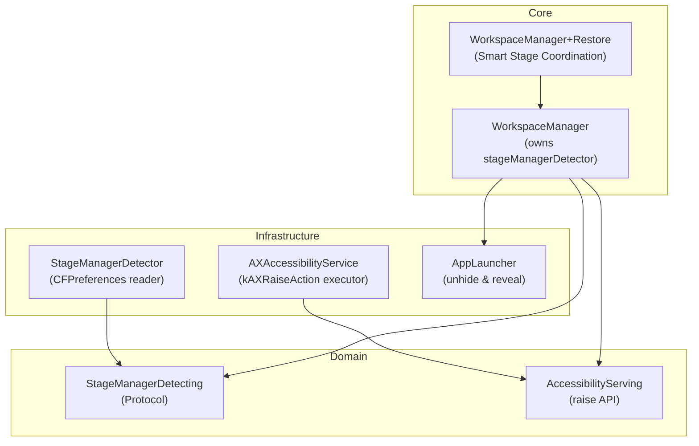

# Technical Architecture & Implementation Plan: US-WORK-017

## 1. Architectural Strategy & Deep Module Boundaries

US-WORK-017 implements **Stage Manager Multi-Window Auto-Grouping on Restore** following John Ousterhout's Deep Modules principle and DDD:

- **Deep Module 1: `StageManagerDetector`**:
  - Implements `StageManagerDetecting`.
  - Encapsulates low-level `CFPreferencesCopyAppValue` / `UserDefaults` reads against `"com.apple.WindowManager"`.
  - Zero private CGS APIs. Clean boolean property `isStageManagerEnabled`.
  - Completely mockable for testing both enabled/disabled states.

- **Deep Module 2: `AccessibilityServing.raise`**:
  - Extends `AccessibilityServing` and `AXAccessibilityService` with `raise(element:)` and `raise(window:)`.
  - Encapsulates `AXUIElementPerformAction(element, kAXRaiseAction as CFString)` behind a simple, type-safe API.
  - Returns `Bool` indicating whether the action succeeded.

- **Core Orchestration: `WorkspaceManager+Restore`**:
  - Introduces `Smart Stage Coordination`:
    - Checks `stageManagerDetector.isStageManagerEnabled`.
    - If enabled:
      - **Anchor App** (index 0): `place(...)` -> `launcher.reveal(bundleID:)` (brings Anchor to current Stage).
      - **Secondary Apps** (index > 0): Unhides app if needed -> `place(...)` -> `accessibilityService.raise(...)`. Does NOT call `launcher.reveal()` or `app.activate()`.
      - **Focus Lock**: Re-raises the Anchor App's primary window at the end of the pass.
    - If disabled:
      - Maintains standard sequential `place(...)` -> `launcher.reveal(bundleID:)`.

---

## 2. Proposed Source Changes

### Domain Layer

- **[NEW]** `FlowSnap/Domain/StageManager/StageManagerDetecting.swift`:
  - Defines public protocol `StageManagerDetecting: Sendable`.

### Infrastructure Layer

- **[NEW]** `FlowSnap/Infrastructure/StageManager/StageManagerDetector.swift`:
  - Concrete class implementing `StageManagerDetecting` via `CFPreferencesCopyAppValue`.
- **[MODIFY]** `FlowSnap/Infrastructure/Accessibility/AccessibilityService.swift`:
  - Add `@discardableResult func raise(element: AXUIElement) -> Bool`
  - Add `@discardableResult func raise(window: ManagedWindow) -> Bool`
- **[MODIFY]** `FlowSnap/Infrastructure/Accessibility/AXAccessibilityService.swift`:
  - Implement `raise(element:)` using `AXUIElementPerformAction(..., kAXRaiseAction)`.
  - Implement `raise(window:)` by resolving the window's AXUIElement and calling `raise(element:)`.

### Core Layer

- **[MODIFY]** `FlowSnap/Core/Workspace/WorkspaceManager.swift`:
  - Add `stageManagerDetector: StageManagerDetecting` property to `WorkspaceManager`.
  - Update `init(...)` with default value `StageManagerDetector()`.
- **[MODIFY]** `FlowSnap/Core/Workspace/WorkspaceManager+Restore.swift`:
  - Refactor `restore` to implement Smart Stage Coordination when `stageManagerDetector.isStageManagerEnabled` is `true`.
  - Lock keyboard focus onto Anchor App at end of pass.

### App Layer

- **[MODIFY]** `FlowSnap/App/AppDependencies.swift`:
  - Pass `stageManagerDetector` into `workspaceManager`.

### Tests Layer

- **[NEW]** `FlowSnapTests/Mocks/MockStageManagerDetector.swift`:
  - Test double allowing toggling `isStageManagerEnabled`.
- **[MODIFY]** `FlowSnapTests/Mocks/MockAccessibilityService.swift`:
  - Implement `raise(element:)` and `raise(window:)` with call recording.
- **[NEW]** `FlowSnapTests/Infrastructure/StageManagerDetectorTests.swift`:
  - Test `StageManagerDetector` initialization and preference reading logic.
- **[NEW / MODIFY]** `FlowSnapTests/Core/WorkspaceManagerStageManagerTests.swift`:
  - Test multi-window restore with Stage Manager ON: verify Anchor App is revealed, Secondary App is raised via `kAXRaiseAction`, and Anchor App receives final focus.
  - Test multi-window restore with Stage Manager OFF: verify all apps are revealed.
