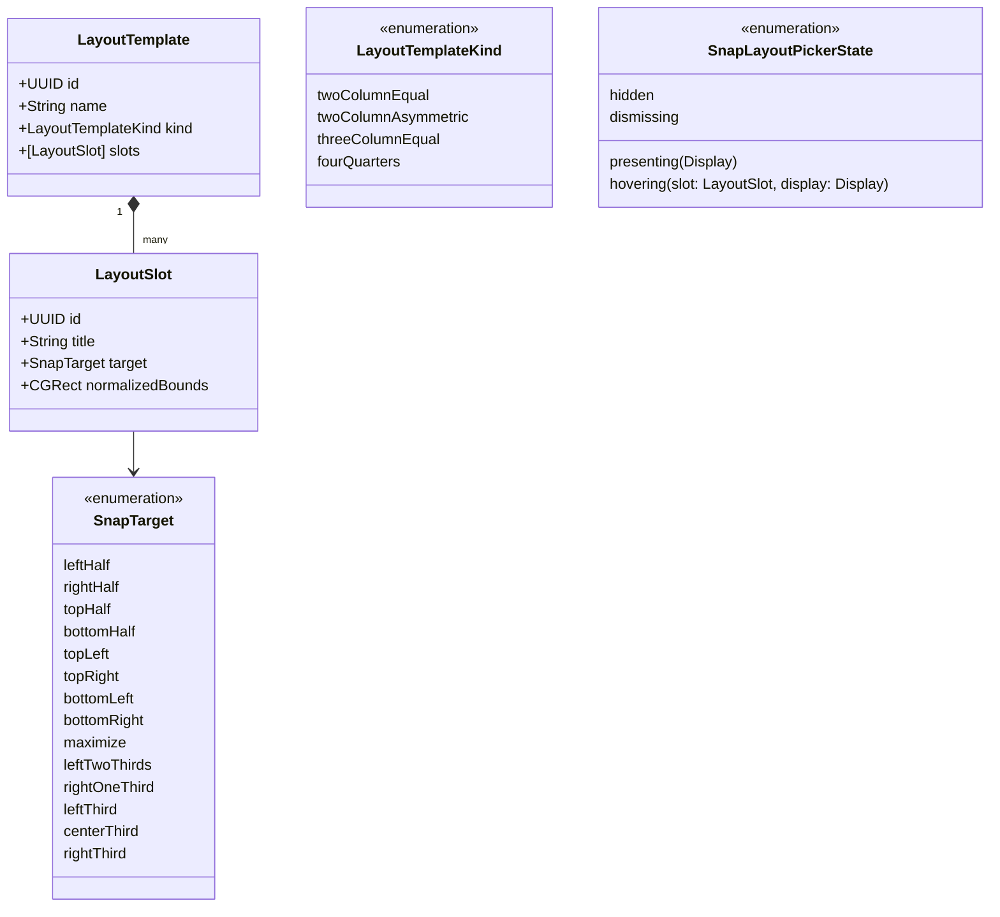
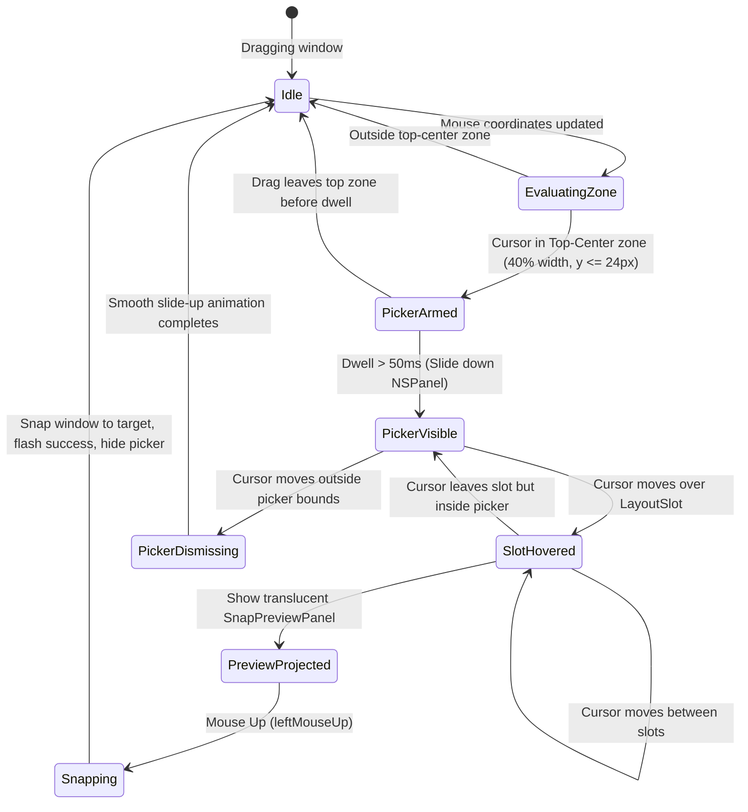

# Domain Model: US-SNAP-007 Top-Edge Snap Layout Picker

## 1. Domain Entities & Value Objects

## 2. State Machine: Top-Edge Layout Picker Lifecycle

## 3. Business Rules (BR-PICKER-###)

- **BR-PICKER-001 (Activation Boundary)**: Khay Layout Picker chỉ kích hoạt khi con trỏ chuột nằm trong vùng đỉnh trung tâm (Top-Center Zone: 30%–70% chiều ngang màn hình đang thao tác, tọa độ y cách đỉnh <= 24px).
- **BR-PICKER-002 (Non-Activating Window)**: `SnapLayoutPickerPanel` là `NSPanel` với `styleMask = [.nonactivatingPanel, .borderless]`, `level = .floating + 1`, không bao giờ cướp focus của ứng dụng đang được kéo.
- **BR-PICKER-003 (Preset Completeness)**: Khay picker luôn cung cấp đủ 4 mẫu bố cục chuẩn: (1) 2 Cột 50/50, (2) 2 Cột 70/30, (3) 3 Cột 1/3, (4) 4 Góc 2x2.
- **BR-PICKER-004 (Dual Visual Feedback)**: Khi con trỏ hover vào một `LayoutSlot` bên trong picker:
  - Khối slot trong picker đổi màu highlight (`accentColor` với hiệu ứng viền sáng).
  - Lớp phủ `SnapPreviewPanel` toàn màn hình hiển thị trước vùng cửa sổ sẽ rơi vào trên màn hình tương ứng.
- **BR-PICKER-005 (Snap Dispatch & Flash)**: Khi nhả chuột (`leftMouseUp`) bên trong một slot:
  - Dispatch lệnh `.snap(target, targetDisplayID)` tới `CommandDispatcher`.
  - Ẩn ngay `SnapLayoutPickerPanel` và `SnapPreviewPanel`.
  - Hiển thị hiệu ứng viền flash báo hiệu snap thành công (`flashSnapSuccess`).
- **BR-PICKER-006 (Smooth Exit Dismissal)**: Nếu con trỏ chuột rời khỏi phạm vi của picker mà không nhả chuột, picker tự động trượt lên biến mất và trả quyền điều khiển lại cho `DragToSnapCoordinator` tiêu chuẩn.
- **BR-PICKER-007 (Display Isolation)**: Trên hệ thống đa màn hình, picker luôn xuất hiện tại đỉnh của đúng màn hình (`Display`) mà con trỏ chuột đang thao tác kéo.
- **BR-PICKER-008 (Permission Gate)**: Nếu `AccessibilityService.isTrusted` là `false`, không kích hoạt picker hay bắt sự kiện drag.

## 4. Non-Functional Requirements (NFRs)

- **Frame Latency**: Quá trình hit-testing và hiển thị preview phải hoàn tất dưới 16ms (đảm bảo 60fps).
- **Visual Aesthetics**: Giao diện Glassmorphic chuẩn macOS với `NSVisualEffectView` (material: `.popover` / `.hudWindow`), bo góc 12px, viền hairline 1px `#e5e5e5`/`#333333`.
- **Concurrency & Safety**: Toàn bộ UI và Coordinator chạy trên `@MainActor`, các models tuân thủ `Sendable`.
