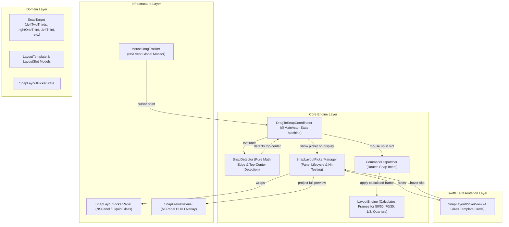

# Technical Architecture Plan: Top-Edge Snap Layout Picker (US-SNAP-007)

## 1. Architectural Overview & Component Seams

---

## 2. Deep Module Architecture & Responsibilities

1. **Domain Layer (`FlowSnap/Domain/Layout/`)**:
   - `SnapTarget.swift`: Add `.leftTwoThirds`, `.rightOneThird`, `.leftThird`, `.centerThird`, `.rightThird`.
   - `LayoutTemplate.swift`: Struct defining a layout pattern containing array of `LayoutSlot`.
   - `LayoutSlot.swift`: Value object mapping relative frame $(x, y, w, h \in 0\dots 1)$ to a `SnapTarget`.
   - `SnapLayoutPickerManaging.swift`: Protocol for presenting, hit-testing, and dismissing the picker.

2. **Core Layer (`FlowSnap/Core/Layout/`)**:
   - `LayoutEngine.swift`: Add frame computation for the 5 new `SnapTarget` enum cases.
   - `SnapDetector.swift`: Add top-center zone detection (`isTopCenterZone(point, display)` returning `.topCenterZone` or dedicated trigger flag).
   - `SnapLayoutPickerManager.swift`: Implementation of `SnapLayoutPickerManaging` managing the AppKit `NSPanel` hosting SwiftUI `SnapLayoutPickerView`.
   - `DragToSnapCoordinator.swift`: Integrate `SnapLayoutPickerManaging` to coordinate transition between edge snap vs layout picker mode.

3. **UI Layer (`FlowSnap/UI/LayoutPicker/`)**:
   - `SnapLayoutPickerView.swift`: SwiftUI component rendering 4 layout cards with animated hover physics.
   - `SnapLayoutPickerPanel.swift`: Non-activating floating `NSPanel` container.

---

## 3. Implementation Phases & Vertical Slices

- **Slice 1 (Domain & Core Math)**: Expand `SnapTarget`, `LayoutTemplate`, `LayoutSlot`, and `LayoutEngine` with full unit test coverage.
- **Slice 2 (Top-Center Detection)**: Update `SnapDetector` to distinguish top-center zone from standard top edge maximize snap.
- **Slice 3 (UI Presentation & Panel)**: Build `SnapLayoutPickerView`, `SnapLayoutPickerPanel`, and `SnapLayoutPickerManager`.
- **Slice 4 (Coordinator Integration)**: Connect `DragToSnapCoordinator` with `SnapLayoutPickerManager`, enabling seamless drag-hover-preview-release cycle.
- **Slice 5 (Lab & E2E Verification)**: FlowSnapLab verification view and automated unit tests.
