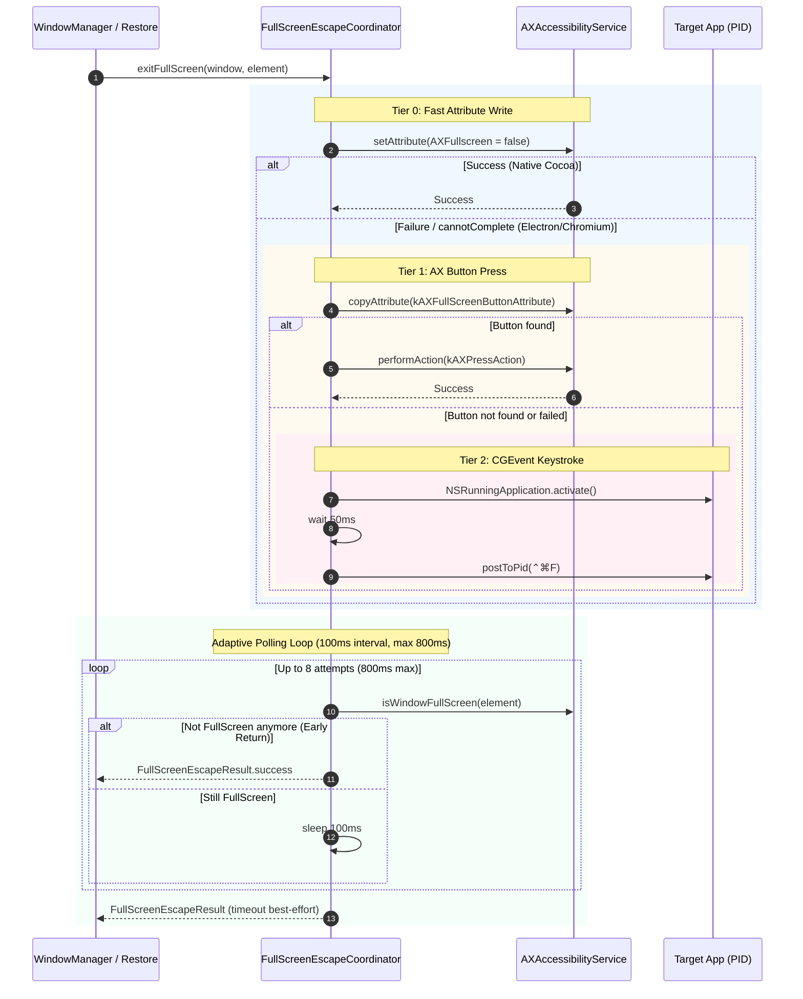

# 03 — Domain Model & Business Rules — universal-fullscreen-escape

## Domain Entities & Enums

### `FullScreenEscapeTier`

```swift
public enum FullScreenEscapeTier: String, Sendable, CaseIterable {
    /// Tier 0: Direct AXUIElement attribute write (AXFullscreen/AXFullScreen = false)
    case attributeWrite
    /// Tier 1: UI tree button press via kAXFullScreenButtonAttribute / kAXPressAction
    case axButtonPress
    /// Tier 2: Synthesized Control + Command + F keystroke posted via CGEvent to target PID
    case cgEventShortcut
}
```

### `FullScreenEscapeResult`

```swift
public struct FullScreenEscapeResult: Sendable, Equatable {
    public let succeeded: Bool
    public let tierUsed: FullScreenEscapeTier?
    public let durationMs: Int
    public let error: String?

    public static func success(tier: FullScreenEscapeTier, durationMs: Int) -> FullScreenEscapeResult {
        FullScreenEscapeResult(succeeded: true, tierUsed: tier, durationMs: durationMs, error: nil)
    }

    public static func failure(durationMs: Int, error: String) -> FullScreenEscapeResult {
        FullScreenEscapeResult(succeeded: false, tierUsed: nil, durationMs: durationMs, error: error)
    }
}
```

---

## Business Rules

### `BR-FSE-001`: Multi-Tier Sequential Fallback

1. Khi có yêu cầu thoát Full Screen cho cửa sổ (`exitFullScreen`):
   - **Thử Tier 0**: Gán thuộc tính `AXFullscreen = false` (hoặc `AXFullScreen = false`). Nếu thành công, kết thúc giai đoạn gửi tín hiệu ngay (< 1ms).
   - **Thử Tier 1**: Nếu Tier 0 trả về `kAXErrorCannotComplete` hoặc thuộc tính không ghi được:
     - Truy vấn `kAXFullScreenButtonAttribute` từ `AXUIElement` của cửa sổ.
     - Nếu tìm thấy button element, gọi `AXUIElementPerformAction(button, kAXPressAction as CFString)`. Nếu thành công, kết thúc giai đoạn gửi tín hiệu.
   - **Thử Tier 2**: Nếu Tier 1 không tìm thấy nút hoặc bấm nút không thành công:
     - Lấy `pid` của tiến trình sở hữu cửa sổ (`pid_t`).
     - Gửi tổ hợp phím `Control + Command + F` trực tiếp tới PID qua `CGEvent`.

### `BR-FSE-002`: Target Application Foreground Activation on CGEvent Fallback

Khi buộc phải sử dụng Tier 2 (`CGEvent`):

1. FlowSnap phải kích hoạt ứng dụng sở hữu cửa sổ qua `NSRunningApplication.activate(options: [.activateIgnoringOtherApps])`.
2. Nghỉ 50ms để WindowServer cập nhật tiêu điểm bàn phím cho tiến trình đích.
3. Tạo và gửi chuỗi sự kiện `CGEvent`:
   - `keyDown` với key code `kVK_ANSI_F` (`0x03`), flags `[.maskControl, .maskCommand]`.
   - `keyUp` với key code `kVK_ANSI_F` (`0x03`), flags `[.maskControl, .maskCommand]`.
   - Đăng tới PID mục tiêu bằng `CGEvent.postToPid(pid)`.

### `BR-FSE-003`: Adaptive Transition Polling with 800ms Maximum Ceiling

Sau khi bất kỳ Tier nào gửi tín hiệu thoát thành công:

1. FlowSnap bước vào vòng lặp kiểm tra thích ứng:
   - Tần suất kiểm tra: mỗi 100ms (`Task.sleep(nanoseconds: 100_000_000)`).
   - Giới hạn thời gian tối đa: 800ms (tương đương tối đa 8 chu kỳ thăm dò).
2. Tại mỗi chu kỳ, kiểm tra điều kiện thoát hoàn tất:
   - Đọc lại thông tin hình học hoặc thuộc tính của cửa sổ: Nếu `window.kind != .fullscreen` (hoặc frame không còn bao trùm toàn bộ kích thước màn hình), coi như quá trình chuyển đổi đã hoàn thành sớm ➔ Trả về ngay lập tức.
3. Nếu chạm mốc 800ms mà trạng thái chưa đổi (do hệ thống tải nặng), kết thúc vòng lặp và tiếp tục luồng xử lý `setFrame` (best-effort).

### `BR-FSE-004`: Non-Destructive Failure Recovery

Nếu cả 3 Tier đều không thể kích hoạt thoát Full Screen:

1. Không làm sập ứng dụng, không ném exception làm gián đoạn toàn bộ quá trình khôi phục Workspace.
2. Ghi log chẩn đoán chi tiết (`[FullScreenEscapeCoordinator] All tiers failed for <Window>`).
3. Trả về `FullScreenEscapeResult.failure`, cho phép `WindowManager` hoặc `WorkspaceManager+Restore` tiếp tục xử lý các cửa sổ còn lại trong hàng đợi.

---

## State Machine & Sequence Diagram


