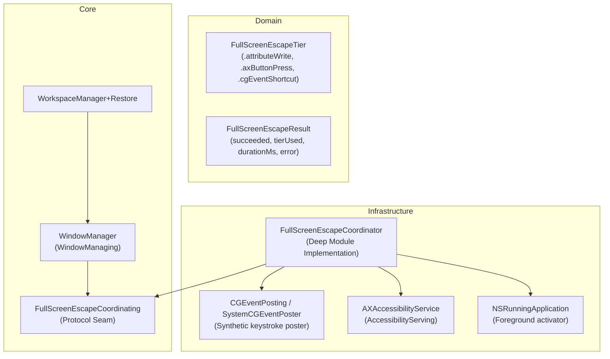

# Technical Architecture & Implementation Plan: US-WORK-019

## 1. Architectural Strategy & Deep Module Boundaries

US-WORK-019 implements **Universal Fullscreen Escape for Electron/Native Apps** using John Ousterhout's Deep Modules principle:

- A simple, narrow protocol seam (`FullScreenEscapeCoordinating`) exposes a single entry point:
  `func exitFullScreen(for element: AXUIElement, pid: pid_t?, isFullScreenChecker: @Sendable () async -> Bool) async throws -> FullScreenEscapeResult`
- Implementation details (attribute write keys, AX hierarchy traversal for `kAXFullScreenButtonAttribute`, `CGEvent` synthesis with `CGEventFlags`, and 100ms adaptive polling) are completely encapsulated within `FullScreenEscapeCoordinator`.
- Zero private APIs.
- Pure protocol-based testability: `CGEventPosting` seam allows unit testing Tier 2 keyboard dispatch without sending actual key events to the OS during test execution.

### Deep Module Diagram:

---

## 2. Proposed Source Changes

### Domain Layer

- **[NEW]** `FlowSnap/Domain/Window/FullScreenEscapeTier.swift`:
  - Enum defining `.attributeWrite`, `.axButtonPress`, `.cgEventShortcut`.
- **[NEW]** `FlowSnap/Domain/Window/FullScreenEscapeResult.swift`:
  - Struct representing the outcome of an escape operation with timing and tier telemetry.

### Core Layer

- **[NEW]** `FlowSnap/Core/Window/FullScreenEscapeCoordinating.swift`:
  - Protocol defining `FullScreenEscapeCoordinating` for dependency injection and mocking.
- **[MODIFY]** `FlowSnap/Core/Window/WindowManager.swift`:
  - Inject `FullScreenEscapeCoordinating` into `WindowManager` (defaulting to concrete coordinator).
  - Update `move` to use coordinator's adaptive exit fullscreen instead of fixed 700ms sleep.

### Infrastructure Layer

- **[NEW]** `FlowSnap/Infrastructure/Accessibility/CGEventPosting.swift`:
  - Protocol `CGEventPosting` and concrete `SystemCGEventPoster` isolating `CGEvent(keyboardEventSource:...)` and `postToPid(pid)` for zero side-effect unit testing.
- **[NEW]** `FlowSnap/Infrastructure/Accessibility/FullScreenEscapeCoordinator.swift`:
  - Implements `FullScreenEscapeCoordinating`:
    - Tier 0: Write `AXFullscreen` and `AXFullScreen` = false.
    - Tier 1: Look up `kAXFullScreenButtonAttribute` and perform `kAXPressAction`.
    - Tier 2: Activate app with `NSRunningApplication.activate`, post `⌃⌘F` via `CGEventPosting`.
    - Adaptive loop: Poll every 100ms up to 800ms ceiling.
- **[MODIFY]** `FlowSnap/Infrastructure/Accessibility/AccessibilityService.swift`:
  - Update protocol `AccessibilityServing.exitFullScreen` to accept `pid: pid_t?` if helpful or delegate to coordinator.
- **[MODIFY]** `FlowSnap/Infrastructure/Accessibility/AXAccessibilityService.swift`:
  - Update `exitFullScreen` implementation to delegate through `FullScreenEscapeCoordinator`.

### Tests Layer

- **[NEW]** `FlowSnapTests/Mocks/MockFullScreenEscapeCoordinator.swift`:
  - Mock implementation for testing `WindowManager` in isolation.
- **[NEW]** `FlowSnapTests/Mocks/MockCGEventPoster.swift`:
  - Mock capturing posted key codes and flags without sending actual OS events.
- **[NEW]** `FlowSnapTests/Infrastructure/FullScreenEscapeCoordinatorTests.swift`:
  - Test Suite covering:
    - Tier 0 success (< 2ms) without calling button or CGEvent.
    - Tier 1 success when Tier 0 throws `cannotComplete`.
    - Tier 2 fallback with `⌃⌘F` and activation when Tier 0 and Tier 1 fail.
    - Adaptive polling early exit at 300ms.
    - 800ms ceiling timeout handling.
- **[MODIFY]** `FlowSnapTests/Core/Window/WindowManagerTests.swift`:
  - Verify `move` calls `exitFullScreen` with adaptive coordinator.
