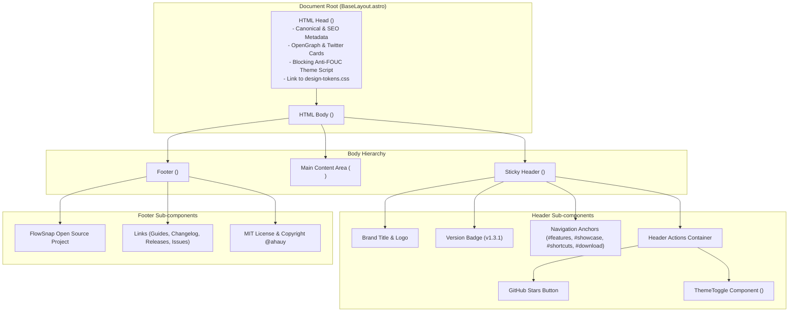
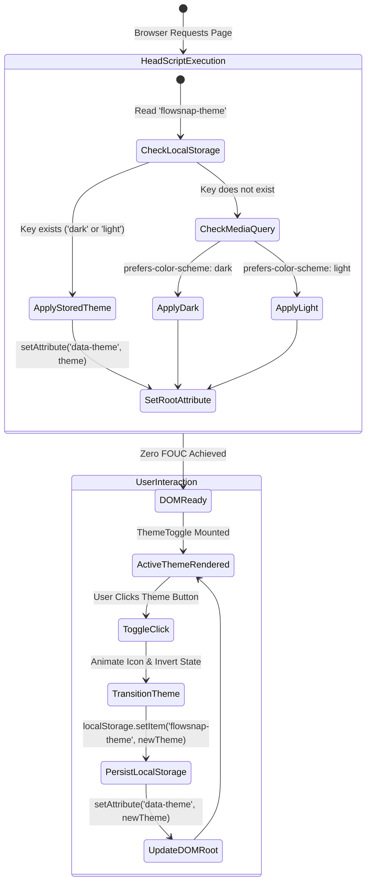

# 03 — Domain Model & Architecture — web-baseline-layout

> Feature: `US-WEB-025` (Astro Baseline, Shadcn Design Tokens & Base Responsive Layout)  
> Stage: Stage 4 (Domain Modeling)

## 1. UI Component Hierarchy & Architecture

---

## 2. State Machine: Theme Toggle Lifecycle

---

## 3. Business Rules

### BR-WEB-001 — Zero-FOUC Theme Persistence

1. Mọi trang web kế thừa từ `BaseLayout.astro` phải thực thi mã khởi tạo theme đồng bộ (blocking script) trong `<head>` trước khi thẻ `<body>` được dựng.
2. Thuộc tính `data-theme="dark"` hoặc `data-theme="light"` phải được gán trực tiếp lên `<html>` root element.
3. Khi người dùng click chuyển đổi theme qua `ThemeToggle.astro`:
   - Trạng thái mới được lưu tức thì vào `localStorage.getItem('flowsnap-theme')`.
   - Thuộc tính `data-theme` được cập nhật mà không cần reload trang.
   - Thao tác chuyển đổi phải có transition mượt mà trên nền tảng CSS variables (`cubic-bezier(0.16, 1, 0.3, 1)`).

### BR-WEB-002 — Sticky Navigation & Anchor Accessibility

1. Header phải luôn bám dính ở đỉnh màn hình (`position: sticky; top: 0`) với `z-index: 50` và hiệu ứng kính mờ `backdrop-filter: blur(20px)`.
2. Header chứa các liên kết neo:
   - `#features` (Bento Grid)
   - `#showcase` (Interactive Sandbox)
   - `#shortcuts` (Keyboard Shortcuts)
   - `#download` (Terminal / DMG Hub)
3. Các liên kết neo phải kích hoạt cuộn mượt (`scroll-behavior: smooth`) tới thẻ mục tiêu.
4. Nút bấm và liên kết phải có chỉ số tiêu điểm bàn phím (`:focus-visible`) rõ ràng, đạt chuẩn tiếp cận WCAG 2.2 AA.

### BR-WEB-003 — Responsive Breakpoints & Viewport Constraints

1. Hệ thống layout hỗ trợ 3 ngưỡng co giãn responsive chính:
   - Mobile: `< 768px` (Thanh điều hướng thu gọn hoặc ẩn nhãn chữ, ưu tiên nút hành động chính).
   - Tablet / Laptop: `768px – 1024px` (Hiển thị đầy đủ menu nhưng thu gọn khoảng cách đệm).
   - Desktop & Ultra-wide: `> 1024px` (Khung nội dung giới hạn tối đa `max-width: 1200px` căn giữa màn hình với padding hai bên `24px` – `32px`).
2. Tuyệt đối không gây thanh cuộn ngang (horizontal overflow scroll) ở bất kỳ kích thước màn hình nào từ `320px` đến `3840px`.

### BR-WEB-004 — Open-Source Attribution & Transparency

1. Footer bắt buộc cung cấp:
   - Thông tin phát hành theo giấy phép MIT.
   - Liên kết tới tác giả `@ahauy` (`https://github.com/ahauy`).
   - Liên kết tới kho mã nguồn (`https://github.com/ahauy/FlowSnap`).
   - Liên kết đến User Guides và Release Notes.

---

## 4. Non-Functional Requirements (NFRs)

- **Performance & Latency**:
  - Tải trang tĩnh < 1s trên kết nối thông thường.
  - Zero FOIT (Flash of Invisible Text) & FOUT: Sử dụng system font stack native, không tải thêm web font ngoài nặng nề.
  - Cumulative Layout Shift (CLS) = 0.
- **Accessibility (a11y)**:
  - Độ tương phản màu sắc văn bản tối thiểu `4.5:1` trên cả giao diện sáng và tối theo WCAG 2.2 AA.
  - Các icon button (như `ThemeToggle`, `GitHub`) phải có `aria-label` đầy đủ cho trình đọc màn hình.
- **Observability**:
  - Không có bất kỳ JavaScript runtime error nào trong Browser DevTools Console.
