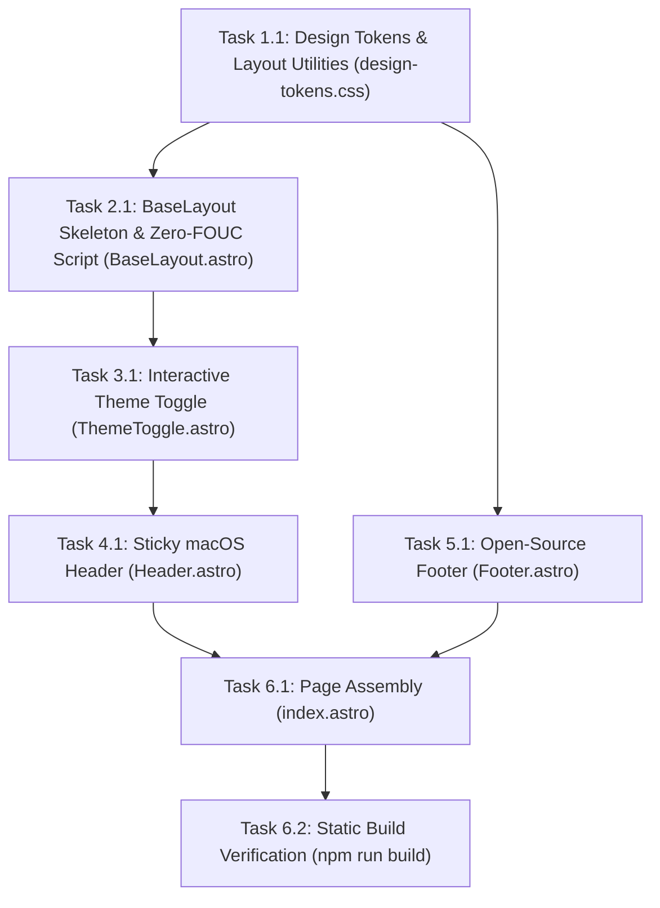

# Implementation Tasks: web-baseline-layout (US-WEB-025)

## Dependencies & Execution Sequence

---

## Task Checklist

### Phase 1: Design Tokens & Layout Utilities

- [x] **Task 1.1**: Update `web/src/styles/design-tokens.css`
  - Add `.page-container` constraint (`max-width: 1200px; margin: 0 auto; padding: 0 24px`).
  - Add `section[id]` with `scroll-margin-top: 80px`.
  - Add version badge styles, button action pills, and focus ring utilities.

### Phase 2: BaseLayout & Anti-FOUC Script

- [x] **Task 2.1**: Create `web/src/layouts/BaseLayout.astro`
  - Setup `<head>` with character set, viewport, title, description, canonical URL (`https://ahauy.github.io/FlowSnap`).
  - Add OpenGraph and Twitter card meta tags.
  - Implement `<script is:inline>` at top of `<head>` to evaluate `flowsnap-theme` or `prefers-color-scheme: dark` and set `data-theme` attribute synchronously before DOM paint.

### Phase 3: Theme Toggle Component

- [x] **Task 3.1**: Create `web/src/components/ThemeToggle.astro`
  - Implement accessible `<button>` with `aria-label="Toggle theme"`.
  - Add crisp Sun & Moon SVG icons.
  - Wire click handler to toggle theme, update DOM `data-theme`, and persist to `localStorage` safely in `try...catch`.

### Phase 4: Sticky Header & Navigation

- [x] **Task 4.1**: Create `web/src/components/Header.astro`
  - Implement sticky navigation bar (`position: sticky; top: 0; z-index: 50`) with backdrop blur 20px and 1px hairline border.
  - Include FlowSnap logo, version badge (`v1.3.1`).
  - Add section links: `#features`, `#showcase`, `#shortcuts`, `#download`.
  - Add GitHub Stars button linking to `https://github.com/ahauy/FlowSnap`.
  - Embed `ThemeToggle` component.
  - Add responsive media query for mobile screens (< 640px).

### Phase 5: Open-Source Footer

- [x] **Task 5.1**: Create `web/src/components/Footer.astro`
  - Implement footer with MIT License attribution and author link `@ahauy`.
  - Include links to GitHub Releases, User Guides, and Issues.
  - Add architecture manifesto tag ("Swift 6 • Zero Private APIs • Apple HIG Compliant").

### Phase 6: Index Page Integration & Verification

- [x] **Task 6.1**: Update `web/src/pages/index.astro`
  - Import and mount `BaseLayout`, `Header`, placeholder sections with IDs (`features`, `showcase`, `shortcuts`, `download`), and `Footer`.
- [x] **Task 6.2**: Run `npm run build` in `web/`
  - Verify static output generation without errors or bundle warnings.
