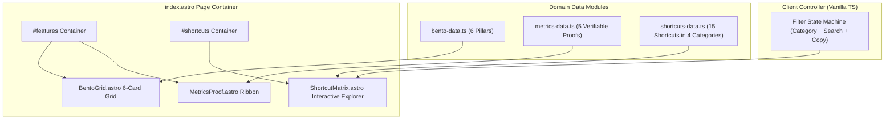
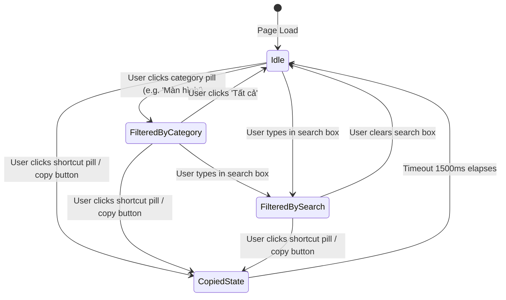

# 04-Domain Modeling: Bento Grid Features Showcase, Proof & Shortcut Matrix (US-WEB-027)

- **Slug**: `web-bento-shortcuts`
- **Date**: 2026-09-08

---

## 1. Domain Entities & TypeScript Models

```typescript
export type BentoCardSpan = "hero" | "standard"; // 'hero' = 2 cols on desktop, 'standard' = 1 col

export interface BentoCard {
  id: string;
  title: string;
  tagline: string;
  description: string;
  badge: string;
  span: BentoCardSpan;
  category:
    | "picker"
    | "divider"
    | "spaces"
    | "workspaces"
    | "scratchpad"
    | "multimonitor";
  keyHighlight?: string[];
}

export interface MetricProof {
  id: string;
  metric: string;
  label: string;
  sublabel: string;
  iconName: "concurrency" | "shield" | "check" | "speed" | "fps";
}

export type ShortcutCategoryKey =
  "all" | "window" | "display" | "workspace" | "utility";

export interface ShortcutCategory {
  key: ShortcutCategoryKey;
  label: string;
}

export interface ShortcutItem {
  id: string;
  action: string;
  category: ShortcutCategoryKey;
  keys: string[]; // e.g. ["⌃", "⌥", "←"]
  displayKeys: string; // e.g. "⌃⌥←"
  description: string;
  badge?: string;
}
```

---

## 2. Component Architecture & Data Flow



---

## 3. Interactive Shortcut State Machine



---

## 4. Accessibility (a11y) & Performance NFRs

1. **Keyboard Accessibility**: Filter category tabs implement ARIA `role="tablist"`, `role="tab"`, and `aria-selected="true/false"`.
2. **Copy Visual Feedback**: When a user clicks to copy a shortcut combination, an ARIA live region (`aria-live="polite"`) announces the copy success, and a badge temporarily changes to "Copied!" for 1500ms.
3. **High Contrast**: Text in dark mode strictly passes 4.5:1 contrast against `#09090b` and `#121215`. Text in light mode strictly passes 4.5:1 against `#ffffff` and `#fafafa`.
4. **Performance**: Zero external network requests; pure CSS micro-illustrations for the 6 cards with no raster asset latency.
