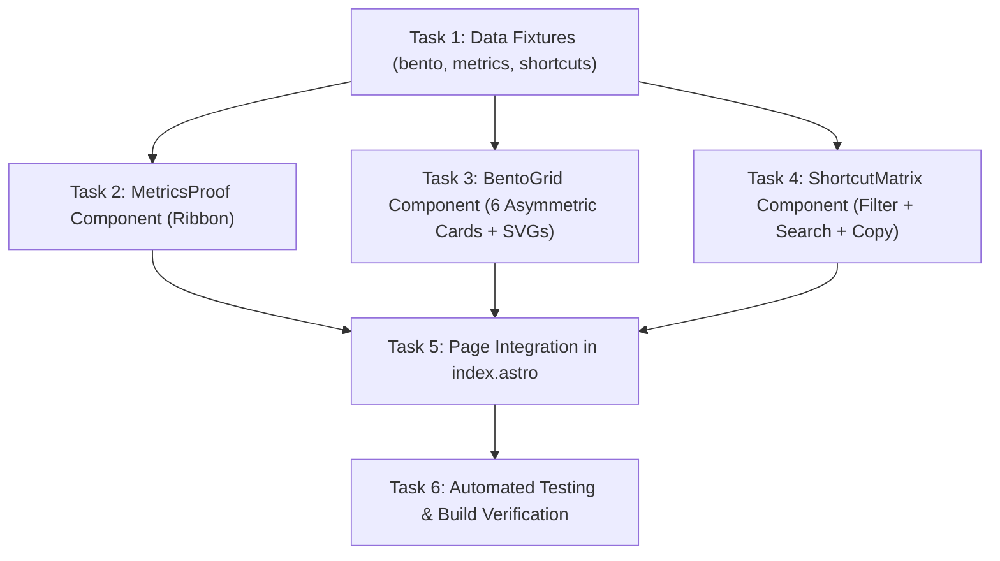

# Implementation Tasks: Bento Grid & Shortcut Matrix (US-WEB-027)

## Task Dependency Graph

---

## Detailed Task Breakdown

### Phase 1: Data Layer (Foundation)

- [ ] **TASK-01: Implement Domain Data Fixtures**
  - **Files**: `web/src/data/bento-data.ts`, `web/src/data/metrics-data.ts`, `web/src/data/shortcuts-data.ts`
  - **Dependencies**: None
  - **Details**:
    - Define TypeScript interfaces for Bento cards, metric proofs, and shortcuts.
    - Export `bentoFeatures` (6 items with titles, badges, descriptions, spans, SVG layout descriptors).
    - Export `metricsProof` (5 items: Swift 6, 0 Private APIs, 470+ Tests, < 1ms math, 60fps drag).
    - Export `shortcutsCatalog` (15 items across `window`, `display`, `workspace`, `utility` categories).
  - **Verification**: Files export valid TypeScript data matching `data-model.md`.

### Phase 2: UI Components (Deep Modules)

- [ ] **TASK-02: Implement Metrics Proof Ribbon Component**
  - **Files**: `web/src/components/MetricsProof.astro`
  - **Dependencies**: `TASK-01`
  - **Details**:
    - Construct responsive grid/flex ribbon displaying the 5 metrics.
    - Style with 1px hairline border, subtle elevated surface, and crisp typography (`SF Pro Display` for numbers, `SF Pro Text` for labels).
    - Add SVG badge icons for concurrency, shield, test checkmark, speed, and 60fps.
  - **Verification**: Responsive rendering without horizontal overflow.

- [ ] **TASK-03: Implement Asymmetric Bento Grid Component**
  - **Files**: `web/src/components/BentoGrid.astro`
  - **Dependencies**: `TASK-01`
  - **Details**:
    - Render 6-card grid with desktop 3-column asymmetric layout (Top-Edge & Scratchpad `col-span-2`, others `col-span-1`).
    - Implement 6 inline vector SVG/CSS micro-illustrations:
      1. Top-Edge Picker (window dragging up, 4-zone picker slide-down preview).
      2. Collinear 2D Resize (two adjacent windows with crosshair handle and arrows).
      3. Current Space Preservation (macOS desktop frame, Space 1 badge, pinned window).
      4. Workspaces & Presets (tri-split Coding Flow preset with `⌃⌥⌘1` badge).
      5. Quake Scratchpad (top-down terminal drop with `⌥Space` and dismiss cues).
      6. Multi-Monitor Topology (dual-screen schematic with cross-display throw arrow `⌃⌥⇧→`).
    - Add hover lift (`translateY(-2px)`), hairline borders (`var(--color-border)`), and tag pills.
  - **Verification**: Responsive collapse to 2 cols (tablet) and 1 col (mobile).

- [ ] **TASK-04: Implement Interactive Shortcut Matrix Component**
  - **Files**: `web/src/components/ShortcutMatrix.astro`
  - **Dependencies**: `TASK-01`
  - **Details**:
    - Render category filter tabs (`Tất cả`, `Cửa sổ`, `Màn hình`, `Workspace`, `Tiện ích`) with count badges.
    - Render live search input bar with search icon and clear button.
    - Render shortcut cards/rows featuring authentic macOS keycap pills (`SF Mono`, border, subtle shadow).
    - Implement vanilla client script handling:
      - Category tab switching with active indicator.
      - Real-time search filtering across action name, keys, and descriptions.
      - Zero-state empty view when no shortcuts match.
      - 1-click clipboard copy (`navigator.clipboard.writeText`) with temporary `Copied!` visual feedback.
  - **Verification**: ARIA tab roles, keyboard navigation, copy feedback works reliably.

### Phase 3: Integration & Testing

- [ ] **TASK-05: Page Integration in `index.astro`**
  - **Files**: `web/src/pages/index.astro`
  - **Dependencies**: `TASK-02`, `TASK-03`, `TASK-04`
  - **Details**:
    - Replace placeholder box in `#features` with `<MetricsProof />` and `<BentoGrid />`.
    - Replace placeholder box in `#shortcuts` with `<ShortcutMatrix />`.
    - Ensure smooth spacing, typography hierarchy, and section anchor navigation.
  - **Verification**: Page renders without visual artifacts; anchor navigation `#features` and `#shortcuts` jump accurately.

- [ ] **TASK-06: Automated Test Suite & Build Verification**
  - **Files**: `web/tests/bento-shortcuts.test.mjs`, `web/package.json`
  - **Dependencies**: `TASK-05`
  - **Details**:
    - Write Node.js test script asserting 6 Bento items, 5 metrics proofs, 15 shortcuts, and key component exports.
    - Run `npm test` in `web/`.
    - Run `npm run build` in `web/` to verify zero Astro static build errors.
  - **Verification**: 100% test pass, zero build warnings/errors.
