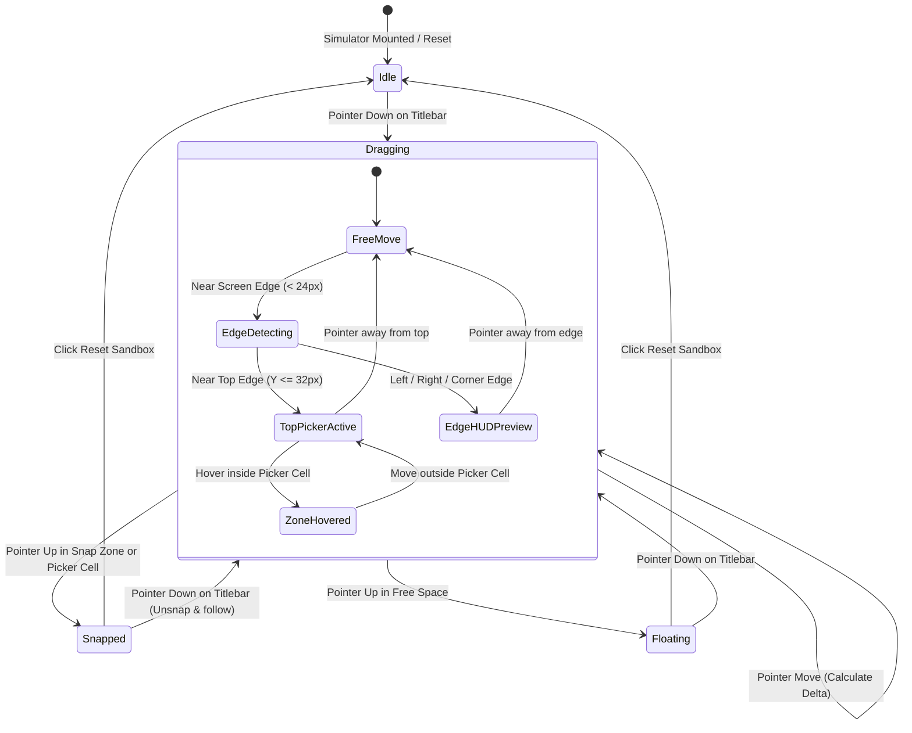
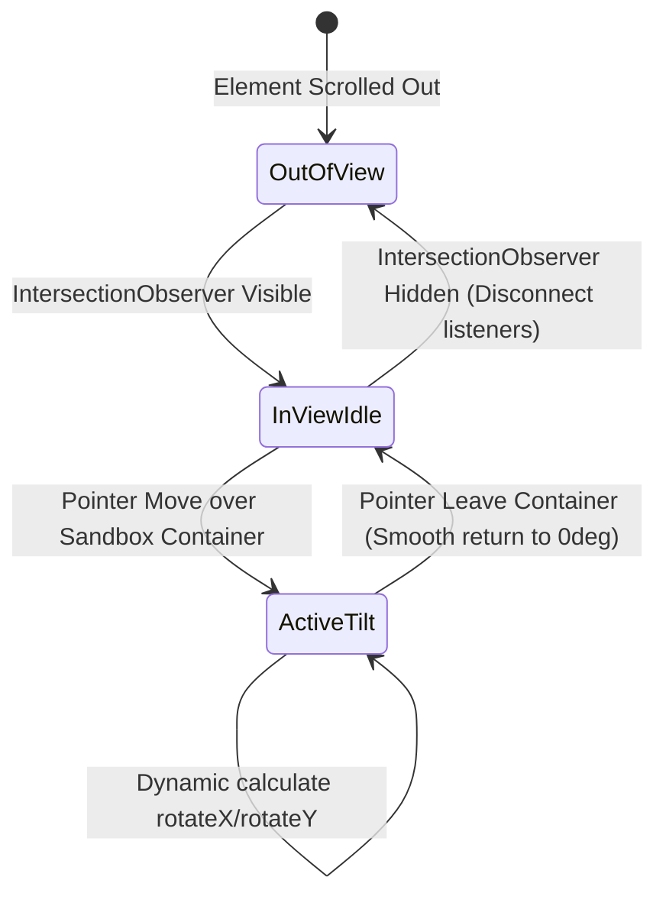

# 04 — Domain Modeling: 3D Interactive macOS Desktop Simulator (US-WEB-026)

## 1. Domain Entities & State Models

### Sandbox State Machine

### 3D Tilt State Machine

## 2. Business Rules (`BR-SANDBOX-###`)

- **BR-SANDBOX-001 (Zero Mouse Slip / Pointer Capture)**:
  - Khi bắt đầu kéo trên thanh tiêu đề (`pointerdown`), gọi `element.setPointerCapture(event.pointerId)` để con trỏ chuột không bị trượt mất tiêu điểm ngay cả khi người dùng di chuột với tốc độ cao vượt ra ngoài biên của phần tử.
  - Khi nhả chuột (`pointerup` hoặc `pointercancel`), giải phóng `releasePointerCapture`.

- **BR-SANDBOX-002 (Top-Edge Picker Activation Threshold)**:
  - Khay Top-Edge Snap Picker chỉ kích hoạt khi con trỏ chuột đang kéo cửa sổ và vị trí Y của con trỏ nằm trong khoảng `<= 32px` tính từ đỉnh của màn hình ảo (ngay sát dưới Menu Bar ảo).
  - Khi kích hoạt, khay picker hiển thị 4 mẫu template:
    1. 2 Cột (50/50)
    2. 2 Cột bất đối xứng (70/30)
    3. 3 Cột (25/50/25)
    4. 4 Góc (25% mỗi góc)

- **BR-SANDBOX-003 (Real-time HUD Preview Responsiveness)**:
  - Khi con trỏ chuột hover vào một ô trong Top-Edge Picker hoặc chạm mép trái/phải màn hình (< 24px):
    - Hiển thị lớp phủ kính mờ `HUD Preview` với kích thước và vị trí chính xác của vùng snap tương ứng.
    - Animation xuất hiện và co giãn sử dụng transition `transform 0.18s cubic-bezier(0.16, 1, 0.3, 1), opacity 0.18s ease`.

- **BR-SANDBOX-004 (Snap Transition Physics)**:
  - Khi nhả chuột vào vùng snap đã chọn, cửa sổ ảo chuyển từ vị trí tự do sang vị trí snap với hiệu ứng spring mượt mà (`transition: all 0.28s cubic-bezier(0.16, 1, 0.3, 1)`).
  - Khi người dùng nhấp kéo lại một cửa sổ đang snap, cửa sổ tự động khôi phục về kích thước tự do trước khi snap và bám theo con trỏ chuột một cách tự nhiên.

- **BR-SANDBOX-005 (0.0% Idle CPU Budget & IntersectionObserver)**:
  - Toàn bộ tính toán góc nghiêng 3D tilt và animation tracking phải tự động ngắt (dừng `requestAnimationFrame` và tạm gỡ event listeners) khi `IntersectionObserver` báo container khuất khỏi màn hình người dùng (`intersectionRatio <= 0`).

- **BR-SANDBOX-006 (One-Click Reset Guarantees)**:
  - Nút `Reset Sandbox` luôn khả dụng. Khi nhấn, cửa sổ ảo trở về tọa độ trung tâm mặc định (Width 52%, Height 56%, Center-Center), hủy bỏ mọi trạng thái snap đang áp dụng và ẩn khay picker / HUD preview.

- **BR-SANDBOX-007 (Touch & Mobile Fallback)**:
  - Trên màn hình di động nhỏ (< 768px), hiệu ứng 3D tilt bị vô hiệu hóa để tránh rung lắc không mong muốn.
  - Cung cấp thanh nút bấm nhanh `[Snap Left 50%]`, `[Top-Edge Picker]`, `[Snap Right 50%]`, `[Reset]` để người dùng cảm ứng vẫn có thể kiểm thử toàn bộ khả năng snap mà không bị giới hạn bởi không gian màn hình nhỏ.
