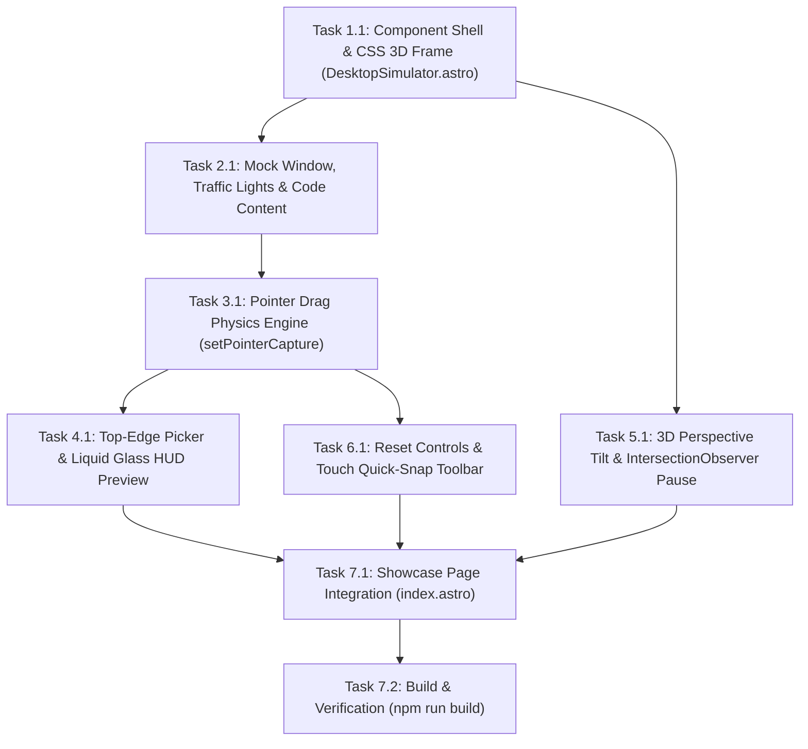

# Implementation Tasks: 3D Interactive macOS Desktop Simulator (US-WEB-026)

## Dependencies & Execution Sequence

---

## Task Checklist

### Phase 1: Component Shell & macOS Frame Styling

- [x] **Task 1.1**: Create `web/src/components/DesktopSimulator.astro` component markup & styles
  - Setup 16:10 simulated macOS desktop frame (`.mac-desktop-frame`) with 16px radius, hairline border, and dark wallpaper canvas.
  - Implement simulated Menu Bar (`.mac-menubar`) with Apple logo, app title "FlowSnap", menus, and status clock.
  - Implement simulated Dock (`.mac-dock`) with liquid glass backdrop blur and app icons (Finder, FlowSnap, VS Code, Terminal).

### Phase 2: Mock Window & Code Editor Content

- [x] **Task 2.1**: Implement mock window (`.mock-window`) within the virtual desktop
  - macOS title bar with authentic traffic lights (Red, Yellow, Green).
  - Snap status indicator badge (e.g. "Floating", "Left 50%", "Snapped").
  - Mini code editor displaying clean Swift 6 snippet (`struct SnapEngine`, `@MainActor`, `snapWindow`).

### Phase 3: Pointer Drag Physics Engine

- [x] **Task 3.1**: Implement client-side window dragging with `PointerEvents`
  - Bind `pointerdown`, `pointermove`, `pointerup`, `pointercancel` on title bar with `setPointerCapture`.
  - Calculate drag coordinates relative to desktop bounds with boundary clamping.
  - Apply spring transitions `cubic-bezier(0.16, 1, 0.3, 1)` on snap/release.

### Phase 4: Top-Edge Picker & HUD Preview

- [x] **Task 4.1**: Implement Windows 11-style Top-Edge Snap Picker & HUD Preview
  - Trigger picker slide-down when title bar is dragged near top menu bar (`Y <= 32px`).
  - Render 4 canonical FlowSnap layout templates (50/50, 70/30, 25/50/25, 4 Quarters).
  - Highlight zones on hover and project liquid glass HUD preview overlay over desktop quadrants.
  - Snap window to target geometry on pointer release.
  - Also support direct edge snapping (dragging to left/right desktop edges).

### Phase 5: CSS 3D Perspective Tilt & Zero-CPU Suspension

- [x] **Task 5.1**: Implement hardware-accelerated 3D perspective tilt
  - Track pointer position over `#showcase` to apply `perspective: 1200px` with `rotateX` / `rotateY` (clamped to ±5deg).
  - Add dynamic specular glare reflection following cursor angle.
  - Respect `prefers-reduced-motion: reduce` by disabling tilt.
  - Wire `IntersectionObserver` to pause pointer listeners and clock when scrolled off-screen (0.0% CPU idle).

### Phase 6: Reset Controls & Mobile Touch Fallback

- [x] **Task 6.1**: Implement reset button and quick snap actions
  - Add floating "Reset Sandbox" button restoring window to center floating position.
  - Add responsive Quick Snap action chips for touch/mobile devices (< 768px).
  - Add traffic light click interactions (Red: reset, Green: toggle maximize).

### Phase 7: Page Integration & Verification

- [x] **Task 7.1**: Integrate `<DesktopSimulator />` into `web/src/pages/index.astro`
  - Replace placeholder `#showcase` card with the interactive simulator component.
- [x] **Task 7.2**: Verification & Build
  - Run `npm run build` in `web/` to verify zero static generation or type errors.
