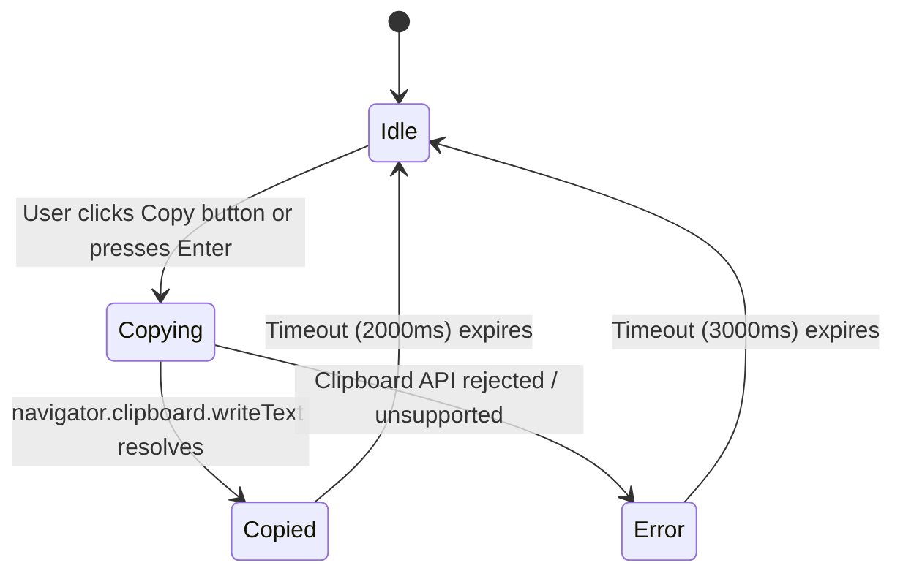
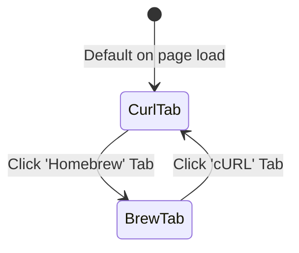
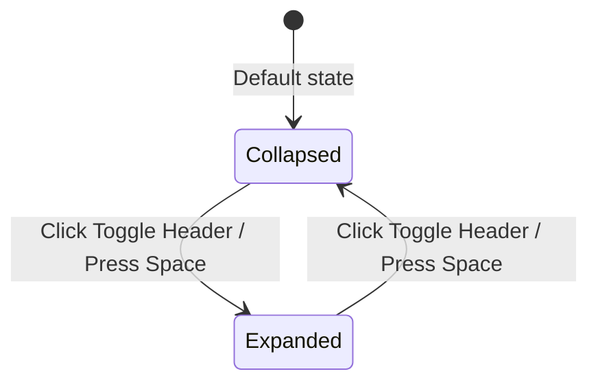

# Domain Modeling: Distribution Hub, 1-Click Terminal Copy, DMG & Privacy Manifesto (US-WEB-028)

- **Feature**: `web-distribution-hub` (US-WEB-028)
- **Status**: Complete

---

## 1. Domain Entities & Type Definitions

```typescript
export type InstallMethod = "curl" | "brew";

export interface DownloadReleaseMeta {
  readonly version: string; // e.g. "v1.3.1"
  readonly releaseDate: string; // e.g. "September 2026"
  readonly dmgUrl: string; // GitHub Releases latest download URL
  readonly releasePageUrl: string; // GitHub Releases page URL
  readonly binaryArch: string; // e.g. "Universal (Apple Silicon & Intel)"
  readonly minMacOS: string; // e.g. "macOS 14.0+ (Sonoma, Sequoia)"
  readonly fileSize: string; // e.g. "~14.2 MB"
  readonly license: string; // e.g. "MIT License (Free & Open Source)"
}

export interface TerminalCommandTab {
  readonly id: InstallMethod;
  readonly label: string;
  readonly command: string;
  readonly description: string;
}

export interface PrivacyPillar {
  readonly id: string;
  readonly title: string;
  readonly subtitle: string;
  readonly icon: string; // Semantic SVG identifier
  readonly details: readonly string[];
}

export interface GatekeeperGuideStep {
  readonly stepNumber: number;
  readonly title: string;
  readonly description: string;
  readonly command?: string;
}
```

---

## 2. State Machine Diagrams

### 2.1. Clipboard Copy State Machine



### 2.2. Terminal Tab Selector State Machine



### 2.3. Gatekeeper Accordion State Machine



---

## 3. Numbered Business Rules (`BR-DIST-###`)

- **BR-DIST-001 [Direct DMG Download Link]**: Nút tải file `.dmg` phải trỏ trực tiếp đến `https://github.com/ahauy/FlowSnap/releases/latest/download/FlowSnap.dmg` với thuộc tính `rel="noopener noreferrer"`.
- **BR-DIST-002 [Dual-Method Terminal Commands]**: Khung Terminal Installer phải hỗ trợ 2 tab:
  - Tab 1: `curl -fsSL https://raw.githubusercontent.com/ahauy/FlowSnap/main/install.sh | bash`
  - Tab 2: `brew install --cask ahauy/tap/flowsnap`
- **BR-DIST-003 [Accurate Clipboard Extraction]**: Thao tác nhấp nút Copy (hoặc phím tắt) trên khung Terminal chỉ sao chép chính xác câu lệnh của tab đang kích hoạt (không chứa khoảng trắng thừa hay ký tự xuống dòng `\n`).
- **BR-DIST-004 [Copy Visual Feedback & Timeout]**: Khi copy thành công, giao diện hiển thị ngay lập tức nhãn "Copied!" và icon dấu tích (`Checkmark`) trong đúng 2000ms trước khi chuyển về nhãn "Copy". Nếu thất bại, hiển thị thông báo lỗi thân thiện.
- **BR-DIST-005 [Privacy & Trust Triad]**: Tuyên ngôn quyền riêng tư phải nêu bật 3 cam kết không thỏa hiệp:
  1. _100% Offline_: Ứng dụng không thực hiện bất kỳ kết nối mạng ngoại vi nào; không phụ thuộc máy chủ từ xa.
  2. _Zero Telemetry_: Không nạp Google Analytics, Mixpanel, Sentry hay bất kỳ SDK thu thập dữ liệu hành vi người dùng nào.
  3. _Accessibility Transparency_: Giải thích rõ macOS Accessibility (`AXUIElement`) là API duy nhất của hệ thống cho phép tiện ích di chuyển và thay đổi kích thước cửa sổ của các ứng dụng khác, tuyệt đối không ghi nhận hay giám sát nội dung bàn phím (`Zero Keylogging`).
- **BR-DIST-006 [Gatekeeper Quarantine Removal Guidance]**: Khối hướng dẫn Gatekeeper phải cung cấp câu lệnh chính thức `xattr -cr /Applications/FlowSnap.app` kèm nút Copy 1-click riêng biệt, giải thích lý do macOS gắn thuộc tính cách ly (`com.apple.quarantine`) trên ứng dụng nguồn mở chưa ký chứng chỉ trả phí của Apple.
- **BR-DIST-007 [Design System & Accessibility Consistency]**: Toàn bộ các thẻ và nút bấm phải sử dụng Design Tokens từ `web/DESIGN.md` (1px hairline border, obsidian dark canvas, focus ring `var(--color-primary-glow)`), đạt độ tương phản WCAG 2.2 AA và hỗ trợ đầy đủ phím Tab/Enter/Space.
