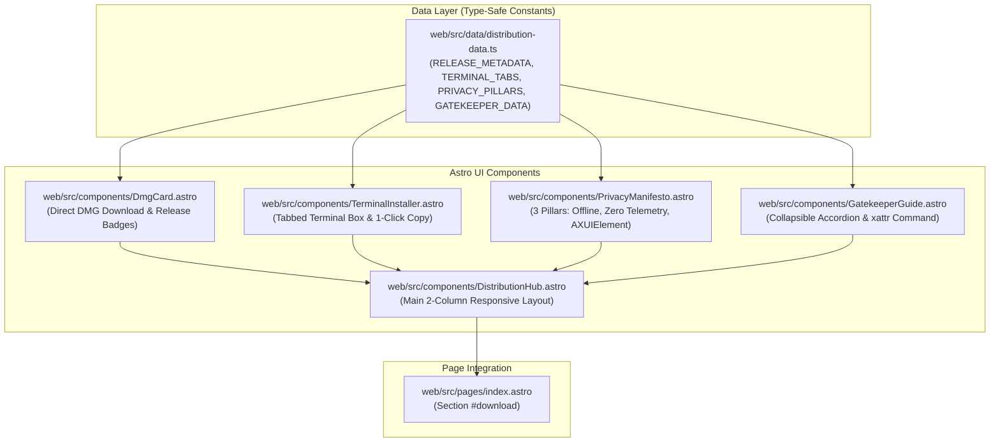

# Technical Implementation Plan: Distribution Hub, 1-Click Terminal Copy, DMG & Privacy Manifesto (US-WEB-028)

## 1. Architecture Overview & Component Decomposition

Following the Deep Module principles and clean component separation in Astro:

## 2. Component Design & Responsibilities

1. **`web/src/data/distribution-data.ts`**:
   - Single source of truth for release versions, direct download links, CLI commands, security pillars, and Gatekeeper steps.
2. **`web/src/components/DmgCard.astro`**:
   - Displays primary direct download button for `FlowSnap.dmg` with prominent iconography.
   - Highlights Universal Binary badge, macOS 14.0+ badge, file size (~14.2 MB), and MIT license.
   - Includes secondary link to GitHub Releases repository.
3. **`web/src/components/TerminalInstaller.astro`**:
   - Simulated macOS terminal window with titlebar dots, active tab selector (`cURL` / `Homebrew`).
   - Terminal prompt (`$`) and syntax-highlighted command.
   - Dedicated 1-click Copy button with visual feedback (`Copied!` & checkmark) and screen reader announcement.
4. **`web/src/components/PrivacyManifesto.astro`**:
   - 3 structured guarantee cards (100% Offline, Zero Telemetry, Accessibility Transparency).
   - Crisp SVG vector icons, reassuring copy, and GitHub audit link.
5. **`web/src/components/GatekeeperGuide.astro`**:
   - Collapsible accordion with clean toggle indicator.
   - Clear 3-step explanation of macOS quarantine attribute.
   - Dedicated 1-click copy box for `xattr -cr /Applications/FlowSnap.app`.
6. **`web/src/components/DistributionHub.astro`**:
   - Coordinates the 2-column split layout on desktop (Left: DMG + Terminal; Right: Privacy + Gatekeeper).
   - Responsive transition to 1-column stacked flow on mobile screens.
7. **`web/src/pages/index.astro`**:
   - Replaces placeholder text `
` inside `<section id="download">` with `<DistributionHub />`.

## 3. Client Interaction Script Specifications

- **Tab Switching**:
  - Pure declarative or minimal client script: Clicking a tab sets `data-active="true"`, updates `aria-selected`, and displays the corresponding command in the code block and copy target.
- **Copy to Clipboard (`copyToClipboard`)**:
  - Attempts `navigator.clipboard.writeText(text)`.
  - Fallback: creates off-screen `<textarea>`, selects content, and executes `document.execCommand('copy')`.
  - On success: updates button content to checkmark + "Copied!", adds `.copied` class for 2000ms, then reverts.
- **Accordion Toggle**:
  - Accessible native HTML `
` and `
` element with customized modern disclosure triangle or CSS chevron animation.

## 4. Verification & Testing Strategy

- **Unit & Contract Tests (`web/tests/distribution-hub.test.mjs`)**:
  - Verify all exports in `distribution-data.ts` conform to TypeScript types and contain valid URLs and non-empty commands.
  - Verify cURL and Homebrew commands conform to valid shell syntax.
  - Verify `xattr -cr` command syntax.
  - Verify release download URL points to expected GitHub repository.
- **Astro Build Verification**:
  - Run `npm run build` in `web/` to guarantee zero compile or template errors and clean static HTML output.
