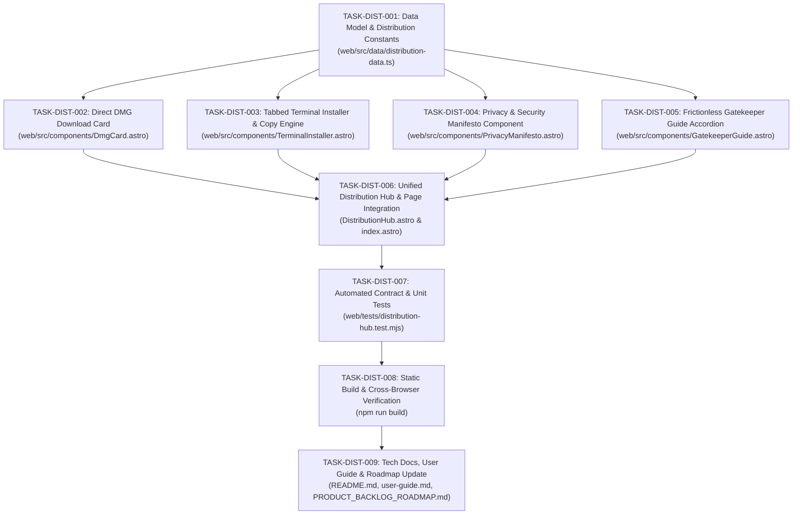

# Tasks Breakdown: Distribution Hub, 1-Click Terminal Copy, DMG & Privacy Manifesto (US-WEB-028)

- **Feature**: `web-distribution-hub` (US-WEB-028)
- **Status**: Ready for Sign-Off at Confirmation Gate 2

---

## Task Sequencing & Dependency Graph

---

## Tasks Breakdown

### Phase 1: Data Contracts & Single Source of Truth

- [x] **TASK-DIST-001: Create distribution data models and constants**
  - Path: `web/src/data/distribution-data.ts`
  - Implement: `ReleaseMetadata`, `TerminalTabItem`, `PrivacyPillarItem`, `GatekeeperGuideData`.
  - Populate constants: `RELEASE_METADATA`, `TERMINAL_TABS`, `PRIVACY_PILLARS`, `GATEKEEPER_DATA`.

### Phase 2: Component Construction (Deep Modules)

- [x] **TASK-DIST-002: Build Direct DMG Download Card**
  - Path: `web/src/components/DmgCard.astro`
  - Implement primary download CTA button linked to GitHub Releases DMG URL.
  - Implement metadata chips (v1.3.1, Universal Binary, macOS 14.0+, ~14.2 MB, MIT).
  - Include secondary link to all releases.

- [x] **TASK-DIST-003: Build Tabbed Terminal Installer Component**
  - Path: `web/src/components/TerminalInstaller.astro`
  - Implement macOS terminal header with dots and tab toggle pills (cURL / Homebrew).
  - Implement syntax-highlighted command box with prompt sign `$`.
  - Implement accessible 1-click Copy button with dual fallback and 2000ms "Copied!" checkmark feedback.

- [x] **TASK-DIST-004: Build Privacy Manifesto Component**
  - Path: `web/src/components/PrivacyManifesto.astro`
  - Implement 3 trust cards: 100% Offline, Zero Telemetry, AXUIElement Transparency.
  - Integrate semantic vector icons and clear guarantee bullet points.

- [x] **TASK-DIST-005: Build Gatekeeper Guide Component**
  - Path: `web/src/components/GatekeeperGuide.astro`
  - Implement accessible `
` / `
` accordion with smooth disclosure styling.
  - Include 3-step quarantine explanation and 1-click copy box for `xattr -cr /Applications/FlowSnap.app`.

### Phase 3: Hub Assembly & Landing Page Integration

- [x] **TASK-DIST-006: Assemble DistributionHub and integrate into landing page**
  - Path: `web/src/components/DistributionHub.astro` & `web/src/pages/index.astro`
  - Compose the 2-column split layout on desktop (Left: DMG + Terminal; Right: Privacy + Gatekeeper).
  - Ensure responsive collapse on mobile screens (< 1024px).
  - Replace placeholder box in `web/src/pages/index.astro` under `<section id="download">`.

### Phase 4: Testing & Verification

- [x] **TASK-DIST-007: Implement automated test suite**
  - Path: `web/tests/distribution-hub.test.mjs`
  - Test data integrity, download URLs, CLI syntax, SHA-256 formatting, and clipboard fallback assertions.
- [x] **TASK-DIST-008: Verify static build and zero console errors**
  - Run `npm run build` in `web/` to confirm zero template errors and static build pass.

### Phase 5: Technical Documentation & User Guides

- [x] **TASK-DIST-009: Author tech documentation and user guide**
  - Path: `docs/features/web-distribution-hub/README.md`
  - Path: `docs/user-guides/web-distribution-hub.md`
  - Update `docs/features/README.md` index table.
  - Mark `US-WEB-028` as `[x]` in `docs/PRODUCT_BACKLOG_ROADMAP.md`.
