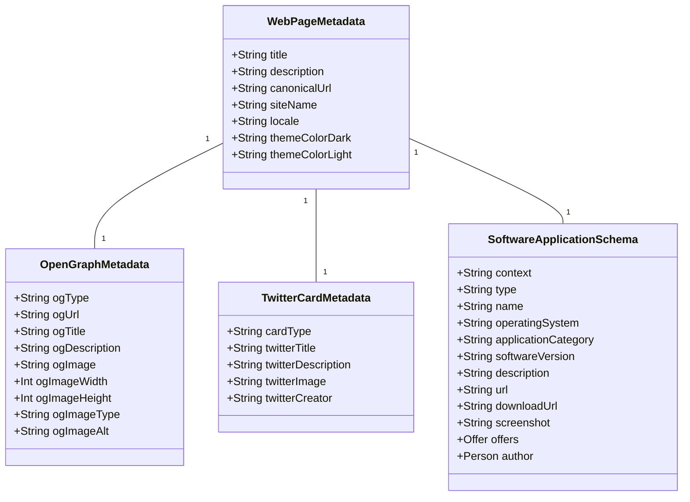
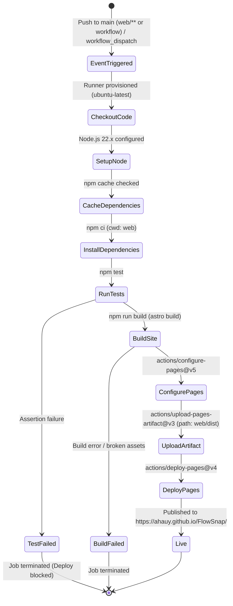

# Domain Modeling: SEO, OpenGraph, JSON-LD Schema & GitHub Pages CI/CD (US-WEB-029)

> Feature Slug: `web-seo-cicd`  
> Domain Role: Business Analyst & Web Architect  
> Compliance: `CONTEXT.md`, Apple HIG, Schema.org Standards

---

## 1. Domain Entities & Data Structures

---

## 2. GitHub Actions Deployment Pipeline (State Machine)

---

## 3. Business Rules (`BR-SEO-###`)

| Rule ID      | Rule Name                            | Specification                                                                                                                                                                                                                                               |
| :----------- | :----------------------------------- | :---------------------------------------------------------------------------------------------------------------------------------------------------------------------------------------------------------------------------------------------------------- |
| `BR-SEO-001` | **Absolute Social Asset Addressing** | Mọi thuộc tính `og:image`, `twitter:image` và canonical URL phải là URL tuyệt đối chứa domain gốc (`https://ahauy.github.io/FlowSnap/...`) để tương thích với các bot mạng xã hội không hỗ trợ relative paths.                                              |
| `BR-SEO-002` | **Authentic Schema.org Fidelity**    | Dữ liệu có cấu trúc JSON-LD phải tuân thủ chuẩn `SoftwareApplication` của Schema.org: `operatingSystem: "macOS 14.0+"`, `applicationCategory: "UtilitiesApplication"`, `offers.price: "0"`, `offers.priceCurrency: "USD"`, `author.name: "ahauy"`.          |
| `BR-SEO-003` | **Subpath Asset Integrity**          | Cấu hình `astro.config.mjs` với `base: process.env.BASE_PATH ?? '/FlowSnap'` và `site: 'https://ahauy.github.io'` đảm bảo mọi đường dẫn tĩnh (`/favicon.svg`, `/og-preview.png`, CSS, JS bundles) tự động gắn tiền tố base path khi build cho GitHub Pages. |
| `BR-SEO-004` | **Test-Gated Deployment**            | Quy trình CI/CD bắt buộc chạy `npm test` thành công trước khi gọi `npm run build`. Nếu bất kỳ test nào thất bại, quy trình dừng ngay lập tức và không bao giờ deploy bản lỗi lên GitHub Pages.                                                              |
| `BR-SEO-005` | **Anti-AI-Slop Visual Card**         | Ảnh đại diện xã hội (`og-preview.png`, kích thước 1200x630 pixel) phải bám sát ngôn ngữ thiết kế Obsidian (`#09090b`), viền hairline 1px, typography Apple SF/Geist, hiển thị mock window snap và thông số hiệu năng thực tế.                               |
| `BR-SEO-006` | **Crawler Openness & Indexing**      | Tệp `robots.txt` cho phép toàn bộ công cụ tìm kiếm thu thập thông tin và khai báo vị trí của `sitemap.xml` hợp lệ.                                                                                                                                          |

---

## 4. Non-Functional Requirements (NFRs)

1. **Lighthouse Score**: Đạt điểm tối thiểu `95+` trên cả 4 hạng mục Google Lighthouse (Performance, Accessibility, Best Practices, SEO).
2. **Zero FOUC & Zero CLS**: Quá trình khởi tạo theme và load ảnh preview xã hội không gây giật chuyển layout (Cumulative Layout Shift = `0.0`).
3. **Execution Latency**: Workflow GitHub Actions hoàn tất build và deploy trong `< 2 phút`.
4. **Security & Permissions**: Workflow chỉ cấp quyền tối thiểu cần thiết cho GitHub Pages (`pages: write`, `id-token: write`).
