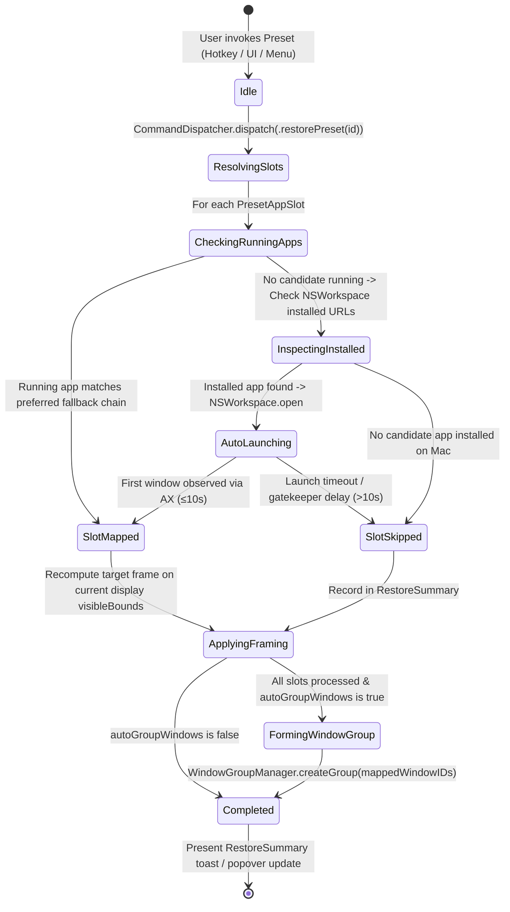
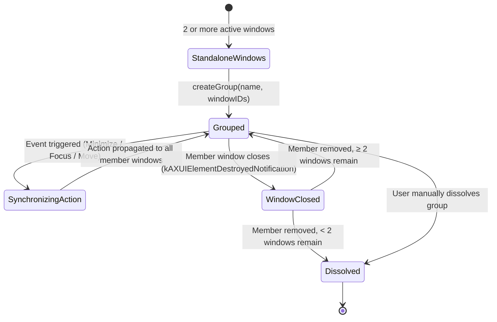
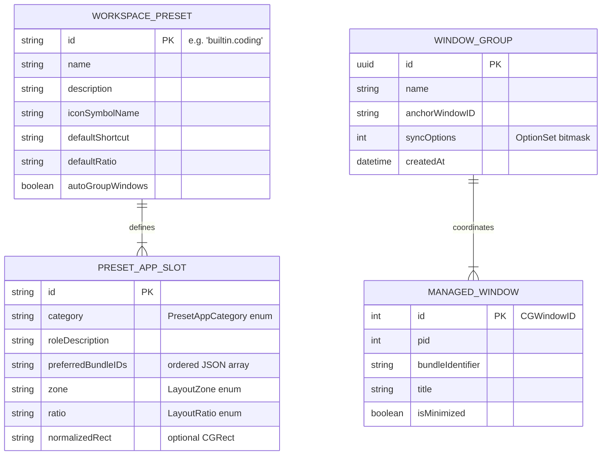

# Domain Model: Window Groups & Workspace Presets (US-WORK-012)

- **Feature**: `window-groups-presets`
- **Stage**: BA Pipeline — Stage 4: Domain Modeling
- **Anchors**: ASM-GROUP-001 (app category fallbacks), ASM-GROUP-002 (group synchronization & lifecycle), ASM-GROUP-003 (hotkey routing & collision prevention)

---

## 1. Entities & Value Objects

### 1.1 `WorkspacePreset` (Aggregate Value Object)

An immutable or user-customized workflow template defining multi-window layout intents and application archetypes.

```swift
public struct WorkspacePreset: Identifiable, Codable, Hashable, Sendable {
    public let id: String                        // e.g. "preset.coding", "preset.research"
    public var name: String                      // e.g. "Coding", "Research & Notes"
    public var description: String               // e.g. "VS Code (60%), Browser (25%), Terminal (15%)"
    public var iconSymbolName: String            // SF Symbol, e.g. "chevron.left.forwardslash.chevron.right"
    public var defaultShortcut: KeyboardShortcut? // e.g. ⌃⌥C
    public var defaultRatio: LayoutRatio         // e.g. .seventyThirty or .threeColumn25_50_25
    public var slots: [PresetAppSlot]            // Ordered placement slots
    public var autoGroupWindows: Bool            // Whether to link restored windows into a WindowGroup

    public init(
        id: String,
        name: String,
        description: String,
        iconSymbolName: String,
        defaultShortcut: KeyboardShortcut? = nil,
        defaultRatio: LayoutRatio = .seventyThirty,
        slots: [PresetAppSlot],
        autoGroupWindows: Bool = true
    ) {
        self.id = id
        self.name = name
        self.description = description
        self.iconSymbolName = iconSymbolName
        self.defaultShortcut = defaultShortcut
        self.defaultRatio = defaultRatio
        self.slots = slots
        self.autoGroupWindows = autoGroupWindows
    }
}
```

### 1.2 `PresetAppSlot` & `PresetAppCategory` (Value Objects)

Represents a logical role within a preset with prioritized fallback application identifiers.

```swift
public struct PresetAppSlot: Codable, Hashable, Sendable, Identifiable {
    public var id: String { "\(roleDescription)-\(zone.rawValue)" }
    public let category: PresetAppCategory
    public let roleDescription: String           // e.g. "Primary Code Editor"
    public let preferredBundleIDs: [String]      // Fallback chain, e.g. ["com.microsoft.VSCode", "com.apple.dt.Xcode"]
    public let zone: LayoutZone                  // Target zone
    public let ratio: LayoutRatio                // Associated split ratio
    public let normalizedRect: CGRect?           // Fine-grained proportional rect (optional)

    public init(
        category: PresetAppCategory,
        roleDescription: String,
        preferredBundleIDs: [String],
        zone: LayoutZone,
        ratio: LayoutRatio = .equal,
        normalizedRect: CGRect? = nil
    ) {
        self.category = category
        self.roleDescription = roleDescription
        self.preferredBundleIDs = preferredBundleIDs
        self.zone = zone
        self.ratio = ratio
        self.normalizedRect = normalizedRect
    }
}

public enum PresetAppCategory: String, Codable, Hashable, Sendable, CaseIterable {
    case editor = "Code & Text Editor"
    case browser = "Web Browser"
    case terminal = "Terminal & Shell"
    case notes = "Notes & Knowledge"
    case writing = "Writing & Documents"
    case design = "Design & UI Tools"
    case custom = "Custom Application"
}
```

### 1.3 `BuiltinPresetFactory` (Domain Service / Factory)

Supplies the immutable, out-of-the-box standard workflow presets according to roadmap acceptance criteria.

```swift
public enum BuiltinPresetFactory {
    public static let codingPreset = WorkspacePreset(
        id: "builtin.coding",
        name: "Coding",
        description: "Editor (60%), Browser (25%), Terminal (15%)",
        iconSymbolName: "chevron.left.forwardslash.chevron.right",
        defaultShortcut: KeyboardShortcut(keyCode: 8, carbonModifiers: UInt32(controlKey | optionKey)), // ⌃⌥C
        defaultRatio: .seventyThirty,
        slots: [
            PresetAppSlot(
                category: .editor,
                roleDescription: "Primary Code Editor",
                preferredBundleIDs: ["com.microsoft.VSCode", "com.apple.dt.Xcode", "com.panic.Nova", "com.apple.TextEdit"],
                zone: .left60_40,
                normalizedRect: CGRect(x: 0, y: 0, width: 0.60, height: 1.0)
            ),
            PresetAppSlot(
                category: .browser,
                roleDescription: "Documentation / Web",
                preferredBundleIDs: ["com.google.Chrome", "com.apple.Safari", "company.thebrowser.Browser", "com.brave.Browser"],
                zone: .topRight,
                normalizedRect: CGRect(x: 0.60, y: 0, width: 0.40, height: 0.60)
            ),
            PresetAppSlot(
                category: .terminal,
                roleDescription: "Terminal / Debug Console",
                preferredBundleIDs: ["com.apple.Terminal", "com.googlecode.iterm2", "com.mitchellh.ghostty", "io.alacritty"],
                zone: .bottomRight,
                normalizedRect: CGRect(x: 0.60, y: 0.60, width: 0.40, height: 0.40)
            )
        ],
        autoGroupWindows: true
    )

    public static let researchPreset = WorkspacePreset(
        id: "builtin.research",
        name: "Research",
        description: "Primary Browser (50%), Notes (25%), Reference Browser (25%)",
        iconSymbolName: "books.vertical.fill",
        defaultShortcut: KeyboardShortcut(keyCode: 15, carbonModifiers: UInt32(controlKey | optionKey)), // ⌃⌥R
        defaultRatio: .equal,
        slots: [
            PresetAppSlot(
                category: .browser,
                roleDescription: "Primary Research Browser",
                preferredBundleIDs: ["com.google.Chrome", "com.apple.Safari", "company.thebrowser.Browser"],
                zone: .leftHalf,
                normalizedRect: CGRect(x: 0, y: 0, width: 0.50, height: 1.0)
            ),
            PresetAppSlot(
                category: .notes,
                roleDescription: "Notes & Knowledge Base",
                preferredBundleIDs: ["com.apple.Notes", "notion.id", "md.obsidian"],
                zone: .topRight,
                normalizedRect: CGRect(x: 0.50, y: 0, width: 0.50, height: 0.50)
            ),
            PresetAppSlot(
                category: .browser,
                roleDescription: "Reference & Sources",
                preferredBundleIDs: ["com.apple.Safari", "com.google.Chrome", "com.brave.Browser"],
                zone: .bottomRight,
                normalizedRect: CGRect(x: 0.50, y: 0.50, width: 0.50, height: 0.50)
            )
        ],
        autoGroupWindows: true
    )

    public static let writingPreset = WorkspacePreset(
        id: "builtin.writing",
        name: "Writing",
        description: "Document Editor (70%), Reference / Dictionary (30%)",
        iconSymbolName: "doc.text.fill",
        defaultShortcut: KeyboardShortcut(keyCode: 13, carbonModifiers: UInt32(controlKey | optionKey)), // ⌃⌥W
        defaultRatio: .seventyThirty,
        slots: [
            PresetAppSlot(
                category: .writing,
                roleDescription: "Focused Document Editor",
                preferredBundleIDs: ["com.apple.Pages", "com.microsoft.Word", "md.obsidian", "com.apple.TextEdit"],
                zone: .left70_30,
                normalizedRect: CGRect(x: 0, y: 0, width: 0.70, height: 1.0)
            ),
            PresetAppSlot(
                category: .browser,
                roleDescription: "Reference & Research",
                preferredBundleIDs: ["com.apple.Safari", "com.google.Chrome", "company.thebrowser.Browser"],
                zone: .rightOneThird,
                normalizedRect: CGRect(x: 0.70, y: 0, width: 0.30, height: 1.0)
            )
        ],
        autoGroupWindows: true
    )

    public static let designPreset = WorkspacePreset(
        id: "builtin.design",
        name: "Design",
        description: "Design Canvas (70%), Assets & Preview (30%)",
        iconSymbolName: "paintbrush.fill",
        defaultShortcut: KeyboardShortcut(keyCode: 2, carbonModifiers: UInt32(controlKey | optionKey)), // ⌃⌥D
        defaultRatio: .seventyThirty,
        slots: [
            PresetAppSlot(
                category: .design,
                roleDescription: "UI & Vector Design Tool",
                preferredBundleIDs: ["com.figma.Desktop", "com.bohemiancoding.sketch3", "com.adobe.illustrator"],
                zone: .left70_30,
                normalizedRect: CGRect(x: 0, y: 0, width: 0.70, height: 1.0)
            ),
            PresetAppSlot(
                category: .browser,
                roleDescription: "Assets & Prototype Preview",
                preferredBundleIDs: ["com.apple.Safari", "com.google.Chrome"],
                zone: .rightOneThird,
                normalizedRect: CGRect(x: 0.70, y: 0, width: 0.30, height: 1.0)
            )
        ],
        autoGroupWindows: true
    )

    public static let allBuiltinPresets: [WorkspacePreset] = [
        codingPreset,
        researchPreset,
        writingPreset,
        designPreset
    ]
}
```

### 1.4 `WindowGroup` (Aggregate Root Entity)

A dynamic, live association of two or more managed windows cooperating as a unified visual unit.

```swift
public struct WindowGroup: Identifiable, Hashable, Sendable {
    public let id: UUID
    public var name: String
    public var windowIDs: Set<CGWindowID>
    public var anchorWindowID: CGWindowID?
    public var syncOptions: GroupSyncOptions
    public let createdAt: Date

    public init(
        id: UUID = UUID(),
        name: String,
        windowIDs: Set<CGWindowID>,
        anchorWindowID: CGWindowID? = nil,
        syncOptions: GroupSyncOptions = .all,
        createdAt: Date = Date()
    ) {
        self.id = id
        self.name = name
        self.windowIDs = windowIDs
        self.anchorWindowID = anchorWindowID ?? windowIDs.first
        self.syncOptions = syncOptions
        self.createdAt = createdAt
    }

    public var memberCount: Int { windowIDs.count }
    public var isValid: Bool { windowIDs.count >= 2 }
}

public struct GroupSyncOptions: OptionSet, Codable, Hashable, Sendable {
    public let rawValue: Int

    public init(rawValue: Int) {
        self.rawValue = rawValue
    }

    public static let minimizeTogether = GroupSyncOptions(rawValue: 1 << 0)
    public static let focusTogether    = GroupSyncOptions(rawValue: 1 << 1)
    public static let moveTogether     = GroupSyncOptions(rawValue: 1 << 2)

    public static let all: GroupSyncOptions = [.minimizeTogether, .focusTogether, .moveTogether]
}
```

### 1.5 `WindowGroupManager` (Core Coordination Actor / Engine)

`@MainActor` coordinator maintaining live window groups, tracking window lifecycle events, and propagating group state changes without recursive re-entrancy.

```swift
@MainActor
public final class WindowGroupManager: ObservableObject {
    @Published public private(set) var activeGroups: [WindowGroup] = []

    public func createGroup(name: String, windowIDs: Set<CGWindowID>, syncOptions: GroupSyncOptions = .all) -> WindowGroup?
    public func dissolveGroup(id: UUID)
    public func addWindow(_ windowID: CGWindowID, toGroup id: UUID)
    public func removeWindow(_ windowID: CGWindowID, fromGroup id: UUID)
    public func group(for windowID: CGWindowID) -> WindowGroup?

    // Group state propagation hooks
    public func handleWindowMinimize(triggerWindowID: CGWindowID) async throws
    public func handleWindowRestore(triggerWindowID: CGWindowID) async throws
    public func handleWindowFocus(triggerWindowID: CGWindowID) async throws
    public func handleWindowMove(triggerWindowID: CGWindowID, delta: CGPoint) async throws
    public func handleWindowDestroyed(windowID: CGWindowID)
}
```

---

## 2. State Machines

### 2.1 Workspace Preset Application Lifecycle



### 2.2 Window Group Dynamic Lifecycle & Auto-Pruning



---

## 3. Business Rules

| Rule ID           | Title                                               | Statement & Invariant                                                                                                                                                                                                                       |
| :---------------- | :-------------------------------------------------- | :------------------------------------------------------------------------------------------------------------------------------------------------------------------------------------------------------------------------------------------ |
| **BR-PRESET-001** | **Curated Standard Workflow Presets**               | FlowSnap shall provide 4 built-in presets: Coding (60/25/15), Research (50/25/25), Writing (70/30), and Design (70/30). Built-in presets are immutable domain templates that can be executed directly or customized into user workspaces.   |
| **BR-PRESET-002** | **Prioritized App Category Fallbacks**              | Each preset slot shall evaluate candidate bundle IDs in prioritized order: (1) currently running candidate, (2) first installed candidate via `NSWorkspace.urlForApplication(withBundleIdentifier:)`, (3) skip slot if no candidate exists. |
| **BR-PRESET-003** | **Graceful App Launch & Non-Blocking Summary**      | When launching an unlaunched fallback app, FlowSnap shall wait ≤ 10s for the first AX window. If the app fails to appear within 10s, it shall be skipped without aborting remaining slots and reported in `RestoreSummary`.                 |
| **BR-PRESET-004** | **Resolution-Independent Intent Framing**           | Presets store relative zones and normalized bounding rectangles. Frame coordinates shall be calculated against the active display's `visibleBounds` at execution time using `DisplayManager` and `LayoutEngine`.                            |
| **BR-PRESET-005** | **Preset Hotkey Execution & Dispatch**              | Global keyboard shortcuts for presets shall be routed through `GlobalHotkeyManager` → `CommandDispatcher.dispatch(.restorePreset(id))` with latest-wins debouncing and strict concurrency.                                                  |
| **BR-PRESET-006** | **Hotkey Collision Rejection**                      | Assigning a preset shortcut that conflicts with an existing standard snap action (`ShortcutAction`) or another active preset/workspace shortcut shall be rejected with immediate UI warning.                                                |
| **BR-GROUP-001**  | **Window Group Membership Cardinality**             | A `WindowGroup` requires at least 2 distinct `CGWindowID` members. If window count drops below 2 due to window closure, the group shall automatically dissolve.                                                                             |
| **BR-GROUP-002**  | **Simultaneous Group Minimize & Un-minimize**       | Minimizing any window in an active group shall minimize all other group members. Restoring/un-minimizing any member shall restore all group members.                                                                                        |
| **BR-GROUP-003**  | **Simultaneous Group Focus & Z-Order Preservation** | Activating/focusing any window in an active group shall bring all group members to the foreground while preserving their relative z-order.                                                                                                  |
| **BR-GROUP-004**  | **Simultaneous Group Repositioning**                | When group move synchronization is enabled, moving the anchor window across displays or spaces shall shift or relocate all member windows cohesively.                                                                                       |
| **BR-GROUP-005**  | **Re-Entrancy & Loop Prevention**                   | Group synchronization handlers in `WindowGroupManager` shall employ an execution lock / generation counter to prevent cascade feedback loops when dispatching AX commands to member windows.                                                |
| **BR-GROUP-006**  | **Zero Private API & Memory Safety**                | Window groups shall track windows purely via public AX APIs and `CGWindowID`. No private CGS APIs or undocumented window server hooks shall be used.                                                                                        |

---

## 4. Entity-Relationship Diagram (ERD)



---

## 5. UX States & Surfaces

| Surface                        | State                  | Visual & Interactive Behavior                                                                                                           |
| :----------------------------- | :--------------------- | :-------------------------------------------------------------------------------------------------------------------------------------- |
| **Settings > Presets Gallery** | Default Gallery        | Grid of curated preset cards with schematic layout previews (60/40, 70/30, 3-column), app badges, and direct "Apply" button.            |
| **Settings > Presets Gallery** | Hotkey Customization   | Inline shortcut recorder field for each preset; displays collision warnings in red if key combo conflicts with standard snap shortcuts. |
| **Settings > Window Groups**   | Active Groups List     | Lists live window groups with member count, app icons, sync toggle checkboxes (Minimize, Focus, Move), and "Ungroup" button.            |
| **Menu Bar Popover**           | Presets Menu           | "Presets" submenu listing Coding, Research, Writing, Design with keyboard shortcut badges for instant 1-click trigger.                  |
| **Menu Bar Popover**           | Active Group Indicator | Visual badge showing active group status (e.g. "Group: Coding (3 windows)") with quick "Ungroup" action.                                |
| **Toast / Notification**       | Restore Summary        | Auto-dismissing banner: "Restored Coding Preset (3/3 windows)" or "Restored 2/3 — Figma not installed".                                 |
