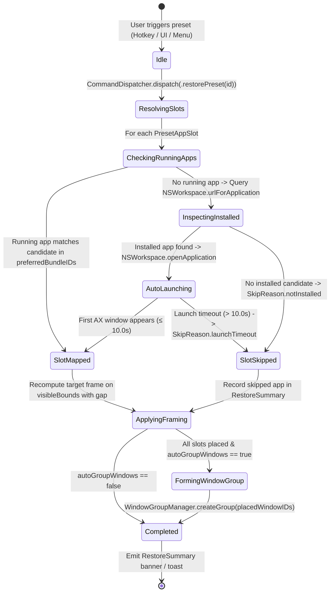

# Data Model: Window Groups & Workspace Presets (US-WORK-012)

**Feature Slug:** `window-groups-presets`  
**Baseline:** `.specify/features/window-groups-presets/baseline.md` (SIGNED-OFF v1.0)  
**Status:** Engineering Data Model Specification  
**Created:** 2026-09-01

---

## 1. Entities & Value Objects

### 1.1 `WorkspacePreset` (Aggregate Value Object)

An immutable or user-customized workflow template defining multi-window layout intents and application archetypes.

```swift
public struct WorkspacePreset: Identifiable, Codable, Hashable, Sendable {
    public let id: String                        // e.g. "builtin.coding", "builtin.research"
    public var name: String                      // e.g. "Coding", "Research"
    public var description: String               // e.g. "Editor (60%), Browser (25%), Terminal (15%)"
    public var iconSymbolName: String            // SF Symbol, e.g. "chevron.left.forwardslash.chevron.right"
    public var defaultShortcut: KeyboardShortcut? // e.g. ⌃⌥C
    public var defaultRatio: LayoutRatio         // e.g. .seventyThirty or .threeColumn25_50_25
    public var slots: [PresetAppSlot]            // Ordered placement slots
    public var autoGroupWindows: Bool            // Whether to link restored windows into a WindowGroup

    public init(
        id: String,
        name: String,
        description: String,
        iconSymbolName: String,
        defaultShortcut: KeyboardShortcut? = nil,
        defaultRatio: LayoutRatio = .seventyThirty,
        slots: [PresetAppSlot],
        autoGroupWindows: Bool = true
    ) {
        self.id = id
        self.name = name
        self.description = description
        self.iconSymbolName = iconSymbolName
        self.defaultShortcut = defaultShortcut
        self.defaultRatio = defaultRatio
        self.slots = slots
        self.autoGroupWindows = autoGroupWindows
    }
}
```

### 1.2 `PresetAppSlot` & `PresetAppCategory` (Value Objects)

Represents a logical application role within a preset with prioritized fallback candidate bundle identifiers.

```swift
public struct PresetAppSlot: Codable, Hashable, Sendable, Identifiable {
    public var id: String { "\(roleDescription)-\(zone.rawValue)" }
    public let category: PresetAppCategory
    public let roleDescription: String           // e.g. "Primary Code Editor"
    public let preferredBundleIDs: [String]      // Fallback chain, e.g. ["com.microsoft.VSCode", "com.apple.dt.Xcode"]
    public let zone: LayoutZone                  // Target zone enum
    public let ratio: LayoutRatio                // Associated split ratio
    public let normalizedRect: CGRect?           // Fine-grained proportional rect (optional)

    public init(
        category: PresetAppCategory,
        roleDescription: String,
        preferredBundleIDs: [String],
        zone: LayoutZone,
        ratio: LayoutRatio = .equal,
        normalizedRect: CGRect? = nil
    ) {
        self.category = category
        self.roleDescription = roleDescription
        self.preferredBundleIDs = preferredBundleIDs
        self.zone = zone
        self.ratio = ratio
        self.normalizedRect = normalizedRect
    }
}

public enum PresetAppCategory: String, Codable, Hashable, Sendable, CaseIterable {
    case editor = "Code & Text Editor"
    case browser = "Web Browser"
    case terminal = "Terminal & Shell"
    case notes = "Notes & Knowledge"
    case writing = "Writing & Documents"
    case design = "Design & UI Tools"
    case custom = "Custom Application"
}
```

### 1.3 `BuiltinPresetFactory` (Domain Factory / Immutables)

Supplies the immutable out-of-the-box standard workflow presets according to roadmap requirements.

```swift
public enum BuiltinPresetFactory {
    public static let codingPreset = WorkspacePreset(
        id: "builtin.coding",
        name: "Coding",
        description: "Editor (60%), Browser (25%), Terminal (15%)",
        iconSymbolName: "chevron.left.forwardslash.chevron.right",
        defaultShortcut: KeyboardShortcut(keyCode: 8, carbonModifiers: UInt32(controlKey | optionKey)), // ⌃⌥C
        defaultRatio: .seventyThirty,
        slots: [
            PresetAppSlot(
                category: .editor,
                roleDescription: "Primary Code Editor",
                preferredBundleIDs: ["com.microsoft.VSCode", "com.apple.dt.Xcode", "com.panic.Nova", "com.apple.TextEdit"],
                zone: .left60_40,
                normalizedRect: CGRect(x: 0, y: 0, width: 0.60, height: 1.0)
            ),
            PresetAppSlot(
                category: .browser,
                roleDescription: "Documentation / Web",
                preferredBundleIDs: ["com.google.Chrome", "com.apple.Safari", "company.thebrowser.Browser", "com.brave.Browser"],
                zone: .topRight,
                normalizedRect: CGRect(x: 0.60, y: 0, width: 0.40, height: 0.60)
            ),
            PresetAppSlot(
                category: .terminal,
                roleDescription: "Terminal / Debug Console",
                preferredBundleIDs: ["com.apple.Terminal", "com.googlecode.iterm2", "com.mitchellh.ghostty", "io.alacritty"],
                zone: .bottomRight,
                normalizedRect: CGRect(x: 0.60, y: 0.60, width: 0.40, height: 0.40)
            )
        ],
        autoGroupWindows: true
    )

    public static let researchPreset = WorkspacePreset(
        id: "builtin.research",
        name: "Research",
        description: "Primary Browser (50%), Notes (25%), Reference Browser (25%)",
        iconSymbolName: "books.vertical.fill",
        defaultShortcut: KeyboardShortcut(keyCode: 15, carbonModifiers: UInt32(controlKey | optionKey)), // ⌃⌥R
        defaultRatio: .equal,
        slots: [
            PresetAppSlot(
                category: .browser,
                roleDescription: "Primary Research Browser",
                preferredBundleIDs: ["com.google.Chrome", "com.apple.Safari", "company.thebrowser.Browser"],
                zone: .leftHalf,
                normalizedRect: CGRect(x: 0, y: 0, width: 0.50, height: 1.0)
            ),
            PresetAppSlot(
                category: .notes,
                roleDescription: "Notes & Knowledge Base",
                preferredBundleIDs: ["com.apple.Notes", "notion.id", "md.obsidian"],
                zone: .topRight,
                normalizedRect: CGRect(x: 0.50, y: 0, width: 0.50, height: 0.50)
            ),
            PresetAppSlot(
                category: .browser,
                roleDescription: "Reference & Sources",
                preferredBundleIDs: ["com.apple.Safari", "com.google.Chrome", "com.brave.Browser"],
                zone: .bottomRight,
                normalizedRect: CGRect(x: 0.50, y: 0.50, width: 0.50, height: 0.50)
            )
        ],
        autoGroupWindows: true
    )

    public static let writingPreset = WorkspacePreset(
        id: "builtin.writing",
        name: "Writing",
        description: "Document Editor (70%), Reference / Dictionary (30%)",
        iconSymbolName: "doc.text.fill",
        defaultShortcut: KeyboardShortcut(keyCode: 13, carbonModifiers: UInt32(controlKey | optionKey)), // ⌃⌥W
        defaultRatio: .seventyThirty,
        slots: [
            PresetAppSlot(
                category: .writing,
                roleDescription: "Focused Document Editor",
                preferredBundleIDs: ["com.apple.Pages", "com.microsoft.Word", "md.obsidian", "com.apple.TextEdit"],
                zone: .left70_30,
                normalizedRect: CGRect(x: 0, y: 0, width: 0.70, height: 1.0)
            ),
            PresetAppSlot(
                category: .browser,
                roleDescription: "Reference & Research",
                preferredBundleIDs: ["com.apple.Safari", "com.google.Chrome", "company.thebrowser.Browser"],
                zone: .rightOneThird,
                normalizedRect: CGRect(x: 0.70, y: 0, width: 0.30, height: 1.0)
            )
        ],
        autoGroupWindows: true
    )

    public static let designPreset = WorkspacePreset(
        id: "builtin.design",
        name: "Design",
        description: "Design Canvas (70%), Assets & Preview (30%)",
        iconSymbolName: "paintbrush.fill",
        defaultShortcut: KeyboardShortcut(keyCode: 2, carbonModifiers: UInt32(controlKey | optionKey)), // ⌃⌥D
        defaultRatio: .seventyThirty,
        slots: [
            PresetAppSlot(
                category: .design,
                roleDescription: "UI & Vector Design Tool",
                preferredBundleIDs: ["com.figma.Desktop", "com.bohemiancoding.sketch3", "com.adobe.illustrator"],
                zone: .left70_30,
                normalizedRect: CGRect(x: 0, y: 0, width: 0.70, height: 1.0)
            ),
            PresetAppSlot(
                category: .browser,
                roleDescription: "Assets & Prototype Preview",
                preferredBundleIDs: ["com.apple.Safari", "com.google.Chrome"],
                zone: .rightOneThird,
                normalizedRect: CGRect(x: 0.70, y: 0, width: 0.30, height: 1.0)
            )
        ],
        autoGroupWindows: true
    )

    public static let allBuiltinPresets: [WorkspacePreset] = [
        codingPreset,
        researchPreset,
        writingPreset,
        designPreset
    ]

    public static func preset(for id: String) -> WorkspacePreset? {
        allBuiltinPresets.first { $0.id == id }
    }
}
```

### 1.4 `WindowGroup` (Aggregate Root Entity)

A dynamic, live association of two or more managed windows cooperating as a unified visual unit.

```swift
public struct WindowGroup: Identifiable, Hashable, Sendable {
    public let id: UUID
    public var name: String
    public var windowIDs: Set<CGWindowID>
    public var anchorWindowID: CGWindowID?
    public var syncOptions: GroupSyncOptions
    public let createdAt: Date

    public init(
        id: UUID = UUID(),
        name: String,
        windowIDs: Set<CGWindowID>,
        anchorWindowID: CGWindowID? = nil,
        syncOptions: GroupSyncOptions = .all,
        createdAt: Date = Date()
    ) {
        self.id = id
        self.name = name
        self.windowIDs = windowIDs
        self.anchorWindowID = anchorWindowID ?? windowIDs.first
        self.syncOptions = syncOptions
        self.createdAt = createdAt
    }

    public var memberCount: Int { windowIDs.count }
    public var isValid: Bool { windowIDs.count >= 2 }
}

public struct GroupSyncOptions: OptionSet, Codable, Hashable, Sendable {
    public let rawValue: Int

    public init(rawValue: Int) {
        self.rawValue = rawValue
    }

    public static let minimizeTogether = GroupSyncOptions(rawValue: 1 << 0)
    public static let focusTogether    = GroupSyncOptions(rawValue: 1 << 1)
    public static let moveTogether     = GroupSyncOptions(rawValue: 1 << 2)

    public static let all: GroupSyncOptions = [.minimizeTogether, .focusTogether, .moveTogether]
}
```

---

## 2. Persistence & Storage Document

### 2.1 Persistence Architecture

1. **Built-in Presets**:
   - Statically compiled into the application binary via `BuiltinPresetFactory`.
   - Immutable; zero disk parsing on cold startup; immune to file corruption.
2. **Custom Shortcut Overrides**:
   - Persisted via `PreferencesStore` (UserDefaults) under the key `"presetCustomShortcuts"` as `[String: KeyboardShortcut]`.
   - Fallback: when no custom shortcut is recorded, `preset.defaultShortcut` is used.
3. **Live Window Groups**:
   - Transient in-memory state owned by `@MainActor WindowGroupManager`.
   - `CGWindowID` numbers are ephemeral per macOS session and are not persisted across app restarts, preventing stale window handles upon reboot.

### 2.2 UserDefaults Payload Example

```json
{
  "presetCustomShortcuts": {
    "builtin.coding": {
      "keyCode": 8,
      "carbonModifiers": 6144,
      "character": "c"
    },
    "builtin.research": {
      "keyCode": 15,
      "carbonModifiers": 6144,
      "character": "r"
    }
  }
}
```

---

## 3. State Machines

### 3.1 Preset Application & Fallback Resolution Lifecycle



### 3.2 Window Group Dynamic Lifecycle & Auto-Pruning

```mermaid
stateDiagram-v2
    [*] --> StandaloneWindows: 2 or more active windows
    StandaloneWindows --> Grouped: createGroup(name, windowIDs)
    Grouped --> SynchronizingAction: Event triggered (Minimize / Focus / Move)
    SynchronizingAction --> Grouped: Action propagated across all members (re-entrancy lock active)
    Grouped --> WindowClosed: Member window closes (kAXUIElementDestroyedNotification)
    WindowClosed --> Grouped: Member pruned; count >= 2
    WindowClosed --> Dissolved: Member pruned; count < 2
    Grouped --> Dissolved: User clicks "Ungroup" in Settings
    Dissolved --> [*]
```



---

## 4. Validation Rules & Invariants

| Invariant                   | Validation Rule                                                         | Enforcement Location                                             |
| --------------------------- | ----------------------------------------------------------------------- | ---------------------------------------------------------------- |
| **Preset Slot Cardinality** | Preset MUST contain at least 1 slot (typical 2–3 slots)                 | `WorkspacePreset.init` / unit tests                              |
| **Fallback Non-Empty**      | `PresetAppSlot.preferredBundleIDs` MUST have ≥ 1 bundle ID              | `PresetAppSlot.init`                                             |
| **Group Minimum Members**   | `WindowGroup.windowIDs.count` MUST be ≥ 2                               | `WindowGroup.isValid`, `WindowGroupManager.createGroup`          |
| **Group Auto-Dissolution**  | If window removal results in `count < 2`, group is dissolved            | `WindowGroupManager.handleWindowDestroyed`, `removeWindow`       |
| **Re-Entrancy Token**       | Inbound events during active synchronization pass are dropped           | `WindowGroupManager.isSynchronizing` flag & token                |
| **Shortcut Uniqueness**     | Preset shortcut MUST NOT collide with `ShortcutAction` or other presets | `PreferencesStore.hasConflict(excluding:)`, `PresetSettingsView` |

---

## 5. Concurrency & Memory Model

- **`WorkspacePreset` & `PresetAppSlot`**: Pure immutable value types conforming to `Sendable`, `Hashable`, `Codable`.
- **`WindowGroup`**: Pure immutable value type conforming to `Sendable`, `Hashable`, `Identifiable`.
- **`WindowGroupManager`**: `@MainActor` observable coordinator owning the active group state.
- **Thread Safety**: All mutations to window groups occur on the MainActor. Background events (AX notifications) dispatch onto `@MainActor` before calling `WindowGroupManager` methods.
