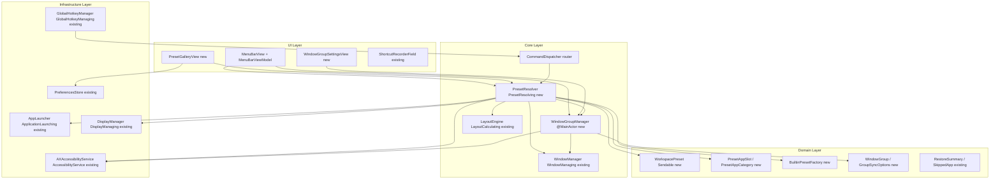
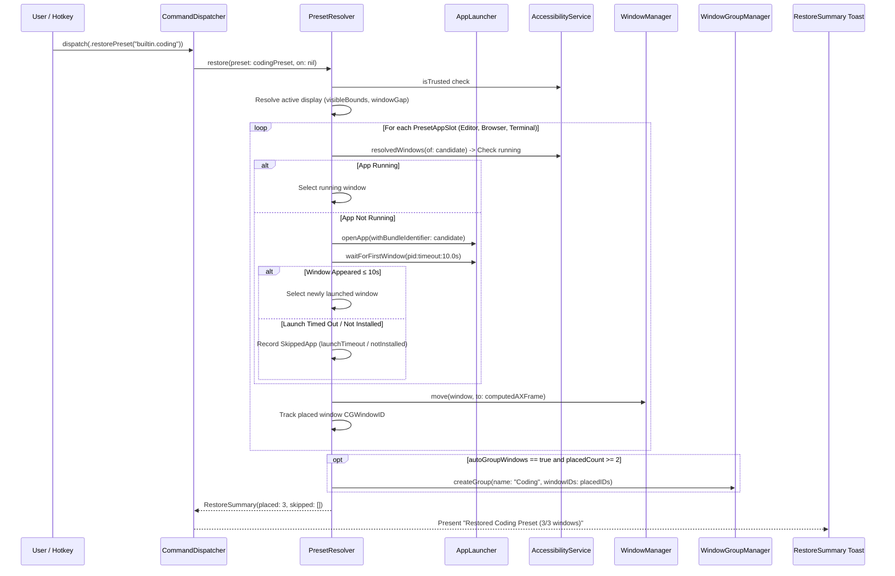
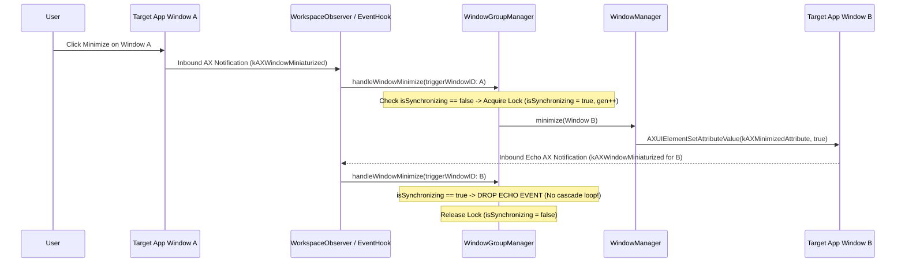
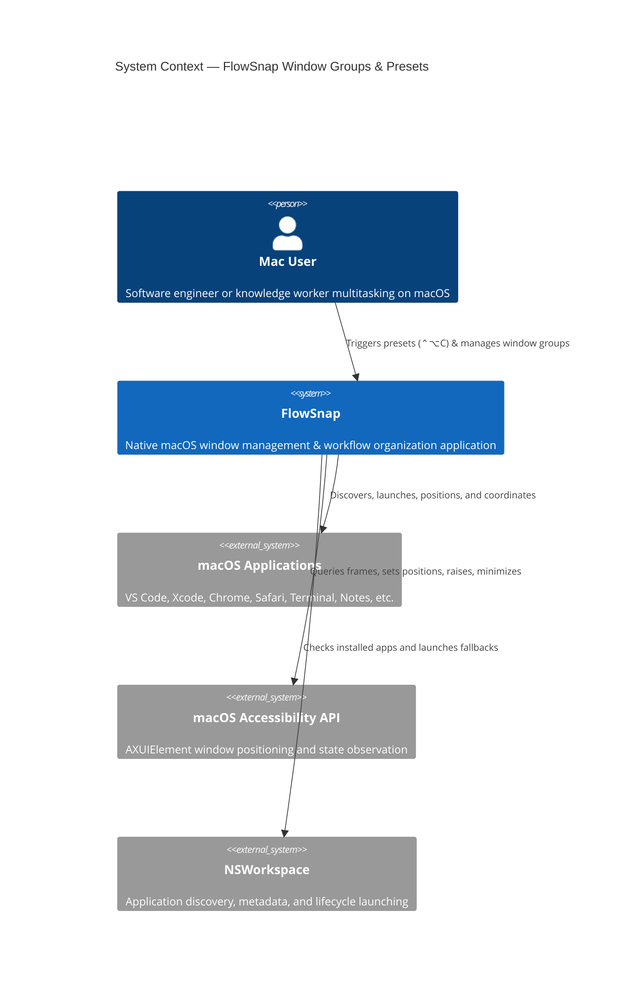
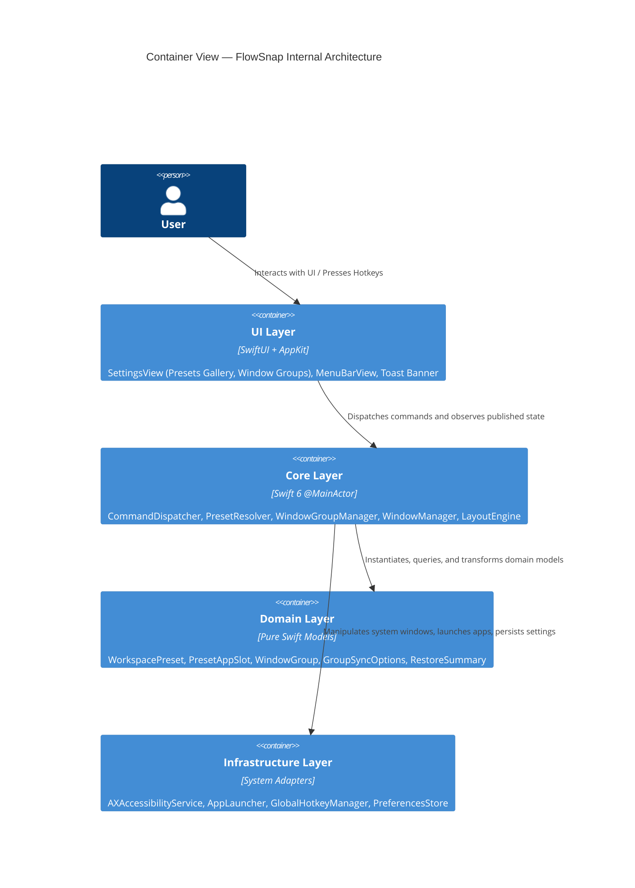

# Implementation Plan: Window Groups & Workspace Presets (US-WORK-012)

**Feature Slug:** `window-groups-presets`  
**Branch:** `feat/window-groups-presets`  
**Date:** 2026-09-01  
**Spec:** [.specify/features/window-groups-presets/spec.md](file:///Users/vutuanhau/Documents/PROJECT/FlowSnap/.specify/features/window-groups-presets/spec.md)  
**Baseline:** [.specify/features/window-groups-presets/baseline.md](file:///Users/vutuanhau/Documents/PROJECT/FlowSnap/.specify/features/window-groups-presets/baseline.md)  
**Status:** Approved Implementation Plan

---

## 1. Summary

Implements **Window Groups & Workspace Presets (US-WORK-012)** for FlowSnap. Delivers 4 immutable curated workflow presets (`Coding` 60/25/15, `Research` 50/25/25, `Writing` 70/30, `Design` 70/30) with smart application category fallback resolution and bounded auto-launch (≤10.0s). Introduces the `WindowGroup` entity and `@MainActor WindowGroupManager` coordinator to synchronize minimize/un-minimize, focus (with z-order preservation), and movement across linked windows with re-entrancy locking and event-driven auto-pruning. Integrates preset triggers into Menu Bar and Settings Presets Gallery with shortcut collision prevention.

---

## 2. Technical Context

- **Language & Runtime**: Swift 6.0 (Strict Concurrency enabled, zero data-race warnings)
- **Frameworks**: SwiftUI + AppKit (macOS Native, Hardened Runtime, LSUIElement agent app)
- **Target Platform**: macOS 14.0+ (Sonoma / Sequoia)
- **Architecture**: Domain-Driven Design (DDD) & Deep Modules
- **Concurrency**: Actors (`WorkspaceStore`), `@MainActor` coordinators (`WindowGroupManager`, `WorkspaceManager`, `CommandDispatcher`), `Sendable` value objects
- **Persistence**: `PreferencesStore` (UserDefaults) for preset hotkeys & group sync preferences; immutable domain factory for built-in presets
- **Testing**: Swift Testing (`@Test`) + protocol-based dependency injection doubles
- **API Policy**: Zero Private API policy (100% public `AXUIElement`, `NSWorkspace`, `CGEventHotKey`)
- **DoD Rules**: File < 800 LOC, Function < 50 LOC, No `!`, `try!`, `as!`, `swiftlint lint --strict` 100% clean

---

## 3. Constitution Check & Gate Evaluation

| Gate Criterion                  | Status | Evaluation & Evidence                                                                                                                                                                                     |
| ------------------------------- | :----: | --------------------------------------------------------------------------------------------------------------------------------------------------------------------------------------------------------- |
| **Gate 1 — Strict Concurrency** |  PASS  | All entities are `Sendable`; managers isolated to `@MainActor`; store is actor-backed; zero unchecked globals                                                                                             |
| **Gate 2 — Zero Private APIs**  |  PASS  | Uses only public AppKit, SwiftUI, `NSWorkspace.openApplication`, and `AXUIElement` APIs                                                                                                                   |
| **Gate 3 — Deep Modules**       |  PASS  | Clean separation of Domain (`WorkspacePreset`, `WindowGroup`), Core (`PresetResolver`, `WindowGroupManager`), Infrastructure (`AppLauncher`, `PreferencesStore`), UI (`PresetGalleryView`, `MenuBarView`) |
| **Gate 4 — Testability & DI**   |  PASS  | All external dependencies abstracted behind protocols (`PresetResolving`, `WindowGroupManaging`, `ApplicationLaunching`, `AccessibilityService`)                                                          |
| **Gate 5 — Non-Blocking UI**    |  PASS  | Fallback launches bounded by 10.0s timeout; hotkeys dispatched via latest-wins debouncer                                                                                                                  |

---

## 4. Component Architecture & Sequence Diagrams

### 4.1 Component Diagram

### 4.2 Sequence Diagram: Preset Application & Smart Fallback Resolution

### 4.3 Sequence Diagram: Window Group Synchronization & Re-Entrancy Guard

---

## 5. Architecture Decision Records (ADRs)

### ADR-0007: Separation of `WorkspacePreset` Templates from `Workspace` Instances

- **Status**: Accepted
- **Context**: Workspace snapshots (`Workspace`) persist exact user apps and counts. Presets (`WorkspacePreset`) are reusable role-based templates with fallback chains (`PresetAppSlot`) that work on any Mac regardless of software installation.
- **Decision**: Define `WorkspacePreset` as a dedicated domain entity with `BuiltinPresetFactory` supplying immutable standard workflows.
- **Consequences**: Zero schema coupling; pristine separation of concerns; zero disk migration risk.

### ADR-0008: `@MainActor WindowGroupManager` Coordinator with Generation Locking

- **Status**: Accepted
- **Context**: Synchronizing minimize/focus/move across windows triggers OS-level AX notifications which echo back to FlowSnap, risking infinite feedback loops and CPU spikes.
- **Decision**: Isolate `WindowGroupManager` to `@MainActor` and guard synchronization with `isSynchronizing` flag and generation token `syncGeneration`.
- **Consequences**: Deterministic thread safety; zero race conditions; elimination of cyclic event feedback.

### ADR-0009: Smart Category Fallback Resolution via `ApplicationLaunching`

- **Status**: Accepted
- **Context**: Presets must handle missing applications without blocking the UI or failing whole workflows.
- **Decision**: `PresetResolver` queries running windows, then installed apps via `NSWorkspace`, with a bounded 10.0s wait on cold launch, falling back to next candidate or recording typed `SkipReason`.
- **Consequences**: Highly resilient to diverse developer environments; unit testable via `MockApplicationLaunching`.

### ADR-0010: Preset Hotkey Dispatch & Collision Prevention

- **Status**: Accepted
- **Context**: Presets need global shortcuts (`⌃⌥C`, `⌃⌥R`, `⌃⌥W`, `⌃⌥D`) without colliding with snap shortcuts.
- **Decision**: Extend `WindowCommand` with `.restorePreset(String)`; integrate validation into `PreferencesStore.hasPresetConflict`.
- **Consequences**: Unified shortcut architecture; consistent latest-wins debouncing in `CommandDispatcher`.

---

## 6. Architecture Diagrams (C4 Model)

### C4 Level 1 — System Context

### C4 Level 2 — Container View

---

## 7. Module Boundary Map & Placement (Deep Modules)

| Module / Component                           | Layer          | File Path                                                    | Responsibility                                   | Depends On                                                           |
| -------------------------------------------- | -------------- | ------------------------------------------------------------ | ------------------------------------------------ | -------------------------------------------------------------------- |
| `WorkspacePreset`                            | Domain         | `FlowSnap/Domain/Workspace/WorkspacePreset.swift`            | Preset entity & Codable template                 | `PresetAppSlot`, `LayoutRatio`, `KeyboardShortcut`                   |
| `PresetAppSlot`                              | Domain         | `FlowSnap/Domain/Workspace/PresetAppSlot.swift`              | Slot value object & Category enum                | `PresetAppCategory`, `LayoutZone`, `LayoutRatio`                     |
| `BuiltinPresetFactory`                       | Domain         | `FlowSnap/Domain/Workspace/BuiltinPresetFactory.swift`       | 4 immutable built-in presets                     | `WorkspacePreset`, `PresetAppSlot`                                   |
| `WindowGroup`                                | Domain         | `FlowSnap/Domain/Window/WindowGroup.swift`                   | Live window group aggregate entity               | `CGWindowID`, `GroupSyncOptions`                                     |
| `GroupSyncOptions`                           | Domain         | `FlowSnap/Domain/Window/GroupSyncOptions.swift`              | OptionSet for sync operations                    | —                                                                    |
| `PresetResolving` / `PresetResolver`         | Core           | `FlowSnap/Core/Workspace/PresetResolver.swift`               | Fallback resolution & preset layout execution    | `AccessibilityService`, `ApplicationLaunching`, `WindowGroupManager` |
| `WindowGroupManaging` / `WindowGroupManager` | Core           | `FlowSnap/Core/Window/WindowGroupManager.swift`              | Live group lifecycle & sync coordination         | `AccessibilityService`, `WindowManaging`                             |
| `CommandDispatcher+Presets`                  | Core           | `FlowSnap/Core/Commands/CommandDispatcher.swift`             | Routes `.restorePreset(id)`                      | `PresetResolving`                                                    |
| `PreferencesStore+Presets`                   | Infrastructure | `FlowSnap/Infrastructure/Persistence/PreferencesStore.swift` | Persists preset shortcuts & validates collisions | `BuiltinPresetFactory`, `KeyboardShortcut`                           |
| `PresetGalleryView`                          | UI             | `FlowSnap/UI/Settings/PresetGalleryView.swift`               | Settings Presets Gallery tab                     | `PreferencesStore`, `PresetResolving`                                |
| `WindowGroupSettingsView`                    | UI             | `FlowSnap/UI/Settings/WindowGroupSettingsView.swift`         | Settings Window Groups tab                       | `WindowGroupManaging`                                                |
| `MenuBarView+Presets`                        | UI             | `FlowSnap/UI/MenuBar/MenuBarView.swift`                      | Presets submenu in Menu Bar                      | `MenuBarViewModel`, `PresetResolving`                                |

---

## 8. Risks & Mitigations (from Risk Register)

- **Echo Feedback Loop (RISK-GROUP-001)**: Mitigated by `isSynchronizing` re-entrancy lock and `syncGeneration` counter in `WindowGroupManager`.
- **Dangling Window Handles (RISK-GROUP-002)**: Mitigated by event-driven auto-pruning on `kAXUIElementDestroyedNotification` and automatic dissolution when member count < 2.
- **Cold App Launch Hang (RISK-GROUP-003)**: Mitigated by strict 10.0s timeout per slot; timed-out slots marked `launchTimeout` and skipped gracefully.
- **Hotkey Collisions (RISK-GROUP-004)**: Mitigated by proactive validation in `PreferencesStore.hasPresetConflict` against all snap actions and presets.
- **Display Resolution Scaling (RISK-GROUP-005)**: Mitigated by normalized proportional zones and runtime `visibleBounds` recomputation.
- **Debounce Races (RISK-GROUP-006)**: Mitigated by `CommandDispatcher` latest-wins debouncing cancelling prior tasks.
- **Untrusted AX (RISK-GROUP-007)**: Mitigated by pre-flight `AXAccessibilityService.isTrusted` verification.
- **Z-Order Inversion (RISK-GROUP-008)**: Mitigated by deterministic raising order (background members first, anchor window last).
