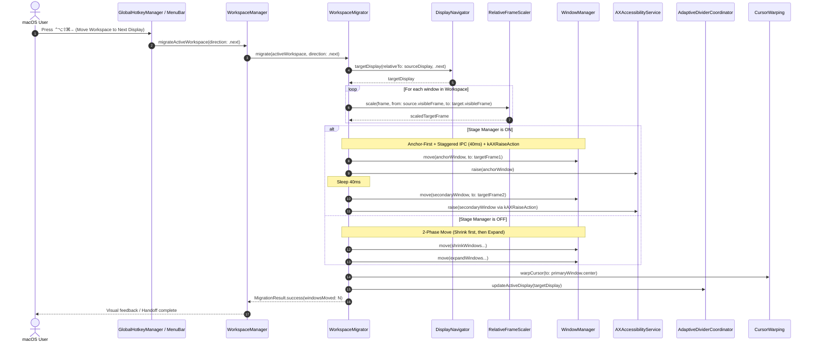

# 03 — Domain Model & Architecture Specification: workspace-cross-display-migration (US-DISP-017)

## 1. Ubiquitous Language Additions (for `CONTEXT.md`)

- **WorkspaceMigrating**: Protocol định nghĩa hợp đồng di chuyển nguyên tử toàn bộ Không gian làm việc (Workspace) đa cửa sổ xuyên qua các màn hình hiển thị.
- **WorkspaceMigrator**: Bộ điều phối cốt lõi tính toán chuyển đổi tọa độ tỉ lệ (`RelativeFrameScaler`), thực thi thứ tự di chuyển 2 pha (2-phase move ordering), phối hợp Stage Manager (`SmartStageCoordination`) và chuyển dải phân cách (`AdaptiveDividerCoordinator`).
- **MigrationDirection**: Hướng dịch chuyển màn hình hiển thị (`.next` hoặc `.previous`) theo thứ tự không gian từ trái sang phải với cơ chế cyclic wrap-around của `DisplayNavigator`.
- **MigrationResult**: Kết quả trả về của quá trình di chuyển (thành công với số lượng cửa sổ đã chuyển, hoặc no-op kèm lý do).

---

## 2. Business Rules (`BR-MIG-###`)

- **BR-MIG-001 (Source & Target Display Resolution)**:
  - Màn hình nguồn (`sourceDisplay`) được xác định ưu tiên theo vị trí tâm cửa sổ đang có tiêu điểm (focused window trong AppKit space); nếu không có, xác định theo vị trí con trỏ chuột (`NSEvent.mouseLocation`).
  - Màn hình đích (`targetDisplay`) được tính toán thông qua `DisplayNavigator.display(relativeTo: sourceDisplay, direction: direction, displays: displays)`.
  - Nếu `displays.count <= 1` hoặc `sourceDisplay.id == targetDisplay.id`, hệ thống thực hiện no-op êm dịu (`.noOp(.singleDisplay)`), không giật màn hình.
- **BR-MIG-002 (Active Workspace Identification)**:
  - Workspace cần di chuyển là Workspace đang hoạt động (`activeWorkspace`) có các cửa sổ đang nằm trên `sourceDisplay`.
  - Nếu không có Workspace nào đang active trên `sourceDisplay`, hệ thống thực hiện no-op êm dịu (`.noOp(.noActiveWorkspace)`).
- **BR-MIG-003 (Proportional Geometric Scaling)**:
  - Mọi cửa sổ trong Workspace được chuyển đổi tọa độ từ `sourceDisplay.visibleFrame` sang `targetDisplay.visibleFrame` bằng `RelativeFrameScaler.scale(...)`.
  - Bảo toàn tuyệt đối tỉ lệ chia tách (ví dụ 50/50, 70/30, 33/33/34) và khoảng cách mép màn hình/gap giữa các cửa sổ.
- **BR-MIG-004 (2-Phase Move Ordering & Stage Manager Cohesion)**:
  - **Khi Stage Manager BẬT (`isStageManagerEnabled == true`)**:
    - Di chuyển cửa sổ Anchor (cửa sổ đầu tiên) sang màn hình đích trước.
    - Áp dụng Staggered IPC delay (40ms) giữa các cửa sổ tiếp theo.
    - Gọi `kAXRaiseAction` trên các cửa sổ phụ để gom nhóm vào cùng một Stage trên màn hình đích mà không kích hoạt `app.activate()`.
  - **Khi Stage Manager TẮT (`isStageManagerEnabled == false`)**:
    - Áp dụng thứ tự di chuyển 2 pha: Nhóm cửa sổ thu nhỏ (target area <= source area) di chuyển trước (Pha 1); nhóm cửa sổ mở rộng di chuyển sau (Pha 2), triệt tiêu nguy cơ va chạm và clamping sai lệch của WindowServer.
- **BR-MIG-005 (Post-Migration Handoff & Focus Retention)**:
  - Tự động di chuyển con trỏ chuột (warp cursor qua `CursorWarping`) đến tâm hình học của cửa sổ chính trên màn hình đích.
  - Tái kích hoạt dải phân cách `AdaptiveDividerCoordinator` tại màn hình đích và hủy bỏ overlay dải phân cách trên màn hình nguồn.
  - Đảm bảo cửa sổ chính của Workspace giữ vững tiêu điểm bàn phím trên màn hình đích.

---

## 3. Interaction Flow & Sequence Diagram



---

## 4. Contract Specifications

### 4.1. Domain: `MigrationDirection`

```swift
public enum MigrationDirection: String, Sendable, Codable, CaseIterable {
    case next
    case previous
}
```

### 4.2. Domain: `MigrationResult`

```swift
public enum MigrationResult: Equatable, Sendable {
    case success(windowsMigrated: Int, targetDisplayID: CGDirectDisplayID)
    case noOp(reason: NoOpReason)

    public enum NoOpReason: Equatable, Sendable {
        case singleDisplay
        case noActiveWorkspace
        case noWindowsFound
        case accessibilityDenied
    }
}
```

### 4.3. Domain Protocol: `WorkspaceMigrating`

```swift
@MainActor
public protocol WorkspaceMigrating: AnyObject {
    func migrateActiveWorkspace(
        direction: MigrationDirection
    ) async throws -> MigrationResult
}
```
